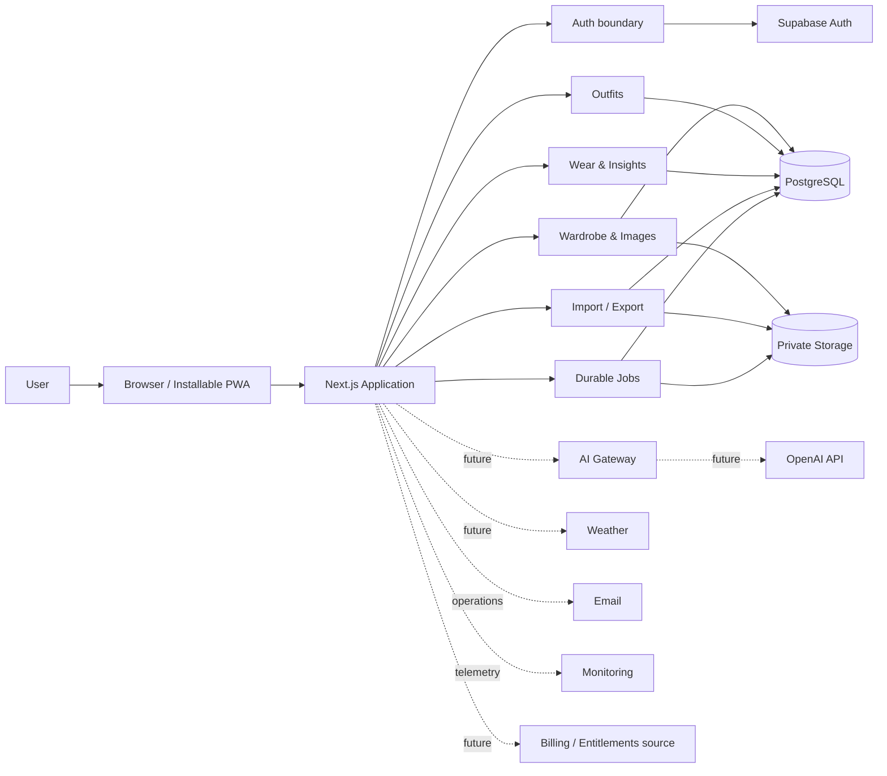
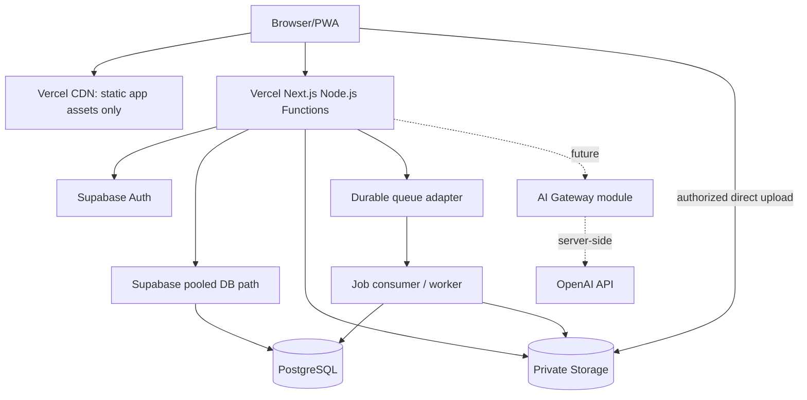

# AI Wardrobe — Technical Architecture

**Phase:** 4 — Technical Architecture  
**Status:** Approved / Complete  
**Baseline:** Approved PRD, UX, Design System and Decisions D-001–D-075  
**Date:** 2026-09-15

# Executive Architecture Summary

AI Wardrobe рекомендуется строить как **server-authoritative modular monolith**: один Next.js application/deployment, внутри которого presentation, application use cases, domain modules и infrastructure adapters имеют явные границы. Browser/PWA отвечает за интерактивность, временные drafts и доступ к camera/files; доверенная identity, authorization, domain invariants, транзакции, import commit, приватная выдача media и будущие AI-вызовы остаются на сервере.

Рекомендуемый стартовый stack: Next.js App Router + React + TypeScript; Tailwind CSS как styling/build layer под внутренними design tokens и доступными компонентами; Supabase PostgreSQL + Auth + private Storage; Vercel как начальный deployment target; provider-neutral durable job boundary для image processing, import, export и deletion cleanup. Конкретные поддерживаемые версии фиксируются перед implementation, а не в этом документе.

Модель данных Phase 5 должна быть multi-user safe с первого дня: каждая user-owned root entity имеет однозначного владельца, дочерние записи наследуют доступ через проверяемого родителя, application authorization дополняется deny-by-default RLS. Пользователь A не может читать, искать, изменять, экспортировать или передавать AI данные пользователя B. Второй реальный пользователь входит в тот же продукт через отдельный account, а не получает отдельный сайт или доверенный обход ownership.

Изображения хранятся только в private storage. Browser получает authorized upload intent и загружает большой payload непосредственно в Storage; пользовательский HTTP request не ждёт производных. Original сохраняется, async pipeline валидирует и создаёт versioned thumbnail/medium/full renditions. UI получает только разрешённую derivative через короткоживущий signed URL или авторизованный delivery path; original не используется в grid.

Bulk Import следует source-audited staged модели D-099: **Choose → Prepare → Review → Resolve → Preview → Confirm → Results**. Preview не меняет production wardrobe. Confirm seals an exact manifest/revision, а Commit имеет durable session state, record-level outcomes, idempotency и ограниченные transaction groups. Raw image set не имеет manifest/stable item IDs, поэтому grouping, image reconciliation и AppearanceVariant mapping всегда требуют явного Resolve.

AI не входит в MVP. Будущая интеграция проходит только через server-side AI Gateway: task routing, минимизация контекста, allowlisted tools, strict structured outputs, validation, usage/cost controls и graceful failure. Модель никогда не выбирает `user_id`, не получает SQL/service credential и не выполняет domain write без обычной application authorization, idempotency и требуемого UX-confirmation.

# Goals

- Реализуемый MVP без микросервисной и AI-зависимости.
- Корректная tenant isolation уже для двух независимых accounts и без фундаментальной переделки при росте до публичного SaaS.
- Server-authoritative ownership, history integrity и explainable deterministic analytics.
- Приватный, безопасный и производительный image lifecycle.
- Повторяемые, восстанавливаемые и идемпотентные import/background workflows.
- Ясная граница browser/server/provider и отсутствие privileged credentials в client bundle.
- Возможность эволюции к Free/Premium, лимитам, Household, native clients и будущему AI через добавление модулей, а не переписывание core ownership.
- Разумная переносимость данных и hosting/provider exit path без преждевременного lowest-common-denominator design.

# Non-Goals

- Database schema, SQL, migrations, table/column definitions или RLS policy code.
- Next.js/React/Tailwind implementation, component code, repository setup или deployment configuration.
- Создание Supabase/Vercel/OpenAI projects, buckets, queues, credentials или environments.
- OpenAI prompts, tool schemas, выбранная production model или AI feature implementation.
- Billing, Stripe, subscription lifecycle, paywalls, Household sharing, public profiles или stylist portal.
- Полный offline sync engine, native mobile API, microservices, event-sourcing или data warehouse.
- Финализация source-dependent Bulk Import UX до Source Audit.
- Начало Phase 5.

# Architectural Principles

1. **Modular monolith first.** Один deployable, ясные module boundaries, extraction только по измеренному ограничению.
2. **Server authoritative.** Browser сообщает intent и данные действия; server определяет actor, права и допустимый state transition.
3. **Private and deny-by-default.** Любой новый domain/store/cache path закрыт до явного разрешения.
4. **Defense in depth.** Application authorization и database/storage RLS проверяют одну ownership model независимо.
5. **Deterministic core.** Catalog, search, outfits, wear и insights не зависят от AI.
6. **History is append-minded.** Mutable outfit/item presentation не переписывает WearEvent snapshot.
7. **Transactions around invariants.** Связанные изменения сохраняются целиком или имеют явный partial outcome.
8. **Idempotency at every retryable write.** Network, queue и user retry не создают скрытые duplicates.
9. **Async for durable slow work.** Request/response не удерживается ради image processing, large import, export или cleanup.
10. **Observability without content leakage.** Диагностика сохраняет correlation, timing и outcome, но не приватное содержимое.
11. **Portable domain, selective adapters.** Framework/provider integration остаётся на infrastructure edge; не строится абстракция на каждый hypothetical vendor.
12. **Graceful degradation.** Сбой AI, weather, email, image derivative или analytics не уничтожает доступ к подтверждённым core records.

# Current/Future Scale Assumptions

| Horizon        |                    Users |                                   Representative per-user load | Architectural posture                                                                                |
| -------------- | -----------------------: | -------------------------------------------------------------: | ---------------------------------------------------------------------------------------------------- |
| Personal Alpha | 1–2 independent accounts | до 1,000 items, 5,000 images, 1,000 outfits, 10,000 WearEvents | Одна application deployment, один managed Postgres/Auth/Storage project per environment              |
| Closed Beta    |                     tens |                               неодинаковые import/image bursts | Quotas, queue capacity, production SMTP, restore drills, cross-user regression suite                 |
| Public Beta    |   hundreds–low thousands |                                concurrent browse/upload/import | Pooling, rate limits, job backpressure, storage/egress monitoring, indexed query review              |
| Public SaaS    |        thousands–10,000+ |                           recurring AI/storage/analytics usage | Entitlements, plan limits, stronger ops/SLO, read/precompute tuning; extraction only where justified |

These are validation targets, not promises of unbounded scale. A wardrobe remains the primary unit of user experience; no normal screen should load the full wardrobe or originals.

# Recommended Stack

| Area                  | Recommendation                                                            | Why / guardrail                                                                                                                                                            |
| --------------------- | ------------------------------------------------------------------------- | -------------------------------------------------------------------------------------------------------------------------------------------------------------------------- |
| Web application       | Next.js App Router + React                                                | Server Components for authenticated reads, Client Components only for interactivity/browser APIs; Server Actions and Route Handlers are still untrusted network boundaries |
| Language              | TypeScript in strict mode                                                 | Shared contracts and exhaustive domain states; runtime validation and DB constraints remain mandatory                                                                      |
| UI styling            | Tailwind CSS + internal semantic tokens/components                        | Matches approved Design System without making utility classes the domain contract; exact Tailwind major depends on browser matrix                                          |
| Accessible primitives | Optional focused library after evaluation                                 | Use for dialog/sheet/menu/listbox only if semantics, focus and bundle constraints pass; no wholesale UI-kit visual language                                                |
| Primary data          | Supabase managed PostgreSQL                                               | Relational integrity, transactions, queryable history, RLS and a portable Postgres core                                                                                    |
| Identity              | Supabase Auth                                                             | Cookie-compatible SSR sessions, recovery and account lifecycle; application still owns authorization                                                                       |
| Media                 | Supabase private Storage                                                  | Private buckets, Storage RLS, direct uploads and time-limited delivery                                                                                                     |
| Hosting               | Vercel for Next.js                                                        | Strong Next.js integration and preview deploys; domain modules avoid Vercel-specific APIs                                                                                  |
| Slow work             | Durable job interface + persisted workflow state                          | Queue/runner is transport, not source of truth; provider selected at implementation gate                                                                                   |
| Observability         | Structured logs, correlation IDs, OpenTelemetry-compatible traces/metrics | Portable operational signals with content redaction                                                                                                                        |
| Future AI             | Server-only AI Gateway; OpenAI Responses API as first adapter             | Tool calling + Structured Outputs, model routing behind config/evals, no AI in core domain                                                                                 |

Current official documentation supports these choices: [Next.js App Router](https://nextjs.org/docs/app), [Server and Client Components](https://nextjs.org/docs/app/getting-started/server-and-client-components), [Backend for Frontend guidance](https://nextjs.org/docs/app/guides/backend-for-frontend), [Supabase database](https://supabase.com/docs/guides/database/overview), [Supabase SSR Auth](https://supabase.com/docs/guides/auth/server-side), [private Storage](https://supabase.com/docs/guides/storage/buckets/fundamentals), [Vercel Functions](https://vercel.com/docs/functions), and [OpenAI function calling](https://developers.openai.com/api/docs/guides/function-calling).

Tailwind v4 currently targets a newer browser baseline, including Safari 16.4+ and Firefox 128+; therefore the selected Tailwind major is explicitly gated by the MVP browser matrix rather than assumed here. See [Tailwind compatibility](https://tailwindcss.com/docs/compatibility).

## Architecture Decision Matrix

| Concern                  | Recommended direction                                         | Phase 4 status                                         |
| ------------------------ | ------------------------------------------------------------- | ------------------------------------------------------ |
| Application architecture | Server-authoritative modular monolith                         | Recommended, awaiting review                           |
| Framework                | Next.js App Router + React + TypeScript                       | Recommended, exact versions deferred to implementation |
| Design implementation    | Tailwind under internal tokens/components                     | Recommended, major gated by browser matrix             |
| Database                 | Supabase managed PostgreSQL                                   | Recommended                                            |
| Authentication           | Supabase Auth with server-verified SSR session                | Recommended                                            |
| Authorization            | Application ownership checks + deny-by-default RLS            | Recommended                                            |
| Storage                  | Supabase private Storage, direct authorized upload            | Recommended                                            |
| Images                   | Async validated versioned derivatives, original retained      | Recommended; processor/HEIC open                       |
| Jobs                     | Durable provider-neutral boundary and persisted state         | Recommended; runner open                               |
| Import                   | Staged no-write preview + idempotent bounded commit           | Recommended; Source Audit details open                 |
| Deployment               | Vercel Node.js near database                                  | Recommended; exact region open                         |
| PWA/cache                | Resilient online, static shell only by default                | Recommended                                            |
| Future AI                | Server-side Gateway with first OpenAI Responses adapter       | Recommended; no implementation/model fixed             |
| Observability            | Redacted structured logs + OpenTelemetry-compatible signals   | Recommended                                            |
| Future SaaS              | Internal Entitlements capability; personal ownership retained | Recommended; billing not implemented                   |

# System Context



External providers are untrusted availability dependencies and receive minimum necessary data. PostgreSQL remains source of truth for confirmed domain state; Storage remains source of truth for file bytes; job state remains inspectable by the application.

# Deployment Topology



- Default runtime is Node.js, not Edge. Edge is considered only for a measured latency/security use case that does not need incompatible libraries or long processing.
- Vercel compute must be placed close to the selected Supabase region; cross-region DB round trips are an avoidable latency and cost risk. [Vercel region guidance](https://vercel.com/docs/functions/configuring-functions/region)
- Images and import archives bypass the Vercel Function body after server authorization. Current Function payload/duration limits make request-bound large-file processing unsuitable. [Vercel Function limits](https://vercel.com/docs/functions/limitations)
- Local, preview/staging and production use isolated data, Storage and secrets. Production data is never a local development dependency.

# Trust Boundaries

| Boundary                    | Trusted on entry?                       | Required checks                                                                                    |
| --------------------------- | --------------------------------------- | -------------------------------------------------------------------------------------------------- |
| Browser → Next.js           | No                                      | Verified session, CSRF posture, runtime input validation, ownership, rate/size limits, idempotency |
| Next.js → PostgreSQL        | Application code is not sufficient      | Least-privilege role, explicit ownership predicate, RLS, transaction invariants                    |
| Browser/Server → Storage    | No path/name claim is trusted           | Authorized upload/read scope, RLS, object/entity binding, MIME/bytes/dimensions checks             |
| Queue → Worker              | Delivery may repeat or be stale         | Signed/internal invocation, job ownership, state/version check, idempotency, bounded retry         |
| Next.js → external provider | Provider may fail/retain data           | Allowlisted destination, timeout, minimized payload, safe logging, contract validation             |
| Model → tools/domain        | Model output is untrusted data          | Strict schema plus semantic validation, server-injected identity, per-object authorization         |
| Cache/CDN/local storage     | Shared/persistent behavior is dangerous | Classification, user scoping, TTL/invalidation, no private shared cache, cleanup on logout         |

# Application Layers

1. **Presentation:** routes, Server/Client Components, view models, forms, accessible feedback. No ownership decisions.
2. **Application:** authenticated use cases, orchestration, authorization calls, transaction/job boundaries, DTO validation and error mapping.
3. **Domain:** entities, policies and invariants such as one physical item per WearEvent, history-safe archive and AppearanceVariant semantics. No Next.js/Supabase/Vercel imports.
4. **Data access:** repositories/query services and transaction coordination. Enforces explicit account scope even when RLS also applies.
5. **Infrastructure:** Supabase Auth/Storage/Postgres clients, queue, email, telemetry, image processor and future provider adapters.
6. **Future AI Gateway:** a server-only application/infrastructure boundary; it calls application/domain capabilities, never repositories directly.

Layers are directional: Presentation → Application → Domain; infrastructure implements inward-facing ports. Read-optimized query services may skip rich entity reconstruction, but cannot skip authorization or ownership scope.

# Domain Modules

| Module                  | MVP responsibility                                                               | Allowed dependencies                                 |
| ----------------------- | -------------------------------------------------------------------------------- | ---------------------------------------------------- |
| Identity / Account      | actor identity, settings, export/deletion request orchestration                  | Auth adapter, Preferences, lifecycle jobs            |
| Wardrobe                | Physical Item, AppearanceVariant, lifecycle, tags/properties, search intent      | Identity scope; Images by stable reference           |
| Images                  | assets, ImageView, role/origin/lineage, processing state, delivery authorization | Identity, Wardrobe parent ownership, Storage/jobs    |
| Outfits                 | drafts, saved compositions, OutfitItem and chosen variant                        | Wardrobe read capabilities, Identity                 |
| Wear                    | WearEvent and immutable composition snapshot                                     | Wardrobe/Outfits read-at-command time, Identity      |
| Insights                | deterministic recorded-wear calculations and drill-down                          | Wear and Wardrobe read models                        |
| Import                  | sessions, preview decisions, source identities, commit/report                    | Wardrobe, Images, jobs, Identity                     |
| Export / Data Lifecycle | portable export, account deletion workflow                                       | All modules through explicit export/delete contracts |
| Settings / Preferences  | locale, timezone, units and user-confirmed preferences                           | Identity                                             |

Future modules are AI, Wishlist, Declutter, Trips/Packing, Purchase, Weather and Entitlements. They may reference core module capabilities but may not redefine ClothingItem ownership, WearEvent truth or Image evidence.

# Module Dependency Rules

- No module reads another module's persistence internals or joins its tables from presentation code.
- Cross-module operations use an application capability or explicit read model.
- Wear may snapshot an Outfit/Wardrobe projection, but Outfit updates never call back to mutate Wear history.
- Insights reads confirmed domain facts; it does not write lifecycle decisions.
- Import calls the same Wardrobe/Image commands as normal creation or an equivalent validated bulk application service; it cannot bypass invariants.
- Export/Data Lifecycle may orchestrate all modules through declared contracts, not unrestricted ad-hoc access.
- Future AI and Entitlements are outer modules. Core domain behavior remains valid when they are disabled.
- Circular module dependencies are release blockers. Shared kernel is limited to identity types, time, money, IDs, error primitives and transaction abstractions.

# Multi-User Ownership

The MVP is single-user-oriented in UX, not single-tenant in architecture.

- Every user-owned root record has one unambiguous owner/account scope from creation.
- Child access is proven through its parent, not accepted from a client-supplied path or foreign key alone.
- Stable external import identifiers are unique only within owner + import source scope.
- Search, count, analytics, jobs, exports, media and future AI retrieval carry the verified actor scope.
- User A and User B may submit identical item IDs/file names without collision or visibility.
- A girlfriend/partner signs up as a second independent account in the same deployment. There is no shared service credential, hardcoded account or separate site.
- No implicit sharing exists. A future Household adds explicit membership and grants while retaining individual ownership and preferences; leaving a Household must not delete personal records.
- Ownership reassignment is not a generic operation. Any future transfer/share feature requires a separate product and security decision.

## Phase 5 Ownership Handoff Constraint

Phase 5 must keep three concepts distinct even if the MVP maps them one-to-one:

- **Authenticated identity** answers who is signed in.
- **Personal owner/account scope** answers whose durable wardrobe record this is.
- **Access/sharing grant** would answer who else may act on or view that record in a future product.

For MVP, an authenticated user may map directly to one personal owner/account scope. That simplification must not make Auth identity the permanent ownership schema or require conversion of personal rows into jointly owned tenant rows when Household is considered. Any future sharing uses explicit membership/grants layered over preserved personal ownership and requires a new product/security decision. No Household tables, shared tenant, membership or grant schema are introduced now.

# Authentication

Supabase Auth is recommended for signup, login, logout, recovery and refresh. Browser and server share a cookie-based SSR session; the server verifies the token/claims and derives the actor. Supabase documents SSR support and recommends its SSR package while noting that package APIs may still change, so implementation must pin and review versions. [Supabase SSR Auth](https://supabase.com/docs/guides/auth/server-side)

Conceptual flow:

1. Browser completes an Auth flow and receives session cookies through the supported PKCE/SSR path.
2. Each protected request resolves a verified server identity; a browser-provided `user_id` is ignored for authority.
3. The application constructs an actor/account context and performs authorization.
4. User-scoped DB/Storage access preserves the Auth identity where RLS is expected.
5. Session refresh updates cookies without allowing authenticated responses into shared caches.
6. Logout/account switch clears user-scoped local drafts/caches and invalidates the local session view.

Recovery responses must not reveal whether another person's account exists beyond provider-safe behavior. Production public signup additionally requires production SMTP, abuse/rate controls and recovery testing.

# Authorization

Authentication answers who the actor is; authorization answers whether that actor may perform this operation on this resource.

- Every use case checks ownership and state before read/write.
- Collection reads are owner-scoped at their entry, not filtered after loading.
- Object IDs are opaque locators, never proof of access.
- Parent/child IDs are checked as one ownership chain.
- Archived/historical access is a domain-state permission, not a bypass of ownership.
- Import, export, background and future AI operations re-establish actor/account scope; they do not inherit trust from queued arguments.
- Admin/service-role paths are isolated, rare, audited and cannot be invoked from the browser.
- Unauthorized/not-found presentation avoids confirming existence where resource enumeration matters.

# RLS Strategy

RLS is the database defense layer for all exposed user data and Storage objects, not a replacement for application checks.

- Enable RLS on every exposed user-owned relation; new relations are deny-by-default until grants and policies are reviewed.
- Minimize database grants separately from policies. Supabase notes that exposed tables need both correct grants and RLS. [Supabase RLS](https://supabase.com/docs/guides/database/postgres/row-level-security)
- Root rows compare verified Auth identity to owner/account scope.
- Child policies derive ownership through safe parent relationships; a child-supplied owner field alone is insufficient.
- Joins/views/functions are reviewed for RLS behavior and security-definer leakage.
- Storage policies validate bucket, object namespace and parent binding; Storage metadata owner alone is not the entire application policy.
- Service-role bypass credentials never reach browser code, preview logs or generic clients.
- Phase 5 defines the concrete model; Phase 7/QA must prove same-user allow and cross-user deny for every CRUD operation, join/view, object path, job, export and AI capability.

# Client / Server Boundaries

**Server only:** session verification, ownership/authorization, domain transitions, transactions, private metadata queries, secrets, signed media authorization, import commit, export/delete orchestration, rate/entitlement decisions, external APIs and future AI Gateway.

**Client appropriate:** sheet/dialog state, keyboard interactions, optimistic display with rollback, staged filters, local image preview, camera/file selection, recoverable drafts and composition manipulation before save.

Client optimism never becomes evidence of server success. A pending wear/archive/save has an explicit state until the authoritative result returns. Runtime validation occurs on all server entries even when TypeScript types exist.

# Application/API Boundary

- **Server Components:** primary authenticated reads directly through application query services; do not call the application's own Route Handler and pay an extra HTTP round trip.
- **Server Actions:** same-application mutations with normal session, input, authorization and idempotency checks. They are network endpoints, not trusted internal calls.
- **Route Handlers/endpoints:** authorized upload intent/completion, callbacks/webhooks, job triggers/status, export downloads and future client integrations.
- **Client fetch:** only where client-only APIs or interactive polling require it.

No public general-purpose REST API is designed now. Future native clients consume server-owned application capabilities through versioned endpoints; they do not connect directly to domain tables. Transport DTOs remain separate from domain objects so a mobile API can be added without moving business rules.

Conceptual authenticated route groups correspond to the approved IA—Wardrobe collections/item, Outfits/builder, Activity/calendar/insights, Import, Settings/account—and do not define literal URL contracts in Phase 4.

## Representative Authenticated Request Flows

1. **Open Wardrobe:** request carries session cookie → server verifies actor → query service applies account scope → PostgreSQL/RLS returns a paginated projection → server emits private, non-shared-cache response → authorized derivative identities are resolved for delivery.
2. **Create item:** client submits runtime-validated intent + idempotency key → server derives owner → Wardrobe policy validates minimum identity → transaction creates the physical item → result returns authoritative ID/version. No client owner field is accepted.
3. **Upload image:** client asks for upload intent for its item/import session → server verifies parent ownership, quota and file declaration → client uploads bytes directly to private Storage → completion endpoint verifies object → asset enters validation/processing job → UI polls/refreshes safe status.
4. **Create outfit:** client sends unique item IDs, roles and chosen variants + expected draft version → server authorizes every item/variant against the same owner → domain checks uniqueness/lifecycle → one transaction saves outfit and members → historical events are untouched.
5. **Wear today:** client sends source outfit/selection + idempotency identity → server derives local-date context and re-authorizes current composition → duplicate policy may require review → transaction stores WearEvent with immutable item/variant snapshot → response returns event ID and exact Undo capability. Later outfit edits cannot change it.

# Storage

- All originals, catalog assets and derivatives are in private buckets; no public object URL is an MVP shortcut.
- Use per-environment, app-controlled namespaces with user/account and opaque asset identity. A path is organizational input to policy, not sole proof of ownership.
- Separate logical classes: source original, catalog/reference asset, derivative and future generated visualization. Physical Item, AppearanceVariant and ImageView relationships remain metadata, not folder inference.
- Upload is server-authorized, then direct to Storage for large bytes. Completion is verified before an asset becomes usable.
- Use immutable/versioned object paths rather than overwriting the same key, avoiding stale CDN content. [Supabase upload guidance](https://supabase.com/docs/guides/storage/uploads/standard-uploads)
- Reads use Auth-header download or a short-lived signed URL created after authorization. Supabase private buckets enforce RLS and support time-limited URLs. [Storage buckets](https://supabase.com/docs/guides/storage/buckets/fundamentals)
- Signed URLs are bearer capabilities and may remain valid until expiry; keep TTL short, never log them and do not imply immediate revocation.
- Orphan detection reconciles Storage objects against application assets; cleanup is delayed and idempotent to avoid racing a commit.
- Archive retains assets. Hard delete/account deletion follows explicit lifecycle workflow and backup policy.

## Direct Upload Capability Semantics

The mechanism-independent flow is:

```text
Browser requests upload intent
→ server verifies authenticated account, owned parent/import session, quota and declaration
→ large bytes upload directly to private Storage
→ completion rechecks the expected object and binding
→ object remains staged/untrusted until validation succeeds
```

Two implementation options remain open:

| Option                                       | Authorization semantics                                                                                                                               | Trade-off / required validation                                                                                                      |
| -------------------------------------------- | ----------------------------------------------------------------------------------------------------------------------------------------------------- | ------------------------------------------------------------------------------------------------------------------------------------ |
| **A. Authenticated direct Storage upload**   | Browser uses its current Supabase identity; Storage RLS evaluates the operation under that identity                                                   | Validate exact insert/update/select policies, parent binding and User A/User B isolation for every operation                         |
| **B. Server-issued signed upload URL/token** | Server issues a narrowly scoped capability; after issuance it is a bearer capability governed by provider lifetime, not continuously re-authenticated | Validate current provider TTL, replay/exposure threat model, one-object scope, logging/caching and cleanup behavior before selection |

Supabase currently documents its signed upload URLs as usable without further authentication and valid for two hours. This is provider-defined behavior, not an architecture constant; Phase 5/implementation must re-check the current TTL and threat model before choosing option B. [Supabase signed upload URL](https://supabase.com/docs/reference/javascript/file-buckets-createsigneduploadurl), [upload to signed URL](https://supabase.com/docs/reference/javascript/file-buckets-uploadtosignedurl)

Security invariants do not depend on the selected mechanism:

- The server chooses an opaque, versioned destination identity; the browser cannot choose or infer an owner namespace.
- Authorization/capability covers exactly one expected object/path and operation scope. A client filename is display metadata, never authority.
- Quota and declared size/type/count are checked before access or capability issuance.
- Successful byte transfer never means catalog-ready. Completion distrusts client claims and verifies expected bucket/object identity, size and state.
- Magic bytes, decode success, dimensions, pixel/decompression budget and required security scanning are checked before promotion.
- New bytes remain in a staged/quarantine state until validation succeeds; failures and abandoned uploads are cleaned up idempotently.
- Guessed paths, object IDs or capabilities must not permit cross-user upload or read. User A/User B isolation tests cover intent, transfer, completion, listing and delivery.
- Signed tokens/capabilities are never logged, persisted as stable identifiers or placed in shared caches.

# Image Pipeline

```text
Authorize upload → direct private upload → verify completion → inspect bytes/decode
→ validate MIME/size/dimensions/pixel budget → strip metadata/re-encode as needed
→ store/retain original → enqueue derivative job → thumbnail/medium/full
→ record ready/failed state → authorized delivery
```

- Upload transport and acceptance are separate: both authenticated-RLS and signed-capability uploads enter the same staged/untrusted pipeline.
- Bucket allowlists and file-size limits are the first gate, not sufficient validation.
- Validate declared MIME plus magic bytes, successful decoder output, dimensions and decompression/pixel budget. Reject polyglots/unsupported content; scanning strategy is selected before accepting arbitrary beta uploads.
- EXIF/location and unnecessary metadata are stripped from derivatives; original-retention policy is explicit.
- HEIC/HEIF is a separate compatibility path: detect, decode in an isolated supported processor and preserve original; if reliable conversion is not selected, give an explicit supported-format error rather than silently corrupting.
- Derivative jobs have a stable asset/version identity. Reprocessing replaces the logical rendition pointer or produces a new version, never a new ClothingItem.
- Processing failure leaves the item and source recoverable; retry is safe and visible.
- Do not use CPU-heavy image processing in a request handler. The chosen worker must support the decoder/library set and resource limits.

Required validation fixture before final media treatment: opaque white-background PNG/JPEG, transparent PNG, square asset inside 4:5, front/back, shoes, trousers and long outerwear. The processor must preserve complete-object containment; it may not mask white rectangles or aspect differences with destructive automatic crop.

# Image Delivery

- Grid/picker receives thumbnail; detail receives responsive medium; original/full is only on explicit view/download.
- Store intrinsic dimensions, reserve the approved ratio and use responsive `sizes`, lazy loading and stable placeholders.
- Deliver versioned immutable derivatives so caching never confuses an old and new asset.
- Private authorization occurs before issuing a short-lived signed URL or serving an authorized proxy response.
- Default Next.js image optimization is delivery tooling, not authorization. The official component does not forward arbitrary authentication headers to source images, so private sources require a browser-readable signed derivative, carefully scoped loader/proxy, or explicit unoptimized path. [Next.js Image](https://nextjs.org/docs/app/api-reference/components/image)
- Remote origins/patterns are allowlisted narrowly. No user-controlled arbitrary fetch URL enters the optimizer.
- Static UI assets may be long cached. User image TTL is bounded by privacy/revocation needs; signed URLs are not persisted in shared or service-worker caches.

# Background Jobs

Durable background work is required for image derivatives, large import parse/commit chunks, export generation, deletion cleanup and future AI batches.

| Option                           | Use                                                   | Decision                                                      |
| -------------------------------- | ----------------------------------------------------- | ------------------------------------------------------------- |
| Synchronous request              | Small validation/transaction under predictable limit  | Use only for short work and immediate domain writes           |
| Post-response hook / `waitUntil` | Best-effort telemetry or short non-critical follow-up | Never the sole completion guarantee                           |
| Durable queue + worker           | Retryable, expensive or multi-step work               | Required architectural pattern for critical slow work         |
| Scheduled trigger                | Cleanup/reconciliation/expired jobs                   | Trigger only; handler remains idempotent and concurrency-safe |

Each job has unique identity, owner/account scope, type, input reference, status, attempts, checkpoint/progress and terminal outcome conceptually; Phase 5 decides representation. Delivery is assumed at-least-once. Consumer rechecks current state and ownership, leases/claims work, records outcome and safely handles a crash between side effect and acknowledgement.

The application exposes a provider-neutral queue/runner port. Leading implementation options are Supabase Queues for a PostgreSQL-native durable queue and Vercel Queues/Workflow; Vercel Queues is currently documented as Beta, so it is not a mandatory foundation. [Supabase Queues](https://supabase.com/docs/guides/queues), [Vercel Queues](https://vercel.com/docs/queues). The final runner/processor is an implementation gate based on region, image libraries, execution limits, maturity, cost and operational visibility.

# Bulk Import Pipeline

```text
Upload
  → Parse (no domain writes)
  → Validate syntax/assets/identities
  → Normalize into review model
  → Preview create/update/skip/conflict
  → User decisions
  → Confirm exact scope
  → Commit bounded groups
  → Reconcile images/jobs
  → Report every record
```

Conceptual Import Session states: uploaded, parsing, review, ready, committing, partial success, complete and failed. This is not a schema or required enum.

- Upload and parse operate in a quarantine/import namespace.
- Preview stores/reconstructs normalized proposals and validation findings; it does not create ClothingItems, variants or primary relationships.
- Mapping decisions are attributed to the verified owner and version of the preview.
- Confirm seals an exact change set. If source or current wardrobe changed, commit reports conflict and requests renewed review rather than silently rebasing.
- Commit uses bounded record/groups so one corrupt entry does not conceal successes; report gives created, explicitly updated, skipped and failed outcomes.
- Successful records become visible without waiting for every derivative; image state may remain processing.
- Cancel before Confirm makes no domain change. Cleanup later removes staged assets safely.

The mandatory Source Audit is complete and recorded in `docs/BULK_IMPORT_SOURCE_AUDIT.md` plus accepted D-099. The implemented image-only flow is Choose → Prepare → Review → Resolve → Preview → Confirm → Results. Authenticated TUS stores raw ZIP parts in the private `wardrobe-imports` bucket; an isolated worker applies bounded ZIP/image validation, creates only unbound staged media before Confirm and builds the internal `aiw.bulk-import/1` manifest. Filename/timestamp/UUID/hash/similarity remain evidence only. Capability-specific commands seal Preview and commit bounded records only after exact-origin Confirm.

# Import Idempotency

- Stable match key is scoped by verified owner/account + import source + external identity, never global external ID.
- Upload/session/commit and each record have idempotency identities. Same confirmed request returns the existing outcome rather than repeating a write.
- A retry processes only records without a terminal success unless the user explicitly chooses a reviewed update.
- Current record version and preview version are compared before overwrite.
- User-confirmed data, primary image, lifecycle, ownership, item/variant relationships and historical facts are never overwritten by implicit merge.
- Visual similarity can produce a review candidate only; it cannot authorize merge/update.
- Front/back ImageViews and AppearanceVariants are not converted into separate ClothingItems merely by file grouping.
- Crash recovery distinguishes “not started”, “committed”, “side effect pending” and “failed after checkpoint”; ambiguous state is reconciled before retry.
- Queue deduplication is helpful but not sufficient; domain uniqueness and idempotent commands remain authoritative.

# Transactions

Transaction boundaries follow user-visible invariants rather than screen boundaries.

- Save Outfit and its current unique members/selected variants commit atomically.
- Create or correct WearEvent commits the event, immutable item/variant snapshots and all uniqueness invariants atomically; analytics is derived from committed facts.
- Single archive commits the lifecycle change and related audit/event marker together. Dependency review happens before the transaction.
- Confirmed import commits in bounded independent groups with one durable outcome per record; the entire large archive is not one long transaction.
- Primary image/appearance selection prevents two simultaneous authoritative primaries for the same scope.
- A job records its state transition/checkpoint with the domain-side effect where feasible, or uses an outbox/reconciliation pattern when provider side effects cannot share a transaction.
- External calls are never held inside a database transaction. Prepare state, commit local intent, perform the external step idempotently, then finalize/reconcile.

Exact constraints and isolation levels belong to Phase 5; the invariant and atomicity expectations are fixed here.

# Concurrency

The MVP uses optimistic concurrency, not locks held across user interaction and not CRDTs.

| Scenario                           | Required behavior                                                                                               |
| ---------------------------------- | --------------------------------------------------------------------------------------------------------------- |
| Same item edited in two tabs       | Mutation includes observed version; stale save becomes Conflict with reload/review, not last-write-wins silence |
| Outfit edited while being worn     | Wear snapshots the confirmed composition at command time; later outfit save cannot change it                    |
| Duplicate Wear today requests      | Idempotency identity returns one event; a real second wear requires explicit duplicate review                   |
| Import rerun during manual edit    | Preview/version mismatch protects confirmed fields and asks for renewed decision                                |
| Concurrent primary-image selection | One invariant wins; loser receives current authoritative state                                                  |
| Archive during picker/save         | Server validates current lifecycle; client refreshes or offers history-safe recovery                            |

Short database locks may protect transaction invariants. User-facing reviews are based on versions and refreshed state rather than long-lived locks.

# Analytics Computation

- MVP insights are deterministic query/application calculations over confirmed ClothingItem and WearEvent facts.
- Every result carries period, population, timezone and observation-coverage definition so count and drill-down use the same predicate.
- Wear count is by physical item per event; selected AppearanceVariant never creates a second unit of wear.
- Current item/outfit edits do not alter historical event snapshots.
- Unknown and incomplete observation are represented explicitly, not coerced to zero.
- Start with indexed relational queries and bounded pagination. Add precomputed summaries/materialized projections only after profiling shows a need.
- Any later summary is rebuildable from source facts and has freshness metadata; it is never a second source of truth.
- No data warehouse, streaming analytics or LLM is required for MVP insights.

# PWA / Offline Boundary

The product is an installable, resilient-online PWA, not offline-first.

- Web manifest, HTTPS and service worker provide installability and a versioned static app shell where supported.
- Install prompting is progressive enhancement because browser/platform behavior differs. [PWA installability](https://developer.mozilla.org/en-US/docs/Web/Progressive_web_apps/Guides/Making_PWAs_installable)
- Service worker may cache public static assets and an offline/status shell. It does not cache authenticated RSC/API responses, private images or signed URLs by default.
- Browser-local storage may hold user-scoped recoverable form/outfit drafts, staged filter state and upload metadata necessary to resume. It must be minimized, versioned, and cleared on logout/account switch/deletion.
- Saved items, outfits, WearEvents, account state and import commits exist only after server confirmation.
- Offline UI never reports server success. Unsupported actions are blocked with retained input; a future queue is explicitly pending.
- Background Sync is not a Baseline browser feature and therefore cannot guarantee deferred writes. [Background Synchronization API](https://developer.mozilla.org/en-US/docs/Web/API/Background_Synchronization_API)
- Full offline capture/wear sync remains a V2 evidence-based decision and would require conflict, identity and secure local-data design.

## Accessibility Technical Constraints

- Prefer SSR and semantic HTML landmarks/headings/forms before client enhancement.
- Interactive primitives preserve accessible names, keyboard behavior, focus trap/return and error association across sheet/drawer responsive changes.
- Async save/upload/import/job state is announced deliberately through live regions without repeated noise.
- Calendar has the complete agenda representation; insight visuals have text/table equivalents.
- Builder, image reorder and composition changes expose non-drag commands and programmatic position feedback.
- Reduced-motion preference removes spatial/pulsing effects without hiding state transitions.
- Image identity uses stable text; alt text never treats future AI inference as confirmed fact.
- Automated accessibility checks supplement keyboard, screen-reader, zoom/reflow and forced-colors manual validation.

## Testing Architecture

| Test layer              | Primary responsibility                                                                                                      |
| ----------------------- | --------------------------------------------------------------------------------------------------------------------------- |
| Unit/domain             | Ownership-independent invariants, physical-item/variant semantics, wear snapshots, analytics definitions, state transitions |
| Application integration | Authenticated use cases, authorization, transactions, conflicts, idempotency and error mapping                              |
| Database/RLS            | Same-owner allow; other-owner/anonymous deny; grants, joins, views/functions and Storage policies                           |
| API/contract            | Runtime validation, CSRF/rate/idempotency, safe errors, upload/callback/webhook boundaries                                  |
| Job workflow            | Replay, lease expiry, crash checkpoints, partial outcome, reconciliation and backpressure                                   |
| Import fixtures         | Source-audit-derived valid/warning/error/duplicate/variant/image/partial-retry cases                                        |
| End-to-end              | Onboarding/import, item, outfit, wear, calendar, insights, export/delete and failure recovery                               |
| Accessibility           | Keyboard, screen reader, 200%/400%, reduced motion, forced colors and non-drag alternatives                                 |
| Performance             | Approved device/network/dataset fixture, p50/p95, images/egress and DB/job capacity                                         |
| Future AI evals         | Ownership grounding, constraints, injection, invalid IDs, model routing, structured failures, cost/latency                  |

No tests are implemented in Phase 4; these layers define Phase 5 onward verification responsibilities.

# Caching

| Data class                                 | Default                                                                                              |
| ------------------------------------------ | ---------------------------------------------------------------------------------------------------- |
| Hashed JS/CSS/fonts/public shell assets    | Long-lived immutable CDN/browser cache                                                               |
| Public marketing/help content, if any      | Revalidate safely by content policy                                                                  |
| Authenticated HTML/RSC/API/domain payloads | Private/no shared cache by default                                                                   |
| User-specific server cache                 | Avoid in MVP; if introduced, key by verified account + permission + query/version and test isolation |
| Signed image URLs                          | Never long-lived/shared; generate after authorization, short TTL                                     |
| Private derivative bytes                   | Bounded private CDN/storage caching only after revocation/delete semantics are understood            |
| Deterministic insight result               | Request calculation initially; later owner-scoped rebuildable cache with source freshness            |
| Future AI response                         | No shared cache; any reuse requires owner/policy/model/input namespace and privacy review            |

Next.js/Vercel cache opt-ins are treated as security changes. Authenticated responses that set/refresh session cookies must not enter shared cache. Service-worker CacheStorage is explicitly managed and cleared; it is not governed automatically by ordinary HTTP cache semantics.

# Error Model

| Class                    | User treatment                                   | Diagnostic treatment                       | Retry                       |
| ------------------------ | ------------------------------------------------ | ------------------------------------------ | --------------------------- |
| Validation               | Point to field/record and preserve input         | Safe error code + rule                     | After correction            |
| Authentication           | Sign-in/recovery without data exposure           | Auth event/correlation                     | After session restored      |
| Authorization            | Generic unavailable/forbidden                    | Actor/resource type, never private payload | No blind retry              |
| Not found                | Honest missing/historical placeholder            | Scoped lookup result                       | Usually no                  |
| Conflict/stale           | Show current state and review choice             | Versions/command ID                        | New reviewed command        |
| Rate/quota               | Explain limit and when/what can continue         | Account-safe counter/limit                 | After window or plan change |
| Storage/media            | Preserve metadata, failed asset and Retry/Remove | Asset/job ID, decoder/provider code        | If safe/transient           |
| External dependency      | Core path continues where possible               | Provider, latency, request ID              | Bounded transient retry     |
| Transient infrastructure | Pending/retry with no false success              | Trace and attempt                          | Yes if idempotent           |
| Internal                 | Safe generic message and support correlation     | Full server stack in protected telemetry   | Controlled                  |

Errors crossing to the browser never include SQL, stack traces, secrets, internal paths, signed URLs or another user's existence/content.

# Retry / Idempotency

- Retry safe reads on bounded transient failures with timeout, exponential backoff and jitter.
- Retry writes only with a stable idempotency identity and a way to return/reconcile the prior outcome.
- Never retry validation, authorization or quota failures as if transient.
- Browser actions disable accidental duplicate submission while still relying on server idempotency.
- Queue work assumes at-least-once delivery; every handler is re-entrant and checkpointed.
- External provider calls have timeout, maximum attempts, circuit breaker/degradation and request correlation.
- Import records, image renditions, export generation, deletion cleanup, future AI-triggered writes and any future payment operation require explicit idempotency.
- Unknown completion after timeout is reconciled before repeating the side effect.

# Logging

Use structured logs with timestamp, environment, severity, request/trace ID, authenticated pseudonymous account reference where necessary, route/use case, duration, outcome/error class and job/import IDs.

Do not log:

- passwords, access/refresh tokens, cookies, service-role/API keys;
- complete private/signed URLs or Storage paths containing user data;
- image bytes, upload bodies, import archives or export contents;
- full wardrobe records, personal notes, exact queries where sensitive;
- future full AI prompts, completions, tool payloads or image context by default;
- raw email or direct personal identifiers when a pseudonymous reference suffices.

Debug content capture, if ever enabled, is sampled, time-bounded, access-controlled, redacted and disabled by default in production. Logs have retention and access policies separate from user-facing audit events.

# Observability

Minimum operational signals:

- **Application/API:** request rate, latency percentiles, errors by safe class, route/use case, deploy version.
- **Database:** query latency, slow queries, pool saturation, locks/deadlocks, storage size and RLS/permission error trends.
- **Auth:** sign-in/recovery failures, refresh anomalies, abuse/rate events; no enumeration content.
- **Storage/images:** upload success/bytes, decode rejection, processing latency/failure, derivative backlog, egress/cache hit where available.
- **Import:** sessions by state, parse/validation duration, review-to-confirm funnel, per-record outcomes, retry/reconciliation backlog.
- **Export/deletion:** job age, completion/failure, cleanup lag and SLA breaches.
- **Future AI:** logical feature, model route/snapshot, tokens/image units, latency, structured-output failure, tool denial, groundedness and cost; no default content log.

Use correlation IDs across request → job → provider and OpenTelemetry-compatible instrumentation so the initial monitoring vendor can change. Alerts focus on cross-user/security signals, elevated core errors, stuck jobs, DB saturation, storage/egress spikes and future AI budget limits.

# Data Portability

- Core source of truth remains standard PostgreSQL plus object files, not an opaque vendor-only datastore.
- Domain identities and relationships remain stable independent of Supabase object paths or Next.js routes.
- MVP export is an async, authorized, expiring package containing a machine-readable manifest, stable identities/relationships and eligible original/catalog assets.
- CSV may supplement flat lists but cannot represent the entire relationship graph alone.
- Export states what is included/excluded, including derivatives and future AI artifacts.
- Export generation uses snapshots/checkpoints so the package is internally coherent without a long blocking request.
- Provider adapters translate Auth/Storage/queue behavior at the infrastructure boundary. Portability is tested through periodic database and object inventory export/restore, not claimed from abstraction alone.

Exact export format and versioning are decided in Phase 5/implementation, preserving PRD requirements.

# Account Deletion

Conceptual workflow:

```text
Request → explain scope/retention → re-authenticate → create deletion workflow
→ restrict/mark account → delete or anonymize domain data per approved policy
→ delete originals/derivatives/staged exports → provider cleanup
→ verify/reconcile → final status → backup expiry according to disclosed SLA
```

- The operation is idempotent and resumable; partial failure never produces a false completion claim.
- Ownership scope is frozen/verified at request time and at each worker step.
- Export-first is optional and separate.
- Active signed URLs and caches are bounded/invalidation-aware; deletion cannot promise instant revocation beyond documented behavior.
- Audit evidence stores the minimum non-content proof needed to operate the workflow.
- Full account deletion is distinct from archive and from unresolved individual hard-delete history semantics.
- Operational and backup deletion scope/SLA remains an open decision that must close before accepting real MVP data.

# Backup / Recovery

- Use managed PostgreSQL backups appropriate to the environment; production requires a documented restore procedure and scheduled restore tests.
- Recommended MVP recovery class is **daily-recovery, non-zero-downtime**: target RPO no worse than 24 hours and recovery target within one operational day for a verified backup incident. Product/operations must approve the exact RPO/RTO before real production data; public scale may require PITR and tighter targets.
- Supabase database backups do not include Storage object bytes, only related metadata; independent object backup/export and reconciliation are therefore required. [Supabase backups](https://supabase.com/docs/guides/platform/backups)
- Protect against accidental logical deletion through archive, delayed cleanup and auditable deletion jobs; backups are not a user-facing Undo mechanism.
- Recovery tests cover database + objects + ownership relationships + current app version, not database restoration alone.
- Keys/configuration and restore access follow least privilege and are exercised without copying production personal data into development.

# Future AI Integration

AI enters only after the relevant product/data/security gates and is optional to the core app.

```text
Authenticated use case
→ AI Gateway policy/context builder
→ configured model adapter
→ model requests allowlisted tool
→ server validates arguments and injects actor scope
→ application/domain capability + RLS
→ bounded sanitized result
→ model structured response
→ server validates IDs/facts/constraints
→ reviewable UI draft
→ separate confirmed domain command if user acts
```

OpenAI's Responses API is the recommended first adapter for a new integration, with provider-side state disabled by default unless a reviewed feature needs it. API data is not used to train by default absent opt-in, but retention/application-state behavior still requires a feature-specific privacy review. [OpenAI data controls](https://developers.openai.com/api/docs/guides/your-data)

For the initial adapter, requests use `store: false` unless an explicitly reviewed product feature needs provider-side state. OpenAI's current Responses reference states that storage defaults to true when omitted, so the setting must be explicit. This is a retention default, not a complete Zero Data Retention claim. [Responses API reference](https://developers.openai.com/api/reference/cli/resources/responses/methods/create)

AI receives only necessary item projections or selected image bytes. It never receives a full unrestricted wardrobe dump, direct DB access, service credentials or authority-bearing IDs from the browser.

# AI Gateway

Gateway responsibilities:

- map a product use case to a logical task profile;
- select configured provider/model snapshot through routing policy;
- build minimal, typed context and apply retention/consent policy;
- maintain an allowlisted tool registry and bounded result sizes;
- use strict function schemas and Structured Outputs where supported;
- validate all tool arguments, object IDs, model output and final groundedness;
- inject verified actor/account scope server-side;
- enforce timeouts, retries, concurrency, rate and future entitlement limits;
- record prompt/tool/version references, usage/cost and safe outcomes without logging sensitive content;
- expose typed failure/abstention so manual UX remains available.

Preferred tools are scoped capabilities such as `searchWardrobe(filters, limit)` or `getOutfitCandidateSet(criteria)`, not `getWardrobe(user_id)`. Identity never appears as model-selectable authority. Read tools are default; a model may propose a draft, while any persistent write goes through the standard confirmed application command.

OpenAI recommends strict mode for reliable function-schema adherence, but schema-valid output still requires semantic authorization and domain validation. [Function calling](https://developers.openai.com/api/docs/guides/function-calling), [Structured Outputs](https://developers.openai.com/api/docs/guides/structured-outputs)

# Future Model Routing

Do not hardcode one global model in domain or UI code.

| Logical task                     | Initial routing intent                      | Release evidence                                             |
| -------------------------------- | ------------------------------------------- | ------------------------------------------------------------ |
| Simple extraction/classification | Lowest-cost capable structured/vision model | Field accuracy, abstention, latency, correction rate         |
| Ordinary styling/explanation     | Balanced model                              | Owned-item grounding, constraints, accept/wear outcome, cost |
| Complex planning/reasoning       | Stronger model only when needed             | Task completion, safety, latency budget                      |

- Deployment configuration maps task profile to a pinned/tested model snapshot.
- Promotion/fallback uses offline evals, adversarial tests and canary telemetry, not model marketing alone.
- Evaluate quality first, then reduce latency/cost while preserving the acceptance threshold.
- Fallback never broadens tool authority or context. An invalid/refused/incomplete output becomes a typed failure or abstention.
- AI usage, image/token limits, concurrency and spend kill switch exist before public AI access.
- Avoid a generic ten-provider framework. One narrow Gateway and one initial adapter are sufficient; add an adapter when a real portability/compliance need exists.

# Future SaaS / Entitlements

Future commercial capability uses the conceptual path:

```text
Verified Identity → Entitlements snapshot → capabilities and limits → application use case
```

- Application asks an internal Entitlements capability for named permissions/limits; domain modules do not scatter `if premium` checks.
- Examples: AI requests/month, model tier, storage bytes, import batch size, advanced analytics, packing, Household members.
- Entitlements may initially be configuration/admin-assigned and later synchronized from a billing provider.
- Billing events never become direct authority until verified, idempotently processed and translated into the internal entitlement state.
- Free/Premium does not change ownership, historical truth or export/delete rights.
- No prices, billing tables, checkout, subscription state machine or Stripe integration are created now.

# Evolution From Personal Product To Public SaaS

| Stage                           | Current architecture already covers                                         | Add at that stage                                                                                 | Must not be hardcoded now                                          | Separate decision                              |
| ------------------------------- | --------------------------------------------------------------------------- | ------------------------------------------------------------------------------------------------- | ------------------------------------------------------------------ | ---------------------------------------------- |
| Personal Alpha: 1–2 accounts    | Auth identity, per-owner data, RLS, private media, job/idempotency concepts | Invite-only access, restore/export rehearsal, real Source Audit                                   | A single user ID, trusted local access, public image bucket        | Exact region, backup/delete SLA, job runner    |
| Closed Beta: tens               | Same deployment and modules; independent accounts                           | Production SMTP, quotas/rate limits, security regression, abuse/support process, storage recovery | Unlimited uploads/import/AI, debug content logs                    | Signup policy, operational SLO, retention      |
| Public Beta: hundreds/thousands | Stateless server tier, pooled DB path, async work, pagination               | Capacity/load tests, queue backpressure, stronger monitoring/on-call, data-region/privacy review  | One region by accident, unbounded queries, manual cleanup          | Regions, public registration, provider tiers   |
| Commercial Free/Premium         | Internal entitlement boundary and usage accounting concepts                 | Billing adapter, verified webhook ingestion, plans/limits, customer-facing usage                  | `if premium` throughout UI/domain, provider price IDs in domain    | Pricing, billing provider, refund/grace policy |
| Optional Household              | Individual ownership remains stable                                         | Household/membership/share grants, invitations, revocation and leave semantics                    | Household as owner of all personal data, automatic partner sharing | Product/authorization model and privacy copy   |
| Future native clients           | Server-owned use cases and stable IDs                                       | Versioned client API, device/session controls, upload protocol                                    | Direct database credentials/access in mobile app                   | API lifecycle and native scope                 |
| Possible stylist Pro            | Module boundaries and explicit grants                                       | Client consent, professional roles, audit, revocation, regulatory/privacy review                  | Global admin visibility or implicit client access                  | Separate product/business/security discovery   |

Moving through these stages should add operational controls, entitlements and explicit sharing—not migrate every row from an ownerless personal prototype. Household and Pro access are not implied by account ownership and cannot be introduced without new decisions.

# Scalability

For 100 users, managed platform capacity and careful images/imports are likely sufficient. For 1,000, monitor connection pools, query/index behavior, job queues, Storage egress and rate limits. For 10,000, capacity planning, backpressure, quotas, summary computation and operational SLOs become mandatory.

Current design scales horizontally because request handlers are stateless, domain state lives in PostgreSQL/Storage, files upload directly, and slow work is durable. Supabase recommends a transaction pooler for serverless short-lived connections; connection/library settings must match that mode. [Supabase database connections](https://supabase.com/docs/guides/database/connecting-to-postgres)

Likely bottlenecks, in order: image bytes/egress and derivative backlog; import bursts; poorly bounded collection/insight queries; DB connection exhaustion; future AI spend/latency; export/delete jobs.

Extraction from the modular monolith is justified only by evidence such as:

- image processing requires incompatible runtime/resources and sustained independent scaling;
- job workload threatens interactive SLO despite isolation/backpressure;
- a module needs a distinct compliance/network boundary;
- team ownership/deployment cadence becomes a measured bottleneck;
- database scale requires a separate read/search/analytics system after query/index/precompute options are exhausted.

Until a trigger occurs, networked microservices add failure, authorization, tracing and transaction complexity without user value.

# Cost Drivers

| Driver                      | Risk                                       | Control                                                                              |
| --------------------------- | ------------------------------------------ | ------------------------------------------------------------------------------------ |
| Original/derivative storage | Multiple renditions and abandoned imports  | Rendition policy, staged cleanup, quotas, lifecycle metrics                          |
| Image egress/CDN            | Image-first grids and signed delivery      | Correct thumbnail sizes, lazy loading, bounded cache, no originals in grid           |
| Image compute               | HEIC/decode/reprocessing                   | Idempotent versions, concurrency/backpressure, avoid repeat processing               |
| Database/connection tier    | Serverless bursts and analytics            | Pooling, pagination, indexes after Phase 5, query budgets                            |
| Functions/jobs              | Long import/export/delete                  | Async chunks, no polling storms, right-size runner                                   |
| Future AI                   | Images/tokens/retries/strong models        | Task routing, bounded context/output, quotas, evals, cache only after privacy review |
| Email/monitoring            | Public auth and high-cardinality telemetry | Production provider budgets, sampling/redaction/retention                            |

The architecture avoids an expensive action on every screen load: no LLM, original fetch, full-wardrobe read or synchronous aggregate rebuild is required for ordinary navigation.

# Vendor Lock-In

| Vendor/choice | Lock-in                                                        | Accepted use                            | Exit path                                                                                                   |
| ------------- | -------------------------------------------------------------- | --------------------------------------- | ----------------------------------------------------------------------------------------------------------- |
| Next.js       | Framework routing/rendering conventions                        | Presentation/server composition         | Next.js self-hosts on Node/Docker; domain/application modules stay framework-neutral                        |
| Vercel        | Deployment/cache/functions and optional queue APIs             | Initial hosting/preview                 | Avoid Vercel APIs in domain; container/self-host or other Next host; provider-neutral jobs                  |
| Supabase      | Auth integration, Storage API/RLS metadata, managed operations | PostgreSQL/Auth/private media           | Standard Postgres export; object manifest/files; adapters around Auth/Storage; stable domain IDs            |
| OpenAI future | API/tool/structured-output semantics and model quality         | First AI provider adapter only          | Narrow Gateway interface, provider-independent product capabilities, stored evidence not raw provider state |
| Tailwind      | Styling syntax/build tool                                      | Internal component/token implementation | Semantic tokens/component APIs remain authoritative                                                         |

Avoid both extremes: do not embed provider SDKs in every domain module, and do not build unused universal abstractions. Portability must be demonstrated by export/restore and bounded adapters.

# Failure Scenarios

| Failure                           | Product behavior                                                          | Recovery                                                              |
| --------------------------------- | ------------------------------------------------------------------------- | --------------------------------------------------------------------- |
| PostgreSQL unavailable            | Authenticated core writes stop; no false success; cached shell may render | Short read retry, circuit/degraded status, restore/failover procedure |
| Auth unavailable/session expired  | Preserve safe draft; request sign-in; no cross-account local display      | Supported refresh/recovery, clear local state on account change       |
| Storage upload fails              | Metadata/draft remains; asset marked pending/failed                       | Resume/retry direct upload or remove asset                            |
| Derivative job fails              | Original/item remains; placeholder/failed state                           | Idempotent retry or alternate processor; backlog alert                |
| Signed URL expires                | Image placeholder/re-authenticated refresh                                | Issue new URL after ownership check, not global cache reuse           |
| Import parse fails                | No domain writes; itemized safe error                                     | Fix source/retry; preserve session when safe                          |
| Import commit partially fails     | Successful records visible; exact failed/skipped outcomes                 | Reconcile then retry selected failures only                           |
| Export/deletion worker stops      | Job stays pending/failed, never claims complete                           | Lease timeout, checkpoint retry, operator alert                       |
| Vercel/function limit hit         | Request ends with safe pending/error                                      | Move work to durable job; direct upload; capacity adjustment          |
| OpenAI unavailable/invalid output | Manual core and builder continue; no partial write                        | Typed unavailable/abstention; bounded retry/fallback if approved      |
| Weather/email unavailable         | Relevant optional function degrades only                                  | Manual input/retry; auth email incidents surfaced operationally       |

# Architecture Risks

| Risk                               | Probability       | Impact      | Mitigation                                                              |
| ---------------------------------- | ----------------- | ----------- | ----------------------------------------------------------------------- |
| Overengineering                    | Medium            | High        | Modular monolith, no schema/API/AI framework expansion before need      |
| Cross-user leak                    | Low with controls | Critical    | Server scope + RLS + private Storage + adversarial isolation tests      |
| Vendor lock-in                     | Medium            | Medium/High | Standard Postgres/files, infrastructure adapters, export/restore drills |
| Image storage cost                 | High              | Medium      | Bounded renditions, quotas, lifecycle/orphan cleanup                    |
| Image egress cost                  | High              | High        | Correct derivatives, lazy load, cache policy, monitoring                |
| Import complexity                  | High              | High        | Source Audit, staged preview, bounded commit, itemized report           |
| DB/RLS mistakes                    | Medium            | Critical    | Deny default, grants review, policy tests, view/function audit          |
| Serverless limits                  | Medium            | High        | Direct upload, pooled DB, short requests, durable jobs                  |
| Long-running jobs                  | High              | High        | Queue, checkpoints, leases, idempotency, backpressure                   |
| PWA limitations                    | Medium            | Medium      | Resilient-online contract, browser matrix, no Background Sync promise   |
| Future AI cost                     | Medium            | High        | Gateway quotas, model routing, bounded context, kill switch             |
| Future subscription complexity     | Medium            | High        | Central Entitlements capability; no billing implementation now          |
| Public scale assumptions too early | Medium            | Medium      | Measure 100/1k/10k thresholds; delay extraction                         |
| Premature microservices            | Medium            | High        | Explicit extraction triggers and module ownership inside monolith       |
| Private cache leak                 | Low with defaults | Critical    | No shared authenticated cache; signed URL/local-cache rules and tests   |
| Signed URL revocation gap          | Medium            | High        | Short TTL, versioned paths, deletion/cache caveat                       |
| Storage backup gap                 | Medium            | Critical    | Separate object backup and combined restore tests                       |

# Open Technical Questions

1. Which exact Supabase region and Vercel compute region satisfy latency, privacy and future residency needs? Close before production.
2. Which durable queue/worker wins implementation validation: Supabase Queues, Vercel Queues/Workflow or another managed runner? Evaluate maturity, region, image runtime, retries, visibility and cost.
3. Where does image processing run, and which decoder/re-encoder safely supports the required PNG/JPEG and possible HEIC set?
4. Is HEIC supported in MVP, converted client-side/server-side, or rejected with guidance?
5. Which private derivative delivery pattern is validated: short-lived signed Storage URLs, authorized proxy, or hybrid? What TTL/cache/revocation behavior is acceptable?
6. What exact portable export package, streaming/chunking strategy and expiry policy are used?
7. What operational/backup deletion SLA and restore RPO/RTO are promised before real data is accepted?
8. What does the Source Audit change in import contract, fixture, batch limits, grouping and reconciliation?
9. What is the exact target browser/device/PWA matrix? It gates Tailwind major, install UX and local draft behavior.
10. Does future Entitlements remain an internal module backed by billing events, or later become an external service boundary?
11. Foundation choice is D-091: user-context RLS reads plus trusted transactional commands. The exact pooled driver/RPC mechanism remains to be selected with the first invariant-heavy command.
12. Do previews use a separate isolated Supabase project from the first implementation? Recommended: yes for staging/production separation.
13. What individual hard-delete/tombstone policy preserves WearEvent historical integrity?
14. What security scanning approach is required for uploaded/imported archives and images before closed beta?
15. What data region, retention and provider policy applies when future AI image analysis is enabled?
16. Which direct private upload mechanism is selected: authenticated Storage operation with current identity/RLS or a server-issued signed upload capability? For the latter, re-verify provider TTL, replay/exposure model, path scope and cleanup immediately before implementation.

# Phase 4 Acceptance Criteria

- [x] Architecture is coherent and the approved MVP is implementable without AI.
- [x] Modular monolith is selected and extraction triggers are explicit.
- [x] Multi-user ownership exists from day one; two partners use separate accounts in one product.
- [x] User A/B isolation is enforced in application authorization, RLS, Storage, jobs, export and future AI.
- [x] Future Household is not blocked and is not implemented.
- [x] Authentication and authorization are separate, server-authoritative boundaries.
- [x] Private Storage, authorized upload, image validation, derivatives and delivery are defined.
- [x] Real-asset validation gate and no-destructive-crop rule are preserved.
- [x] Bulk Import pipeline, pre-confirm no-write rule, per-record outcome and idempotency are defined.
- [x] Mandatory Source Audit remains the gate for detailed source-dependent import UX/contract.
- [x] Critical slow work uses a durable job boundary; post-response hooks are not treated as a guarantee.
- [x] Transaction, concurrency, error, retry and observability models are explicit.
- [x] PWA is resilient-online; server remains source of truth and Background Sync is not assumed.
- [x] Future AI uses a server-only Gateway, validated structured contracts and server-injected ownership.
- [x] No model/provider identifier is hardcoded globally; routing is configuration/eval-backed.
- [x] Core remains usable during AI outage.
- [x] Evolution from 2 to 100/1,000/10,000 users and Free/Premium is possible without ownerless-data migration.
- [x] Entitlements are anticipated but subscriptions/billing are not implemented.
- [x] Security threat model is defined in `docs/SECURITY.md`.
- [x] Portability, deletion, backups, costs, bottlenecks and vendor exit paths are addressed.
- [x] No application code, database schema, SQL, infrastructure project or AI implementation was created.
- [x] Phase 5 has not started.

Critical self-review result: the design does not allow a browser/model to choose tenant scope, does not expose privileged credentials, does not place originals in public storage, does not allow retry to authorize duplicate import/wear writes, and does not couple core availability to AI. The most important remaining gates are Source Audit, region/SLA choices, job/image runner validation, private-delivery cache testing and the Phase 5 ownership/RLS model.

# Phase 6 Implementation Note

The foundation implements the modular monolith as `src/app` presentation, `src/modules` product boundaries, `src/platform` cross-cutting policy, `src/infrastructure` provider adapters and `src/ui` semantic primitives. React Server Components remain the default; there is no global client provider or second backend/API stack.

The database access question is narrowed to a controlled hybrid (D-091): user-context Supabase clients may perform explicitly granted, RLS-protected reads. Invariant-heavy writes remain trusted application commands using bounded PostgreSQL transactions and explicit owner predicates. No service-role/admin client is implemented in Phase 6, and a future worker client may not become an ordinary query path.

Account bootstrap is deferred to Phase 7 as an idempotent trusted command over the unique `accounts.auth_user_id` binding (D-092); no premature Auth trigger or UI exists. PWA foundation is limited to the native manifest and design metadata. Service-worker/offline and authenticated-cache behavior remain gated by the browser matrix and privacy tests.

Local Supabase is configured for PostgreSQL 17 and ten ordered migrations. On 2026-09-15 the current workstation completed the required fresh reset, DB lint, 37 pgTAP assertions and generated-type verification without schema drift. CI retains the same sequence; external Phase 6 review remains the approval gate.

# Phase 7 Authentication Implementation Note

The application now has three deliberately separate Supabase clients: browser-safe, user-context SSR and route-response SSR clients. The route client exists because a PKCE/OTP exchange must write rotated cookies to the exact redirect response. A fourth client is not a general data adapter: it is a server-only, non-persistent account-bootstrap capability using the secret key and one allowlisted RPC.

The request path is `browser → Next proxy refresh/getUser → protected Server Component or Route Handler → user-context RLS read`. Anonymous `/app` requests redirect to `/auth`; anonymous `/api/account` requests receive 401. Account bootstrap occurs only after verified identity and reconciles on the unique Auth binding. No account, tenant or owner supplied by the browser is authorization evidence.

Server Actions own password signup/login/recovery/update/logout mutations and enforce exact same-origin request metadata. Callback destinations are local allowlisted paths. Authenticated pages and account responses are dynamic and `private, no-store`; no service worker or shared private cache was introduced.

This is an implemented and locally tested Phase 7 slice, not an approval claim. It adds no onboarding, wardrobe module, Storage path, import, export/deletion execution, job runner or public API.

# Phase 9 Private Media Runtime

Phase 9 follows D-098. The browser transfers an original directly to private Supabase Storage over authenticated TUS, but the application server first derives the active account and allocates the only permitted object path. Completion is a separate exact-origin command that verifies Storage state and enqueues work. A leased worker performs validation and immutable rendition generation. Product reads use a same-origin authorized delivery route; neither originals nor signed URLs are exposed to the browser.

The media aggregate deliberately keeps `media_assets` (source lifecycle), `media_bindings` (item/variant role, view and ordering) and `media_renditions` (derived bytes) separate. `AppearanceVariant` describes a real physical presentation of one item; `ImageView` describes a camera/viewpoint and cannot create a new variant. ClothingItem archive does not trigger media deletion.

All privileged mutations are capability-specific. Browser input never controls account, user or owner identifiers. Storage RLS independently constrains the direct-upload surface, while database RLS independently constrains media metadata reads. Cleanup calls the Storage API and only then reconciles database state; application SQL never inserts, updates or deletes `storage.objects` rows directly.
