# AI Wardrobe — Database / Data Model

**Phase:** 5 — Database / Data Model  
**Status:** Approved / Complete  
**Baseline:** Approved PRD, UX, Design System, Architecture, Security and Decisions D-001–D-088  
**Date:** 2026-09-15  
**Artifact type:** design specification; no SQL or migration has been applied

# Executive Data Model Summary

The MVP model contains **31 application tables** in PostgreSQL, plus the provider-owned conceptual `auth.users` identity relation. A separate `accounts` row is the durable personal ownership scope. In MVP one Auth identity maps one-to-one to one account, but all personal domain roots reference `accounts.id`; future Household access can therefore be added through grants without changing the owner of existing rows.

Internal IDs use PostgreSQL `uuid` with `gen_random_uuid()` UUIDv4 defaults. Human-visible reference codes and owner/source-scoped external import identifiers are separate values and never primary keys. UUIDv7 may later replace the generation method without changing column types, but it is not required by the MVP schema or assumed before the actual Supabase PostgreSQL version is selected.

Core production data is typed and relational. JSONB is limited to import staging, safe workflow detail, idempotency response summaries and field-level proposal evidence. There is no generic EAV model, generic draft document or event-sourced wardrobe.

One `clothing_items` row is one physical garment. Only genuinely selectable appearances receive `appearance_variants` rows. A variant is always subordinate to its item and cannot receive its own owner, lifecycle, price or wear count. Composite foreign keys prevent an Outfit, WearEvent or image binding from pairing a variant with the wrong item or account.

Media is separated into original `media_assets`, contextual `media_bindings` and derived `media_renditions`. Outfit composition is relational and mutable. Wear composition is a durable minimal snapshot: live item/variant references may be cleared during exceptional hard delete, while snapshot identity, labels and category remain until the WearEvent or entire account is deleted.

Bulk Import persists source, session, staged records, staged asset links, decisions and per-record outcomes. It creates no production item/image binding before Confirm. Owner + source + external identifier and record-level commit keys make retries idempotent without treating visual similarity as authority.

# Goals

- Make every MVP entity, column, type, key, constraint, ownership path and lifecycle unambiguous enough to author migrations after approval.
- Prevent cross-account relationships in addition to filtering cross-account reads.
- Preserve physical identity, historical wear truth, media lineage and import explainability.
- Keep common reads indexed and bounded for the documented Personal Alpha fixture and independent public accounts.
- Retain explicit gates where provider version, Source Audit or implementation validation is still required.

# Non-Goals

- No database, schema, extension, table, policy or Supabase project is created by this document.
- No migration SQL, seed script, trigger, function, repository, API, Auth, Storage or job implementation is produced.
- No Wishlist, Trip, Packing, Purchase, Weather, AI conversation/recommendation, billing, Household, organization or stylist tables are included.
- No universal taxonomy, data warehouse, event sourcing, Elasticsearch or generic EAV/drafts system is introduced.
- Phase 6 is not started.

# Database Principles

1. Physical identity is stable and independent of images, views, appearances and imports.
2. Verified identity resolves to a durable personal account; account owns data; future access is separate.
3. Root ownership is direct and indexed. High-risk/high-volume children repeat `account_id` only when protected by composite foreign keys.
4. Confirmed values live in typed columns/relations. Proposals and evidence never become query authority implicitly.
5. Unknown is `NULL` or absence of a relation, never a fabricated zero, empty code or current date.
6. Archive is a reversible timestamped state. Hard delete is exceptional and domain-specific.
7. Mutable current models never determine historical WearEvent composition.
8. Retryable writes have a durable idempotency identity and reconcile uncertain completion.
9. JSONB has a named schema/version and bounded purpose; it does not replace ownership or core relations.
10. Application authorization and deny-by-default RLS enforce the same account topology.

# Naming Conventions

- Application tables are plural `snake_case`; technical vocabulary is stable English.
- Primary key is `id`; foreign keys end in `_id`; absolute moments end `_at`; user-local dates end `_on`.
- Boolean columns use `is_*` only for true booleans. State codes use lowercase stable English text.
- Constraint/index names conceptually follow `{table}_{columns}_{kind}`; migrations may abbreviate within PostgreSQL limits.
- UI translations are not database identifiers. Reference rows use stable `code` plus localized presentation fields.
- All times are stored as `timestamptz`; database/session timezone remains UTC. Calendar truth uses an explicit `date` plus captured IANA timezone.

# Identity vs Ownership vs Access

```text
Supabase auth.users.id
        1 : 1
accounts.auth_user_id  →  accounts.id (personal owner)
                                  ↓
                    every user-owned root/child

future only: another identity → membership/grant → selected resource
```

## Alternatives

| Model                               | Benefit                                                                                | Failure mode                                                                                        | Decision     |
| ----------------------------------- | -------------------------------------------------------------------------------------- | --------------------------------------------------------------------------------------------------- | ------------ |
| Direct `auth.users.id` on every row | Fewest MVP joins                                                                       | Couples domain ownership to one identity provider and makes future access/identity changes invasive | Rejected     |
| Separate personal `accounts` table  | Stable domain owner, explicit account lifecycle, future grants without owner migration | One indexed identity lookup and lifecycle orchestration                                             | **Selected** |

`auth.users` remains provider-owned. `accounts.auth_user_id` is a unique identity binding, not the domain primary key. No Household, membership or grant table exists now. Future sharing adds access rows pointing to unchanged personal resources; it does not transfer `account_id`.

# ID Strategy

- Domain IDs: `uuid NOT NULL DEFAULT gen_random_uuid()` (UUIDv4), stable in exports and independent of Storage paths/provider routing.
- PostgreSQL documents `gen_random_uuid()` as UUIDv4 and appropriate for most applications. [PostgreSQL UUID functions](https://www.postgresql.org/docs/17/functions-uuid.html)
- PostgreSQL 18 also supports UUIDv7, but selected Supabase PostgreSQL version is not fixed. Because both use the same `uuid` type, a future generation-only change needs no key migration. [PostgreSQL UUID type](https://www.postgresql.org/docs/18/datatype-uuid.html)
- Pagination never relies on UUID ordering; cursors use `(created_at, id)` or another explicit sort tuple.
- `reference_code`: optional human-visible, owner-scoped value such as `TSH-01`; never authority or PK.
- `external_identifier`: stable source value stored only with owner/account and import source scope.

# Common Data Types

| Concern              | PostgreSQL representation      | Rule                                                                            |
| -------------------- | ------------------------------ | ------------------------------------------------------------------------------- |
| IDs                  | `uuid`                         | Opaque stable locator; never proof of access                                    |
| Absolute moment      | `timestamptz`                  | UTC storage, explicit display timezone                                          |
| Calendar date        | `date`                         | User-local source of truth for Calendar                                         |
| IANA timezone        | `text`                         | Validated against PostgreSQL timezone names before write                        |
| Money                | `numeric(14,2)` + `char(3)`    | Both NULL or both present; amount ≥ 0; ISO 4217 uppercase currency; never float |
| Version              | `bigint`                       | Starts 1; incremented by each authoritative aggregate mutation                  |
| Ordered position     | `integer`                      | Non-negative; unique within parent where required                               |
| Counts/bytes         | `bigint`                       | Non-negative checks                                                             |
| Dimensions           | `integer`                      | Positive when present                                                           |
| Hash                 | `bytea`                        | Owner-scoped comparison; never cross-account duplicate disclosure               |
| Flexible staged data | `jsonb`                        | Schema/version required; size bounded by application                            |
| State/code           | `text` + CHECK or reference FK | Easier controlled evolution than PostgreSQL enum migrations                     |

# Entity Inventory

| Domain                       | Tables                                                                                                  |  Count |
| ---------------------------- | ------------------------------------------------------------------------------------------------------- | -----: |
| Identity / preferences       | `accounts`, `account_preferences`                                                                       |      2 |
| Reference / taxonomy         | `categories`, `colors`, `seasons`, `tags`                                                               |      4 |
| Wardrobe / provenance        | `clothing_items`, three item join tables, `item_metadata_evidence`, `appearance_variants`               |      6 |
| Images                       | `media_assets`, `media_bindings`, `media_renditions`                                                    |      3 |
| Outfits                      | `outfits`, `outfit_items`, `outfit_seasons`, `outfit_tags`                                              |      4 |
| Wear                         | `wear_events`, `wear_event_items`                                                                       |      2 |
| Import                       | `import_sources`, `external_item_identities`, `import_sessions`, `import_records`, `import_asset_links` |      5 |
| Operations / lifecycle       | `jobs`, `idempotency_records`, `audit_events`, `export_requests`, `account_deletion_requests`           |      5 |
| **Total application tables** |                                                                                                         | **31** |

# ER Diagram

```mermaid
erDiagram
    AUTH_USERS ||--|| ACCOUNTS : authenticates
    ACCOUNTS ||--|| ACCOUNT_PREFERENCES : configures
    ACCOUNTS ||--o{ CLOTHING_ITEMS : owns
    CATEGORIES ||--o{ CLOTHING_ITEMS : classifies
    CLOTHING_ITEMS ||--o{ APPEARANCE_VARIANTS : has
    CLOTHING_ITEMS ||--o{ CLOTHING_ITEM_COLORS : tagged
    COLORS ||--o{ CLOTHING_ITEM_COLORS : classifies
    CLOTHING_ITEMS ||--o{ CLOTHING_ITEM_SEASONS : tagged
    SEASONS ||--o{ CLOTHING_ITEM_SEASONS : classifies
    ACCOUNTS ||--o{ TAGS : owns
    CLOTHING_ITEMS ||--o{ CLOTHING_ITEM_TAGS : tagged
    TAGS ||--o{ CLOTHING_ITEM_TAGS : applies
    CLOTHING_ITEMS ||--o{ ITEM_METADATA_EVIDENCE : has
    ACCOUNTS ||--o{ MEDIA_ASSETS : owns
    MEDIA_ASSETS ||--o{ MEDIA_BINDINGS : presented_as
    CLOTHING_ITEMS ||--o{ MEDIA_BINDINGS : depicts
    APPEARANCE_VARIANTS o|--o{ MEDIA_BINDINGS : optionally_depicts
    MEDIA_ASSETS ||--o{ MEDIA_RENDITIONS : derives
    ACCOUNTS ||--o{ OUTFITS : owns
    OUTFITS ||--o{ OUTFIT_ITEMS : contains
    CLOTHING_ITEMS ||--o{ OUTFIT_ITEMS : selected
    APPEARANCE_VARIANTS o|--o{ OUTFIT_ITEMS : optional_choice
    OUTFITS ||--o{ OUTFIT_SEASONS : categorized
    OUTFITS ||--o{ OUTFIT_TAGS : tagged
    ACCOUNTS ||--o{ WEAR_EVENTS : owns
    OUTFITS o|--o{ WEAR_EVENTS : source_only
    WEAR_EVENTS ||--|{ WEAR_EVENT_ITEMS : snapshots
    CLOTHING_ITEMS o|--o{ WEAR_EVENT_ITEMS : live_reference
    APPEARANCE_VARIANTS o|--o{ WEAR_EVENT_ITEMS : live_reference
    ACCOUNTS ||--o{ IMPORT_SOURCES : owns
    IMPORT_SOURCES ||--o{ IMPORT_SESSIONS : starts
    IMPORT_SESSIONS ||--o{ IMPORT_RECORDS : stages
    IMPORT_SOURCES ||--o{ EXTERNAL_ITEM_IDENTITIES : namespaces
    CLOTHING_ITEMS ||--o{ EXTERNAL_ITEM_IDENTITIES : maps
    IMPORT_SESSIONS ||--o{ IMPORT_ASSET_LINKS : stages
    MEDIA_ASSETS ||--o{ IMPORT_ASSET_LINKS : links
    ACCOUNTS ||--o{ JOBS : owns
    ACCOUNTS ||--o{ IDEMPOTENCY_RECORDS : scopes
    ACCOUNTS ||--o{ AUDIT_EVENTS : records
    ACCOUNTS ||--o{ EXPORT_REQUESTS : requests
    ACCOUNTS ||--o| ACCOUNT_DELETION_REQUESTS : requests
```



# Account / Preferences

## `accounts`

**Purpose:** durable personal owner and account lifecycle; one-to-one MVP Auth binding.  
**Ownership:** the row is the ownership root; current identity matches `auth_user_id`.

| Column         | Type          | Null | Default             | Notes                                   |
| -------------- | ------------- | ---: | ------------------- | --------------------------------------- |
| `id`           | `uuid`        |   no | `gen_random_uuid()` | Domain owner ID                         |
| `auth_user_id` | `uuid`        |   no | —                   | Unique conceptual FK to `auth.users.id` |
| `state`        | `text`        |   no | `'active'`          | `active`, `restricted`, `deleting`      |
| `created_at`   | `timestamptz` |   no | `now()`             | Creation moment                         |
| `updated_at`   | `timestamptz` |   no | `now()`             | Authoritative update moment             |
| `version`      | `bigint`      |   no | `1`                 | Account-level concurrency               |

**Keys / constraints:** PK `id`; UNIQUE `auth_user_id`; UNIQUE `(id, auth_user_id)`; checks `version > 0`, allowed state. FK to `auth.users` is `ON DELETE RESTRICT`: domain deletion completes before provider identity deletion.  
**Indexes:** unique indexes above; `(state, id)` for deletion/admin workflow.  
**RLS ownership path:** `auth.uid() = auth_user_id`; creation/deletion through trusted account workflow.  
**Delete/archive:** no archive. Account deletion is orchestrated; no single massive cascade.

## `account_preferences`

**Purpose:** durable user-confirmed MVP preferences, not transient UI or learned AI state.  
**Ownership:** direct `account_id`.

| Column                      | Type          | Null | Default         | Notes                                                |
| --------------------------- | ------------- | ---: | --------------- | ---------------------------------------------------- |
| `account_id`                | `uuid`        |   no | —               | PK/FK                                                |
| `locale_code`               | `text`        |  yes | `NULL`          | Unknown until confirmed                              |
| `timezone_name`             | `text`        |  yes | `NULL`          | Confirmed IANA name; not guessed truth               |
| `week_starts_on`            | `smallint`    |   no | `1`             | 1–7, ISO weekday                                     |
| `units_code`                | `text`        |  yes | `NULL`          | E.g. `metric`; only when user chooses                |
| `onboarding_state`          | `text`        |   no | `'not_started'` | `not_started`, `in_progress`, `completed`, `skipped` |
| `preference_schema_version` | `smallint`    |   no | `1`             | For bounded future additions                         |
| `extra_preferences`         | `jsonb`       |   no | `'{}'`          | Allowlisted low-risk keys only                       |
| `updated_at`                | `timestamptz` |   no | `now()`         | Last change                                          |
| `version`                   | `bigint`      |   no | `1`             | Optimistic concurrency                               |

**Keys / constraints:** PK `account_id`; FK account `ON DELETE RESTRICT`; checks weekday, positive versions and JSON object.  
**Indexes:** PK only.  
**RLS:** direct account lookup.  
**Delete:** removed explicitly during account deletion.

# Categories / Tags / Structured Attributes

## `categories`

**Purpose:** global controlled, evolvable classification with stable language-neutral codes.  
**Ownership:** shared read-only reference data; no personal rows.

| Column       | Type      | Null | Default             | Notes                                             |
| ------------ | --------- | ---: | ------------------- | ------------------------------------------------- |
| `id`         | `uuid`    |   no | `gen_random_uuid()` | Stable reference                                  |
| `code`       | `text`    |   no | —                   | Language-neutral unique code                      |
| `parent_id`  | `uuid`    |  yes | `NULL`              | Optional category hierarchy                       |
| `label_ru`   | `text`    |   no | —                   | MVP presentation; later translations can be added |
| `is_active`  | `boolean` |   no | `true`              | Retire without breaking items                     |
| `sort_order` | `integer` |   no | `0`                 | Non-negative                                      |

**Keys / constraints:** PK; UNIQUE code; self-FK `ON DELETE RESTRICT`; nonblank code/label, non-negative order.  
**Indexes:** `(parent_id, sort_order, id)`, `(is_active, sort_order)`.  
**RLS:** authenticated read; no user write.  
**Delete:** deactivate; referenced rows are not deleted.

## `colors`

**Purpose:** controlled filterable color vocabulary; absence means unknown.  
**Ownership:** shared read-only reference.

| Column      | Type      | Null | Default             | Notes                            |
| ----------- | --------- | ---: | ------------------- | -------------------------------- |
| `id`        | `uuid`    |   no | `gen_random_uuid()` | Stable ID                        |
| `code`      | `text`    |   no | —                   | Stable unique code               |
| `label_ru`  | `text`    |   no | —                   | Localized label                  |
| `hex_hint`  | `char(7)` |  yes | `NULL`              | UI hint, not garment color truth |
| `is_active` | `boolean` |   no | `true`              | Reference lifecycle              |

**Keys / constraints:** PK; UNIQUE code; optional hex shape check; nonblank labels.  
**Indexes:** `(is_active, label_ru)`.  
**RLS/delete:** authenticated read; privileged maintenance; deactivate rather than delete.

## `seasons`

**Purpose:** controlled multi-valued season filter.  
**Ownership:** shared read-only reference.

| Column       | Type      | Null | Default             | Notes               |
| ------------ | --------- | ---: | ------------------- | ------------------- |
| `id`         | `uuid`    |   no | `gen_random_uuid()` | Stable ID           |
| `code`       | `text`    |   no | —                   | Stable unique code  |
| `label_ru`   | `text`    |   no | —                   | Localized label     |
| `sort_order` | `integer` |   no | `0`                 | Non-negative        |
| `is_active`  | `boolean` |   no | `true`              | Reference lifecycle |

**Keys / constraints:** PK; UNIQUE code; nonblank label; non-negative order.  
**Indexes:** `(is_active, sort_order)`.  
**RLS/delete:** authenticated read; privileged maintenance; deactivate.

## `tags`

**Purpose:** account-owned controlled or custom purpose/style/organization tags.  
**Ownership:** direct account root.

| Column             | Type          | Null | Default             | Notes                                        |
| ------------------ | ------------- | ---: | ------------------- | -------------------------------------------- |
| `id`               | `uuid`        |   no | `gen_random_uuid()` | Stable tag ID                                |
| `account_id`       | `uuid`        |   no | —                   | Owner                                        |
| `kind`             | `text`        |   no | `'custom'`          | `purpose`, `style`, `custom`                 |
| `code`             | `text`        |  yes | `NULL`              | Stable preset/import mapping code            |
| `label`            | `text`        |   no | —                   | User-visible value                           |
| `normalized_label` | `text`        |   no | —                   | Application-normalized uniqueness/search key |
| `is_system_seed`   | `boolean`     |   no | `false`             | Preset copied into account scope             |
| `archived_at`      | `timestamptz` |  yes | `NULL`              | Reversible removal from new selection        |
| `created_at`       | `timestamptz` |   no | `now()`             | Creation                                     |
| `updated_at`       | `timestamptz` |   no | `now()`             | Update                                       |

**Keys / constraints:** PK; UNIQUE `(account_id, id)`; unique partial `(account_id, kind, code)` when code present; unique active `(account_id, kind, normalized_label)`; nonblank label. Account FK `RESTRICT`.  
**Indexes:** `(account_id, kind, archived_at, label)`.  
**RLS:** direct account.  
**Delete/archive:** archive normally; hard delete only after relation review.

## Attribute modeling decision

| Attribute                      | Representation               | Why                                                            |
| ------------------------------ | ---------------------------- | -------------------------------------------------------------- |
| Category                       | Nullable FK on item          | Single main category, stable filter/analytics identity         |
| Colors                         | `clothing_item_colors` join  | Multi-valued, controlled and filterable                        |
| Seasons                        | `clothing_item_seasons` join | Multi-valued, controlled and filterable                        |
| Purpose/style/custom labels    | Account-owned tags + join    | Editable and extensible without lifecycle pollution            |
| Brand, pattern, material, size | Nullable scalar text         | Sparse descriptive values; separate tables would overnormalize |
| Imported unknown structures    | Import JSONB proposal only   | Never bypass confirmed relational model                        |

# Clothing Item

## `clothing_items`

**Purpose:** one physical garment/physical instance and the unit of ownership, lifecycle, purchase value and wear analytics.  
**Ownership:** direct `account_id` root.

| Column                   | Type            | Null | Default             | Notes                                                               |
| ------------------------ | --------------- | ---: | ------------------- | ------------------------------------------------------------------- |
| `id`                     | `uuid`          |   no | `gen_random_uuid()` | Stable physical-item ID                                             |
| `account_id`             | `uuid`          |   no | —                   | Personal owner                                                      |
| `record_state`           | `text`          |   no | `'draft'`           | `draft`, `committed`                                                |
| `lifecycle_state`        | `text`          |   no | `'active'`          | MVP `active`, `archived` only                                       |
| `display_name`           | `text`          |  yes | `NULL`              | Required/nonblank when committed                                    |
| `reference_code`         | `text`          |  yes | `NULL`              | Optional human-visible code                                         |
| `category_id`            | `uuid`          |  yes | `NULL`              | Unknown allowed                                                     |
| `brand`                  | `text`          |  yes | `NULL`              | Unknown ≠ empty string                                              |
| `description`            | `text`          |  yes | `NULL`              | Neutral searchable description                                      |
| `notes`                  | `text`          |  yes | `NULL`              | Private searchable notes                                            |
| `pattern`                | `text`          |  yes | `NULL`              | Optional scalar                                                     |
| `material`               | `text`          |  yes | `NULL`              | Confirmed/free text in MVP                                          |
| `size_label`             | `text`          |  yes | `NULL`              | Personal reference, not fit proof                                   |
| `purchase_amount`        | `numeric(14,2)` |  yes | `NULL`              | Never float; zero is known zero                                     |
| `purchase_currency`      | `char(3)`       |  yes | `NULL`              | Uppercase ISO 4217-like code                                        |
| `purchased_on`           | `date`          |  yes | `NULL`              | Exact confirmed date only                                           |
| `observation_started_on` | `date`          |  yes | `NULL`              | Eligibility boundary, not inferred current date                     |
| `is_favorite`            | `boolean`       |   no | `false`             | Physical-item favorite                                              |
| `archived_at`            | `timestamptz`   |  yes | `NULL`              | Must agree with lifecycle                                           |
| `created_at`             | `timestamptz`   |   no | `now()`             | Created moment                                                      |
| `updated_at`             | `timestamptz`   |   no | `now()`             | Last authoritative aggregate change                                 |
| `version`                | `bigint`        |   no | `1`                 | Optimistic concurrency                                              |
| `search_text`            | `text`          |   no | generated           | Lowercase same-row scalar search text only                          |
| `search_document`        | `tsvector`      |   no | generated           | Weighted same-row Russian/simple FTS document; no relational labels |

**Keys / constraints:** PK; UNIQUE `(account_id, id)`; case-normalized partial unique `(account_id, reference_code)` when present; FKs account `RESTRICT`, category `RESTRICT`. Checks: positive version; committed requires nonblank display name; money amount/currency both NULL or both present; amount ≥ 0; currency format; active iff `archived_at IS NULL`; draft cannot be archived.  
**Indexes:** active browse `(account_id, archived_at, created_at DESC, id DESC)`; category `(account_id, category_id, archived_at, id)`; favorite partial; FTS GIN; `search_text` trigram GIN after extension validation.  
**RLS:** direct account.  
**Delete/archive:** archive changes lifecycle/timestamp and version. Individual hard delete uses reviewed transaction described below; account delete removes it only after dependents/storage are handled.  
**Invariant:** two identical physical instances are two rows; images/variants never multiply wear units.

## `clothing_item_colors`

**Purpose:** controlled multi-color relation.  
**Ownership:** explicit account protected by item composite FK.

| Column             | Type       | Null | Default | Notes                 |
| ------------------ | ---------- | ---: | ------- | --------------------- |
| `account_id`       | `uuid`     |   no | —       | RLS scope             |
| `clothing_item_id` | `uuid`     |   no | —       | Physical item         |
| `color_id`         | `uuid`     |   no | —       | Controlled color      |
| `position`         | `smallint` |   no | `0`     | Primary/display order |

**Keys / constraints:** PK `(clothing_item_id, color_id)`; composite FK `(account_id, clothing_item_id)` → items `CASCADE`; color FK `RESTRICT`; position ≥ 0.  
**Indexes:** `(account_id, color_id, clothing_item_id)` for filter; `(clothing_item_id, position)`.  
**RLS:** direct `account_id`, integrity derives from item.  
**Delete:** aggregate child cascades only when item is explicitly deleted.

## `clothing_item_seasons`

**Purpose:** controlled multi-season relation.  
**Ownership:** explicit account + protected composite FK.

| Column             | Type   | Null | Default | Notes     |
| ------------------ | ------ | ---: | ------- | --------- |
| `account_id`       | `uuid` |   no | —       | RLS scope |
| `clothing_item_id` | `uuid` |   no | —       | Item      |
| `season_id`        | `uuid` |   no | —       | Season    |

**Keys / constraints:** PK `(clothing_item_id, season_id)`; composite item FK `CASCADE`; season FK `RESTRICT`.  
**Indexes:** `(account_id, season_id, clothing_item_id)`.  
**RLS/delete:** direct account; aggregate cascade on item hard delete.

## `clothing_item_tags`

**Purpose:** purpose/style/custom tag assignments.  
**Ownership:** explicit account; both sides must share it.

| Column             | Type   | Null | Default | Notes       |
| ------------------ | ------ | ---: | ------- | ----------- |
| `account_id`       | `uuid` |   no | —       | Owner       |
| `clothing_item_id` | `uuid` |   no | —       | Item        |
| `tag_id`           | `uuid` |   no | —       | Account tag |

**Keys / constraints:** PK `(clothing_item_id, tag_id)`; composite FKs `(account_id, clothing_item_id)` and `(account_id, tag_id)`; aggregate delete from item `CASCADE`, tag deletion `RESTRICT`.  
**Indexes:** `(account_id, tag_id, clothing_item_id)`.  
**RLS:** direct account.  
**Invariant:** cross-account tag injection is impossible through FK.

# Metadata Provenance

## `item_metadata_evidence`

**Purpose:** bounded field-level imported/future-AI proposal, review decision and provenance; never the authoritative item query model.  
**Ownership:** explicit account + item composite FK.

| Column                 | Type           | Null | Default             | Notes                                                         |
| ---------------------- | -------------- | ---: | ------------------- | ------------------------------------------------------------- |
| `id`                   | `uuid`         |   no | `gen_random_uuid()` | Evidence ID                                                   |
| `account_id`           | `uuid`         |   no | —                   | Owner                                                         |
| `clothing_item_id`     | `uuid`         |   no | —                   | Typed authoritative target                                    |
| `field_code`           | `text`         |   no | —                   | Allowlisted item field only                                   |
| `origin_code`          | `text`         |   no | —                   | `user_entered`, `imported`, `ai_detected`, `system_derived`   |
| `review_state`         | `text`         |   no | `'proposed'`        | `proposed`, `accepted`, `corrected`, `rejected`, `superseded` |
| `proposed_value`       | `jsonb`        |   no | —                   | Versioned typed-by-field proposal                             |
| `decided_value`        | `jsonb`        |  yes | `NULL`              | Value explicitly accepted/corrected                           |
| `confidence`           | `numeric(5,4)` |  yes | `NULL`              | Only machine-generated; 0..1                                  |
| `import_record_id`     | `uuid`         |  yes | `NULL`              | MVP evidence origin                                           |
| `applied_item_version` | `bigint`       |  yes | `NULL`              | Version written atomically if applied                         |
| `decided_at`           | `timestamptz`  |  yes | `NULL`              | Review moment                                                 |
| `created_at`           | `timestamptz`  |   no | `now()`             | Proposal moment                                               |

**Keys / constraints:** PK; UNIQUE `(account_id, id)`; composite item/account FK `CASCADE`; same-account optional FK `(account_id, import_record_id)` → `import_records(account_id, id)` is `ON DELETE RESTRICT` with explicit unlink-before-record-retention-delete semantics; field/origin/state allowlists; confidence only for machine origin; applied version only for accepted/corrected.  
**Indexes:** `(account_id, clothing_item_id, field_code, created_at DESC)`; partial pending review.  
**RLS:** direct account.  
**Delete:** evidence may be retention-pruned after policy. If retained evidence outlives its ImportRecord, a same-account transaction first sets only `import_record_id = NULL`; naive composite `ON DELETE SET NULL` is not used because evidence `account_id` remains required. Account delete removes all.  
**Invariant:** acceptance transaction writes the typed item field/relation, increments item version and records evidence. Filters never read proposal JSON as truth.

# AppearanceVariant

## Strategy

**Option A is selected:** only real selectable appearances have rows. Ordinary front/back-only items have no implicit variant.

| Criterion        | Sparse variants (A)                  | Universal default variant (B)          |
| ---------------- | ------------------------------------ | -------------------------------------- |
| UX semantics     | Rows mean a real user choice         | Creates invisible technical objects    |
| Outfit FK        | Nullable plus transaction rule       | Always required but misleading         |
| Image binding    | Item-level fallback remains explicit | Every image needs synthetic assignment |
| Import           | No fabricated rows                   | More rows and mapping guesses          |
| Query complexity | Small conditional check              | Uniform joins but unnecessary data     |

## `appearance_variants`

**Purpose:** selectable appearance of exactly one physical item.  
**Ownership:** inherited from item; explicit account only for indexed RLS/composite integrity.

| Column             | Type          | Null | Default             | Notes                           |
| ------------------ | ------------- | ---: | ------------------- | ------------------------------- |
| `id`               | `uuid`        |   no | `gen_random_uuid()` | Stable variant ID               |
| `account_id`       | `uuid`        |   no | —                   | Protected owner copy            |
| `clothing_item_id` | `uuid`        |   no | —                   | Physical parent                 |
| `label`            | `text`        |   no | —                   | Required user-facing identity   |
| `is_default`       | `boolean`     |   no | `false`             | Default among active variants   |
| `position`         | `integer`     |   no | `0`                 | Non-negative presentation order |
| `archived_at`      | `timestamptz` |  yes | `NULL`              | Excluded from new selection     |
| `created_at`       | `timestamptz` |   no | `now()`             | Creation                        |
| `updated_at`       | `timestamptz` |   no | `now()`             | Update                          |

**Keys / constraints:** PK; UNIQUE `(account_id, id, clothing_item_id)` and `(account_id, id)`; composite parent FK `ON DELETE RESTRICT`; unique partial one default per item; unique active normalized label per item; nonblank label; archived variant cannot be default.  
**Indexes:** `(account_id, clothing_item_id, archived_at, position, id)`.  
**RLS:** direct account plus parent composite integrity.  
**Delete/archive:** archive is normal. Hard delete only after current outfit/media dependency review; WearEvent live references are cleared while snapshots remain.  
**Transaction invariant:** when an item has active variants, exactly one is default; changing/archiving default atomically selects another or removes all active variants. Variant has no price, lifecycle, favorite or wear count.

# Media Asset Model

## `media_assets`

**Purpose:** authoritative database record for one private original Storage object and its validation/deletion state.  
**Ownership:** direct account root; Storage key is not authority.

| Column               | Type          | Null | Default             | Notes                                                                                          |
| -------------------- | ------------- | ---: | ------------------- | ---------------------------------------------------------------------------------------------- |
| `id`                 | `uuid`        |   no | `gen_random_uuid()` | Opaque asset ID                                                                                |
| `account_id`         | `uuid`        |   no | —                   | Owner                                                                                          |
| `origin_code`        | `text`        |   no | —                   | `user_captured`, `user_uploaded`, `imported`, `external_catalog`                               |
| `evidence_status`    | `text`        |   no | —                   | `real_item_evidence`, `reference_only`                                                         |
| `storage_bucket`     | `text`        |   no | —                   | Allowlisted private bucket                                                                     |
| `storage_object_key` | `text`        |   no | —                   | Server-selected opaque/versioned key                                                           |
| `original_filename`  | `text`        |  yes | `NULL`              | Display metadata only                                                                          |
| `declared_mime_type` | `text`        |  yes | `NULL`              | Untrusted declaration                                                                          |
| `verified_mime_type` | `text`        |  yes | `NULL`              | Set after validation                                                                           |
| `byte_size`          | `bigint`      |  yes | `NULL`              | Verified after completion                                                                      |
| `width_px`           | `integer`     |  yes | `NULL`              | Verified decoded width                                                                         |
| `height_px`          | `integer`     |  yes | `NULL`              | Verified decoded height                                                                        |
| `content_hash`       | `bytea`       |  yes | `NULL`              | Same-account retry/duplicate aid                                                               |
| `processing_state`   | `text`        |   no | `'awaiting_upload'` | See state machine                                                                              |
| `failure_code`       | `text`        |  yes | `NULL`              | Safe bounded code, no private payload                                                          |
| `replaces_asset_id`  | `uuid`        |  yes | `NULL`              | Optional replacement lineage                                                                   |
| `delete_after`       | `timestamptz` |  yes | `NULL`              | Cleanup eligibility                                                                            |
| `created_at`         | `timestamptz` |   no | `now()`             | Intent/record time                                                                             |
| `updated_at`         | `timestamptz` |   no | `now()`             | State update                                                                                   |
| `version`            | `bigint`      |   no | `1`                 | Optimistic concurrency for authoritative row state/metadata only; never image-content identity |

**Keys / constraints:** PK; UNIQUE `(account_id, id)`; UNIQUE `(storage_bucket, storage_object_key)`; account FK `RESTRICT`; same-account replacement FK `(account_id, replaces_asset_id)` → `media_assets(account_id, id)` is `ON DELETE RESTRICT` with explicit unlink-before-predecessor-delete semantics; `replaces_asset_id <> id`; positive size/dimensions/version; verified dimensions both NULL or both present; allowed state/origin/evidence codes. Cycle prevention is an application/transaction validation.  
**Indexes:** `(account_id, processing_state, created_at)`; owner-scoped hash partial `(account_id, content_hash)`; cleanup `(processing_state, delete_after)` partial.  
**RLS:** direct account. Storage policy additionally validates server-owned object namespace/binding.  
**Delete:** row/object lifecycle is coordinated: `pending_delete` → object removal → reconciled row removal. Before deleting a predecessor asset, same-account successor rows explicitly clear/reconcile `replaces_asset_id`; naive composite `ON DELETE SET NULL` is not used because `account_id` is non-null ownership state. Archive of item does nothing to asset.  
**Hash rule:** equality suggests repeated bytes, not duplicate physical item; never expose global hash existence.

**Identity rule:** original bytes and `storage_object_key` are immutable for one MediaAsset. Replacing source bytes creates a new `media_assets.id`; increasing row `version` only coordinates state/metadata transitions.

# Image Bindings / Views

## `media_bindings`

**Purpose:** describes how an asset represents an item and optional appearance, independently across role, ImageView, order and primary status.  
**Ownership:** explicit account protected against item/variant/asset mismatch.

| Column                  | Type          | Null | Default             | Notes                                            |
| ----------------------- | ------------- | ---: | ------------------- | ------------------------------------------------ |
| `id`                    | `uuid`        |   no | `gen_random_uuid()` | Binding ID                                       |
| `account_id`            | `uuid`        |   no | —                   | RLS/integrity scope                              |
| `media_asset_id`        | `uuid`        |   no | —                   | Original asset                                   |
| `clothing_item_id`      | `uuid`        |   no | —                   | Physical item depicted                           |
| `appearance_variant_id` | `uuid`        |  yes | `NULL`              | Only for real selectable appearance              |
| `product_role`          | `text`        |   no | —                   | `evidence_source`, `catalog`, `reference`        |
| `image_view`            | `text`        |   no | `'unspecified'`     | `front`, `back`, `side`, `detail`, `unspecified` |
| `position`              | `integer`     |   no | `0`                 | Non-negative order in scope                      |
| `is_primary`            | `boolean`     |   no | `false`             | Cover for item or variant scope                  |
| `created_at`            | `timestamptz` |   no | `now()`             | Binding time                                     |

**Keys / constraints:** PK; composite FKs to asset and item `(account_id, id)`; composite variant FK `(account_id, appearance_variant_id, clothing_item_id)`; uniqueness prevents duplicate same semantic binding; partial unique one primary catalog binding for `(clothing_item_id)` where variant NULL and one for each `appearance_variant_id`; only `catalog` may be primary; position ≥ 0.  
**Indexes:** `(account_id, clothing_item_id, appearance_variant_id, product_role, position)`; `(account_id, media_asset_id)`.  
**RLS:** direct account with composite ownership.  
**Delete:** binding is aggregate presentation and can be removed after dependency review; asset deletion first removes/replaces bindings.  
**Fallback:** active variant primary → item primary → first ready catalog binding by position → placeholder. Database enforces at-most-one; application permits temporary zero during processing.

# Media Renditions

## `media_renditions`

**Purpose:** one current technical derivative for one immutable source MediaAsset and rendition kind.  
**Ownership:** explicit account + asset composite FK.

| Column                      | Type          | Null | Default             | Notes                                                               |
| --------------------------- | ------------- | ---: | ------------------- | ------------------------------------------------------------------- |
| `id`                        | `uuid`        |   no | `gen_random_uuid()` | Rendition ID                                                        |
| `account_id`                | `uuid`        |   no | —                   | Owner                                                               |
| `media_asset_id`            | `uuid`        |   no | —                   | Source original                                                     |
| `rendition_kind`            | `text`        |   no | —                   | `thumbnail`, `medium`, `full`                                       |
| `processor_profile_version` | `text`        |   no | —                   | Versioned transformation recipe/processor profile                   |
| `storage_bucket`            | `text`        |   no | —                   | Private derivative bucket                                           |
| `storage_object_key`        | `text`        |   no | —                   | Immutable/versioned server key                                      |
| `mime_type`                 | `text`        |  yes | `NULL`              | Verified output MIME                                                |
| `byte_size`                 | `bigint`      |  yes | `NULL`              | Verified output size                                                |
| `width_px`                  | `integer`     |  yes | `NULL`              | Output width                                                        |
| `height_px`                 | `integer`     |  yes | `NULL`              | Output height                                                       |
| `state`                     | `text`        |   no | `'pending'`         | `pending`, `processing`, `ready`, `failed`, `pending_delete`        |
| `failure_code`              | `text`        |  yes | `NULL`              | Safe code                                                           |
| `created_at`                | `timestamptz` |   no | `now()`             | Created                                                             |
| `updated_at`                | `timestamptz` |   no | `now()`             | State update                                                        |
| `version`                   | `bigint`      |   no | `1`                 | Rendition-row optimistic concurrency, separate from source identity |

**Keys / constraints:** PK; UNIQUE `(account_id, media_asset_id, rendition_kind)`; UNIQUE bucket/key; composite asset FK `CASCADE`; nonblank processor profile; positive dimensions/bytes/row version; ready requires MIME/dimensions/size. `media_asset_id` is the complete source-content identity because source bytes are immutable.  
**Indexes:** `(account_id, media_asset_id, state)`; partial `(state, updated_at)` for reconciliation.  
**RLS:** direct account.  
**Delete/regeneration:** regeneration updates the single logical rendition row using its own optimistic `version`, writes a new immutable Storage object key, then schedules the predecessor derivative object for reconciled cleanup. MVP does not retain a database history of past rendition generations. Replacing source bytes creates a new MediaAsset and new rendition rows; derivative deletion never deletes the source asset or ClothingItem.

# Outfit

## `outfits`

**Purpose:** mutable working draft or committed reusable composition.  
**Ownership:** direct account root.

| Column            | Type          | Null | Default             | Notes                                   |
| ----------------- | ------------- | ---: | ------------------- | --------------------------------------- |
| `id`              | `uuid`        |   no | `gen_random_uuid()` | Stable outfit ID                        |
| `account_id`      | `uuid`        |   no | —                   | Owner                                   |
| `record_state`    | `text`        |   no | `'draft'`           | `draft`, `committed`                    |
| `lifecycle_state` | `text`        |   no | `'active'`          | `active`, `archived`                    |
| `title`           | `text`        |  yes | `NULL`              | Neutral title required when committed   |
| `notes`           | `text`        |  yes | `NULL`              | Private searchable notes                |
| `is_favorite`     | `boolean`     |   no | `false`             | Favorite outfit                         |
| `archived_at`     | `timestamptz` |  yes | `NULL`              | Lifecycle timestamp                     |
| `created_at`      | `timestamptz` |   no | `now()`             | Created                                 |
| `updated_at`      | `timestamptz` |   no | `now()`             | Aggregate update                        |
| `version`         | `bigint`      |   no | `1`                 | Includes composition/tag/season changes |

**Keys / constraints:** PK; UNIQUE `(account_id, id)`; account FK `RESTRICT`; allowed states; lifecycle/timestamp consistency; committed requires nonblank title. Minimum committed composition is a deferred transaction invariant, not a row CHECK.  
**Indexes:** library `(account_id, archived_at, updated_at DESC, id DESC)`; favorites partial; title trigram after extension validation.  
**RLS:** direct account.  
**Delete/archive:** archive reversible. Hard delete removes current children but WearEvents retain snapshots and first clear `source_outfit_id` in reviewed transaction.

# OutfitItem

## `outfit_items`

**Purpose:** current mutable outfit composition.  
**Ownership:** explicit account protected by composite FKs to outfit/item/variant.

| Column                  | Type          | Null | Default             | Notes                                                                    |
| ----------------------- | ------------- | ---: | ------------------- | ------------------------------------------------------------------------ |
| `id`                    | `uuid`        |   no | `gen_random_uuid()` | Stable member ID                                                         |
| `account_id`            | `uuid`        |   no | —                   | Owner scope                                                              |
| `outfit_id`             | `uuid`        |   no | —                   | Parent aggregate                                                         |
| `clothing_item_id`      | `uuid`        |   no | —                   | Physical item                                                            |
| `appearance_variant_id` | `uuid`        |  yes | `NULL`              | Required by transaction when item has active variants                    |
| `semantic_role`         | `text`        |  yes | `NULL`              | `top`, `bottom`, `one_piece`, `outerwear`, `shoes`, `accessory`, `other` |
| `position`              | `integer`     |   no | —                   | Non-negative display order                                               |
| `created_at`            | `timestamptz` |   no | `now()`             | Added                                                                    |

**Keys / constraints:** PK; UNIQUE `(account_id, id)`; UNIQUE `(outfit_id, clothing_item_id)`; UNIQUE `(outfit_id, position)`; composite FKs to outfit/item; composite variant/item/account FK; non-negative position and role allowlist. Outfit parent delete `CASCADE`; item/variant delete `RESTRICT`.  
**Indexes:** `(account_id, outfit_id, position)`; `(account_id, clothing_item_id, outfit_id)`.  
**RLS:** direct account plus composite integrity.  
**Invariant:** no physical item twice; variant can only belong to selected item. Saved composition changes increment Outfit version atomically.

## `outfit_seasons`

**Purpose:** controlled multi-season outfit filter.  
**Ownership:** explicit account + outfit composite FK.

| Column       | Type   | Null | Default | Notes            |
| ------------ | ------ | ---: | ------- | ---------------- |
| `account_id` | `uuid` |   no | —       | Owner            |
| `outfit_id`  | `uuid` |   no | —       | Outfit           |
| `season_id`  | `uuid` |   no | —       | Reference season |

**Keys / constraints:** PK `(outfit_id, season_id)`; composite `(account_id, outfit_id)` FK `CASCADE`; season FK `RESTRICT`.  
**Indexes:** `(account_id, season_id, outfit_id)`.  
**RLS/delete:** direct account; aggregate child.

## `outfit_tags`

**Purpose:** occasion/purpose/style tags for outfit filtering.  
**Ownership:** explicit account; both parent references share account.

| Column       | Type   | Null | Default | Notes       |
| ------------ | ------ | ---: | ------- | ----------- |
| `account_id` | `uuid` |   no | —       | Owner       |
| `outfit_id`  | `uuid` |   no | —       | Outfit      |
| `tag_id`     | `uuid` |   no | —       | Account tag |

**Keys / constraints:** PK `(outfit_id, tag_id)`; composite outfit/tag FKs; outfit delete `CASCADE`, tag delete `RESTRICT`.  
**Indexes:** `(account_id, tag_id, outfit_id)`.  
**RLS:** direct account.

# WearEvent

## `wear_events`

**Purpose:** confirmed factual wear occurrence, independent of current Outfit composition.  
**Ownership:** direct account root.

| Column                         | Type          | Null | Default             | Notes                                      |
| ------------------------------ | ------------- | ---: | ------------------- | ------------------------------------------ |
| `id`                           | `uuid`        |   no | `gen_random_uuid()` | Event ID                                   |
| `account_id`                   | `uuid`        |   no | —                   | Owner                                      |
| `occurred_on`                  | `date`        |   no | —                   | **Calendar source of truth**               |
| `occurred_at`                  | `timestamptz` |  yes | `NULL`              | Optional exact instant/order               |
| `timezone_name`                | `text`        |   no | —                   | Captured IANA timezone used for local date |
| `source_outfit_id`             | `uuid`        |  yes | `NULL`              | Mutable source reference only              |
| `source_outfit_title_snapshot` | `text`        |  yes | `NULL`              | Historical source label                    |
| `notes`                        | `text`        |  yes | `NULL`              | Event note                                 |
| `voided_at`                    | `timestamptz` |  yes | `NULL`              | Domain-specific event removal/Undo state   |
| `created_at`                   | `timestamptz` |   no | `now()`             | Recorded moment                            |
| `updated_at`                   | `timestamptz` |   no | `now()`             | Correction moment                          |
| `version`                      | `bigint`      |   no | `1`                 | Controlled correction concurrency          |

**Keys / constraints:** PK; UNIQUE `(account_id, id)`; account FK `RESTRICT`; composite account/outfit FK `RESTRICT`; nonblank timezone; version > 0; `occurred_at`, if supplied, must map to `occurred_on` under captured timezone (transaction validation).  
**Indexes:** calendar `(account_id, occurred_on DESC, id DESC)` partial where not voided; source outfit history; `(account_id, updated_at)` for recalculation.  
**RLS:** direct account.  
**Delete/correction:** user delete sets `voided_at` for exact Undo and excludes counts; retention job may purge later. Correction replaces child snapshot in one version-checked transaction. Outfit edits never touch event rows.

# WearEvent Snapshot

## `wear_event_items`

**Purpose:** minimal durable item/appearance/category snapshot for one factual event.  
**Ownership:** explicit account + event composite FK.

| Column                       | Type      | Null | Default             | Notes                                                     |
| ---------------------------- | --------- | ---: | ------------------- | --------------------------------------------------------- |
| `id`                         | `uuid`    |   no | `gen_random_uuid()` | Snapshot row ID                                           |
| `account_id`                 | `uuid`    |   no | —                   | Owner scope                                               |
| `wear_event_id`              | `uuid`    |   no | —                   | Event parent                                              |
| `snapshot_item_id`           | `uuid`    |   no | —                   | Original stable item identity, retained after hard delete |
| `clothing_item_id`           | `uuid`    |  yes | —                   | Nullable live reference                                   |
| `snapshot_variant_id`        | `uuid`    |  yes | `NULL`              | Original variant ID if selected                           |
| `appearance_variant_id`      | `uuid`    |  yes | `NULL`              | Nullable live reference                                   |
| `item_display_name_snapshot` | `text`    |   no | —                   | Historical readable identity                              |
| `variant_label_snapshot`     | `text`    |  yes | `NULL`              | Required when snapshot variant exists                     |
| `category_code_snapshot`     | `text`    |  yes | `NULL`              | Stable historical category code                           |
| `category_label_snapshot`    | `text`    |  yes | `NULL`              | Historical presentation                                   |
| `position`                   | `integer` |   no | —                   | Snapshot order                                            |

**Keys / constraints:** PK; UNIQUE `(wear_event_id, snapshot_item_id)`; UNIQUE `(wear_event_id, position)`; composite `(account_id, wear_event_id)` event FK `CASCADE`; optional live item composite FK `RESTRICT`; optional live variant/item composite FK `RESTRICT`; nonblank item snapshot; variant ID/label paired; non-negative position. Snapshot IDs are deliberately not live FKs because they preserve historical identity after hard delete.  
**Indexes:** `(account_id, clothing_item_id, wear_event_id)` partial where live item exists; `(account_id, snapshot_item_id, wear_event_id)`; `(account_id, wear_event_id, position)`.  
**RLS:** direct account with event composite integrity.  
**Delete:** event deletion/retention cascades snapshots. Individual item/variant hard delete first nulls live references in a reviewed transaction; minimal snapshot remains. Account deletion removes all snapshots.  
**Wear count:** count distinct non-voided `wear_event_id` by `snapshot_item_id`/live item; variant never defines a separate count.

# Import Source

## `import_sources`

**Purpose:** stable owner-scoped namespace and adapter identity for imports.  
**Ownership:** direct account root.

| Column             | Type          | Null | Default             | Notes                                              |
| ------------------ | ------------- | ---: | ------------------- | -------------------------------------------------- |
| `id`               | `uuid`        |   no | `gen_random_uuid()` | Source ID                                          |
| `account_id`       | `uuid`        |   no | —                   | Owner                                              |
| `source_kind`      | `text`        |   no | —                   | E.g. `wardrobe_archive`, `csv_package` after audit |
| `source_namespace` | `text`        |   no | —                   | Stable user/source namespace, not a path           |
| `display_name`     | `text`        |   no | —                   | User-visible source identity                       |
| `adapter_version`  | `text`        |   no | —                   | Parser contract version                            |
| `created_at`       | `timestamptz` |   no | `now()`             | Created                                            |
| `last_used_at`     | `timestamptz` |  yes | `NULL`              | Last import                                        |

**Keys / constraints:** PK; UNIQUE `(account_id, id)` and `(account_id, source_kind, source_namespace)`; account FK `RESTRICT`; nonblank fields.  
**Indexes:** `(account_id, last_used_at DESC)`.  
**RLS:** direct account.  
**Delete:** `RESTRICT` while identities/sessions exist; usually retained for idempotency and historical import context.

## `external_item_identities`

**Purpose:** production mapping from owner/source/external item ID to one physical item.  
**Ownership:** explicit account protected on source and item.

| Column                  | Type          | Null | Default             | Notes                  |
| ----------------------- | ------------- | ---: | ------------------- | ---------------------- |
| `id`                    | `uuid`        |   no | `gen_random_uuid()` | Mapping ID             |
| `account_id`            | `uuid`        |   no | —                   | Owner                  |
| `import_source_id`      | `uuid`        |   no | —                   | Namespace              |
| `external_identifier`   | `text`        |   no | —                   | Source-stable item ID  |
| `clothing_item_id`      | `uuid`        |   no | —                   | Physical item          |
| `first_seen_session_id` | `uuid`        |  yes | `NULL`              | Traceability           |
| `last_seen_session_id`  | `uuid`        |  yes | `NULL`              | Traceability           |
| `created_at`            | `timestamptz` |   no | `now()`             | First commit           |
| `updated_at`            | `timestamptz` |   no | `now()`             | Last confirmed mapping |

**Keys / constraints:** PK; UNIQUE `(account_id, id)` and `(account_id, import_source_id, external_identifier)`; composite source/item/session FKs; source/item delete `RESTRICT`; nonblank identifier.  
**Indexes:** unique match index; `(account_id, clothing_item_id)`.  
**RLS:** direct account.  
**Delete/invariant:** mapping is current production identity, not a historical tombstone. Before individual ClothingItem hard delete, all same-account mappings to that item are deleted in the reviewed workflow. Visual similarity cannot create/update mapping. A later import with the same external identifier is therefore a new unmapped candidate and still requires Preview + explicit Confirm; it never silently restores the deleted item.

# Import Session

## `import_sessions`

**Purpose:** durable staged import workflow and sealed confirmation boundary.  
**Ownership:** direct account root.

| Column                    | Type          | Null | Default             | Notes                                             |
| ------------------------- | ------------- | ---: | ------------------- | ------------------------------------------------- |
| `id`                      | `uuid`        |   no | `gen_random_uuid()` | Session ID                                        |
| `account_id`              | `uuid`        |   no | —                   | Owner                                             |
| `import_source_id`        | `uuid`        |   no | —                   | Source/adapter                                    |
| `state`                   | `text`        |   no | `'uploaded'`        | State machine below                               |
| `source_schema_version`   | `text`        |  yes | `NULL`              | Parsed declaration, provisional                   |
| `preview_revision`        | `bigint`      |   no | `1`                 | Changes when normalized proposal/decision changes |
| `confirmed_revision`      | `bigint`      |  yes | `NULL`              | Sealed revision to commit                         |
| `confirmed_manifest_hash` | `bytea`       |  yes | `NULL`              | Exact scope digest                                |
| `confirmed_at`            | `timestamptz` |  yes | `NULL`              | User confirmation moment                          |
| `summary`                 | `jsonb`       |   no | `'{}'`              | Versioned counts only                             |
| `failure_code`            | `text`        |  yes | `NULL`              | Safe session failure                              |
| `created_at`              | `timestamptz` |   no | `now()`             | Created                                           |
| `updated_at`              | `timestamptz` |   no | `now()`             | State/review update                               |
| `version`                 | `bigint`      |   no | `1`                 | Optimistic concurrency                            |

**Keys / constraints:** PK; UNIQUE `(account_id, id)`; composite source FK; positive revisions/version; confirmation fields all present or all NULL; committing/partial/completed require confirmed revision/hash/time.  
**Indexes:** `(account_id, state, updated_at DESC)`; source history.  
**RLS:** direct account; commit is server application capability.  
**Delete/cancel:** cancel before Confirm creates no production rows; staged assets expire. Completed sessions retained per import-history policy.

# Import Record / Staging

## `import_records`

**Purpose:** one proposed source record/group with raw/normalized data, issues, user decision and idempotent outcome.  
**Ownership:** explicit account + session composite FK.

| Column                | Type          | Null | Default             | Notes                                                          |
| --------------------- | ------------- | ---: | ------------------- | -------------------------------------------------------------- |
| `id`                  | `uuid`        |   no | `gen_random_uuid()` | Record ID                                                      |
| `account_id`          | `uuid`        |   no | —                   | Owner                                                          |
| `import_session_id`   | `uuid`        |   no | —                   | Session                                                        |
| `record_ordinal`      | `integer`     |   no | —                   | Stable display/order within session                            |
| `source_record_key`   | `text`        |   no | —                   | Parser-stable key within package                               |
| `external_identifier` | `text`        |  yes | `NULL`              | Provisional source item ID                                     |
| `raw_payload`         | `jsonb`       |   no | —                   | Versioned untrusted source data                                |
| `normalized_payload`  | `jsonb`       |  yes | `NULL`              | Versioned proposal, not production truth                       |
| `validation_state`    | `text`        |   no | `'pending'`         | `pending`, `valid`, `warning`, `error`                         |
| `issues`              | `jsonb`       |   no | `'[]'`              | Typed bounded issue list                                       |
| `candidate_item_id`   | `uuid`        |  yes | `NULL`              | Possible owner-scoped existing match                           |
| `proposed_action`     | `text`        |  yes | `NULL`              | `create`, `update`, `link`, `skip`                             |
| `proposed_diff`       | `jsonb`       |   no | `'{}'`              | Field/relation changes shown in preview                        |
| `user_decision`       | `text`        |   no | `'pending'`         | `pending`, `approve`, `skip`, `needs_review`                   |
| `decision_payload`    | `jsonb`       |   no | `'{}'`              | Explicit field/relationship choices                            |
| `commit_key`          | `uuid`        |   no | `gen_random_uuid()` | Stable record retry identity                                   |
| `commit_outcome`      | `text`        |   no | `'pending'`         | `pending`, `created`, `updated`, `linked`, `skipped`, `failed` |
| `committed_item_id`   | `uuid`        |  yes | `NULL`              | Authoritative result if any                                    |
| `outcome_detail`      | `jsonb`       |   no | `'{}'`              | Safe itemized result/error codes                               |
| `committed_at`        | `timestamptz` |  yes | `NULL`              | Terminal write moment                                          |
| `created_at`          | `timestamptz` |   no | `now()`             | Parsed row time                                                |
| `updated_at`          | `timestamptz` |   no | `now()`             | Review/outcome update                                          |

**Keys / constraints:** PK; UNIQUE `(account_id, id)`, `(import_session_id, record_ordinal)`, `(import_session_id, source_record_key)`, `(account_id, commit_key)`; composite session FK and same-account optional live FKs `(account_id, candidate_item_id)` / `(account_id, committed_item_id)` to ClothingItem; non-negative ordinal; JSON shapes/version validated by application and bounded checks; terminal outcome consistency.  
**Indexes:** `(account_id, import_session_id, validation_state, user_decision, record_ordinal)`; `(account_id, external_identifier)`; candidate item.  
**RLS:** direct account.  
**Delete:** cascades only when a never-committed cancelled session is explicitly purged. Before individual ClothingItem hard delete, nullable `candidate_item_id` and `committed_item_id` live references are cleared in the same reviewed workflow; `external_identifier`, source/session context, terminal `commit_outcome`, safe `outcome_detail` and `committed_at` remain explainable until their own retention/account deletion.  
**Invariant:** parse/review updates this table only. Production writes occur only for sealed confirmed revision and record decision. Re-executing an old committed session returns/reconciles its retained terminal outcomes and must not recreate a deliberately deleted item. A later new session with the same now-unmapped external identifier starts a normal Preview + explicit Confirm path.

## `import_asset_links`

**Purpose:** staged relation between import source references and private assets before production item/image binding.  
**Ownership:** explicit account with composite FKs.

| Column              | Type          | Null | Default             | Notes                                                     |
| ------------------- | ------------- | ---: | ------------------- | --------------------------------------------------------- |
| `id`                | `uuid`        |   no | `gen_random_uuid()` | Link ID                                                   |
| `account_id`        | `uuid`        |   no | —                   | Owner                                                     |
| `import_session_id` | `uuid`        |   no | —                   | Staging session                                           |
| `import_record_id`  | `uuid`        |  yes | `NULL`              | Proposed record/group if resolved                         |
| `media_asset_id`    | `uuid`        |   no | —                   | Staged private asset                                      |
| `source_reference`  | `text`        |   no | —                   | Package-relative logical reference, not Storage authority |
| `proposed_role`     | `text`        |  yes | `NULL`              | Provisional mapping                                       |
| `proposed_view`     | `text`        |  yes | `NULL`              | Provisional ImageView                                     |
| `created_at`        | `timestamptz` |   no | `now()`             | Linked                                                    |

**Keys / constraints:** PK; UNIQUE `(import_session_id, source_reference)` and `(import_session_id, media_asset_id)`; composite FKs to session/record/asset; nonblank source reference.  
**Indexes:** `(account_id, import_record_id)`, `(account_id, media_asset_id)`.  
**RLS:** direct account.  
**Delete/promotion:** confirmation transaction creates validated `media_bindings`; this staged link never itself makes an asset catalog-ready.

# Jobs / Durable Workflow State

## `jobs`

**Purpose:** provider-neutral durable execution state for slow/retryable work; domain workflows retain their own user-facing state.  
**Ownership:** explicit account; privileged worker re-establishes scope.

| Column                        | Type          | Null | Default             | Notes                                                   |
| ----------------------------- | ------------- | ---: | ------------------- | ------------------------------------------------------- |
| `id`                          | `uuid`        |   no | `gen_random_uuid()` | Job ID                                                  |
| `account_id`                  | `uuid`        |   no | —                   | Owner                                                   |
| `job_type`                    | `text`        |   no | —                   | Allowlisted type                                        |
| `state`                       | `text`        |   no | `'queued'`          | `queued`, `running`, `succeeded`, `failed`, `cancelled` |
| `deduplication_key`           | `text`        |   no | —                   | Stable logical work identity                            |
| `media_asset_id`              | `uuid`        |  yes | `NULL`              | Typed subject option                                    |
| `import_session_id`           | `uuid`        |  yes | `NULL`              | Typed subject option                                    |
| `export_request_id`           | `uuid`        |  yes | `NULL`              | Typed subject option                                    |
| `account_deletion_request_id` | `uuid`        |  yes | `NULL`              | Typed subject option                                    |
| `payload`                     | `jsonb`       |   no | `'{}'`              | IDs/options only, no bytes/tokens                       |
| `checkpoint`                  | `jsonb`       |   no | `'{}'`              | Versioned safe progress                                 |
| `attempt_count`               | `integer`     |   no | `0`                 | Non-negative                                            |
| `max_attempts`                | `integer`     |   no | `5`                 | Positive bounded retry                                  |
| `available_at`                | `timestamptz` |   no | `now()`             | Scheduling                                              |
| `lease_owner`                 | `text`        |  yes | `NULL`              | Internal worker identity                                |
| `lease_expires_at`            | `timestamptz` |  yes | `NULL`              | Recoverable lease                                       |
| `failure_code`                | `text`        |  yes | `NULL`              | Safe code                                               |
| `created_at`                  | `timestamptz` |   no | `now()`             | Created                                                 |
| `updated_at`                  | `timestamptz` |   no | `now()`             | State/checkpoint update                                 |

**Keys / constraints:** PK; UNIQUE `(account_id, job_type, deduplication_key)`; account FK `RESTRICT`; composite optional subject FKs; exactly one typed subject; attempt/lease/state consistency.  
**Indexes:** pending work `(state, available_at, created_at)` partial; lease expiry; owner/status `(account_id, state, updated_at DESC)`.  
**RLS:** owner may read safe status; creation/mutation through application/worker only. Service-role worker always predicates account + ID and revalidates subject.  
**Delete:** retention-pruned after terminal state; never the only evidence of domain completion.

# Draft Model

Drafts are domain-local:

- `clothing_items.record_state='draft'` supports incomplete typed item data.
- `outfits.record_state='draft'` supports zero-item compositions.
- `import_sessions` + `import_records` preserve staged review without domain writes.
- Browser-local recoverable unsynced input remains outside PostgreSQL until server save.

No generic `drafts(entity_type, payload)` table is created: it would weaken FKs, typing, RLS and publication rules.

# Optimistic Concurrency

- `accounts`, `account_preferences`, `clothing_items`, `outfits`, `wear_events`, `import_sessions`, `media_assets` and `media_renditions` carry an optimistic-concurrency `version bigint` where their mutable row state needs it.
- A mutation uses `WHERE account_id = :account AND id = :id AND version = :observed`, increments version once and reports conflict on zero rows.
- Item child changes (variants, colors, seasons, tags, media primary/order) increment ClothingItem version in the same transaction.
- Outfit composition/tag/season changes increment Outfit version.
- Wear correction replaces snapshot rows and increments WearEvent version; source outfit is untouched.
- Import record decisions increment ImportSession preview revision/version. Confirm seals one revision; later changes require a new confirmation.
- MediaAsset `version` coordinates only authoritative asset-row state/metadata. MediaRendition has its own row version; neither value identifies source bytes. Immutable source identity is `media_asset_id`.
- Immutable join/snapshot rows do not carry independent versions.

# Idempotency

## `idempotency_records`

**Purpose:** bounded cross-use-case request deduplication and uncertain-result reconciliation.  
**Ownership:** direct account.

| Column             | Type          | Null | Default             | Notes                                                          |
| ------------------ | ------------- | ---: | ------------------- | -------------------------------------------------------------- |
| `id`               | `uuid`        |   no | `gen_random_uuid()` | Record ID                                                      |
| `account_id`       | `uuid`        |   no | —                   | Scope                                                          |
| `operation_scope`  | `text`        |   no | —                   | E.g. `wear.create`, `item.create`, `media.complete`            |
| `idempotency_key`  | `text`        |   no | —                   | Client/server stable key                                       |
| `request_hash`     | `bytea`       |   no | —                   | Reject same key with different intent                          |
| `state`            | `text`        |   no | `'in_progress'`     | `in_progress`, `succeeded`, `failed_retryable`, `failed_final` |
| `resource_type`    | `text`        |  yes | `NULL`              | Safe result type                                               |
| `resource_id`      | `uuid`        |  yes | `NULL`              | Created/affected root                                          |
| `response_summary` | `jsonb`       |   no | `'{}'`              | Minimal replay response, no secrets                            |
| `created_at`       | `timestamptz` |   no | `now()`             | First request                                                  |
| `completed_at`     | `timestamptz` |  yes | `NULL`              | Terminal outcome                                               |
| `expires_at`       | `timestamptz` |   no | —                   | Retention boundary                                             |

**Keys / constraints:** PK; UNIQUE `(account_id, operation_scope, idempotency_key)`; account FK `RESTRICT`; nonblank keys/scope; expiry after creation; terminal consistency. `resource_type` + `resource_id` is an intentionally polymorphic result locator, not an ownership/authentication FK; callers always re-authorize the resolved resource.  
**Indexes:** cleanup `(expires_at)`; owner/resource lookup.  
**RLS:** no direct broad client access; application command boundary owns writes.  
**Retention:** operation-specific window longer than maximum retry/reconciliation period, then idempotent purge.

Hybrid strategy:

- generic table: item/wear creation, image completion, export/deletion request and future confirmed writes;
- operation uniqueness: import external identities/commit keys, job deduplication, and one current rendition per account+immutable asset+kind; a MediaAsset row-version change does not create new logical rendition work;
- legitimate second wear uses a new idempotency key; no `(account,date,item)` uniqueness exists.

# Audit Events

## `audit_events`

**Purpose:** minimal user/security-relevant durable evidence, not clickstream or infrastructure logs.  
**Ownership:** direct account while account exists.

| Column               | Type          | Null | Default             | Notes                                           |
| -------------------- | ------------- | ---: | ------------------- | ----------------------------------------------- |
| `id`                 | `uuid`        |   no | `gen_random_uuid()` | Event ID                                        |
| `account_id`         | `uuid`        |   no | —                   | Scope                                           |
| `actor_auth_user_id` | `uuid`        |  yes | `NULL`              | Verified actor; NULL for worker                 |
| `event_type`         | `text`        |   no | —                   | Allowlisted significant action                  |
| `target_type`        | `text`        |  yes | `NULL`              | Safe logical type                               |
| `target_id`          | `uuid`        |  yes | `NULL`              | Optional target                                 |
| `metadata`           | `jsonb`       |   no | `'{}'`              | Counts/codes only; no notes/photos/tokens/paths |
| `occurred_at`        | `timestamptz` |   no | `now()`             | Audit moment                                    |

**Keys / constraints:** PK; account FK `RESTRICT`; allowlisted event type; bounded JSON object. Polymorphic target intentionally has no false FK guarantee.  
**Indexes:** `(account_id, occurred_at DESC, id DESC)`; `(account_id, event_type, occurred_at DESC)`.  
**RLS:** ordinary user access only through reviewed account-history capability; writes server/worker only.  
**Delete:** personal audit rows are removed during account deletion. Any post-deletion operational proof belongs to separately governed non-content security logging.

# Export Workflow

## `export_requests`

**Purpose:** durable, resumable private export workflow and expiring package pointer.  
**Ownership:** direct account.

| Column               | Type          | Null | Default             | Notes                                                          |
| -------------------- | ------------- | ---: | ------------------- | -------------------------------------------------------------- |
| `id`                 | `uuid`        |   no | `gen_random_uuid()` | Request ID                                                     |
| `account_id`         | `uuid`        |   no | —                   | Owner                                                          |
| `state`              | `text`        |   no | `'queued'`          | `queued`, `running`, `ready`, `failed`, `expired`, `cancelled` |
| `scope_manifest`     | `jsonb`       |   no | —                   | Versioned selected domain/image scope                          |
| `package_version`    | `text`        |   no | —                   | Portable format version                                        |
| `storage_bucket`     | `text`        |  yes | `NULL`              | Private transient bucket                                       |
| `storage_object_key` | `text`        |  yes | `NULL`              | Server-selected key                                            |
| `byte_size`          | `bigint`      |  yes | `NULL`              | Ready package size                                             |
| `expires_at`         | `timestamptz` |  yes | `NULL`              | Required when ready                                            |
| `failure_code`       | `text`        |  yes | `NULL`              | Safe failure                                                   |
| `created_at`         | `timestamptz` |   no | `now()`             | Requested                                                      |
| `updated_at`         | `timestamptz` |   no | `now()`             | State update                                                   |

**Keys / constraints:** PK; UNIQUE `(account_id, id)`; account FK `RESTRICT`; state/pointer/expiry consistency; non-negative size.  
**Indexes:** `(account_id, state, created_at DESC)`; expiry cleanup partial.  
**RLS:** owner reads/request via server; worker mutation only.  
**Delete:** object cleanup precedes row removal; export never changes domain data.

# Account Deletion Workflow

## `account_deletion_requests`

**Purpose:** one resumable destructive workflow for complete personal account deletion.  
**Ownership:** direct account, one active row per account.

| Column                      | Type          | Null | Default             | Notes                                                                     |
| --------------------------- | ------------- | ---: | ------------------- | ------------------------------------------------------------------------- |
| `id`                        | `uuid`        |   no | `gen_random_uuid()` | Workflow ID                                                               |
| `account_id`                | `uuid`        |   no | —                   | Account being deleted                                                     |
| `state`                     | `text`        |   no | `'requested'`       | `requested`, `restricted`, `deleting`, `verifying`, `failed`, `cancelled` |
| `requested_by_auth_user_id` | `uuid`        |   no | —                   | Re-authenticated actor                                                    |
| `checkpoint`                | `jsonb`       |   no | `'{}'`              | Versioned domain/object cleanup progress                                  |
| `failure_code`              | `text`        |  yes | `NULL`              | Safe failure                                                              |
| `requested_at`              | `timestamptz` |   no | `now()`             | Request moment                                                            |
| `updated_at`                | `timestamptz` |   no | `now()`             | Progress moment                                                           |

**Keys / constraints:** PK; UNIQUE account; UNIQUE `(account_id, id)`; account FK `RESTRICT`; MVP requester FK `(account_id, requested_by_auth_user_id)` → `accounts(id, auth_user_id)`; state/checkpoint consistency.  
**Indexes:** `(state, updated_at)` for worker recovery.  
**RLS:** user may request/read safe status via server; worker-only progress mutation.  
**Delete:** workflow row is removed at the final in-database step immediately before account/Auth cleanup; no personal snapshot is retained secretly.

# Archive / Hard Delete

| Entity/action               | Database behavior                                                                                                                                                                                                   | History effect                                                                                  |
| --------------------------- | ------------------------------------------------------------------------------------------------------------------------------------------------------------------------------------------------------------------- | ----------------------------------------------------------------------------------------------- |
| Item archive/restore        | Toggle `lifecycle_state` + `archived_at`, increment version                                                                                                                                                         | No relation or WearEvent deletion                                                               |
| Variant archive/restore     | Toggle `archived_at`; replace default atomically                                                                                                                                                                    | New selection changes; old Outfit/Wear snapshots remain readable                                |
| Outfit archive/restore      | Toggle lifecycle/timestamp, increment version                                                                                                                                                                       | Wear snapshots untouched                                                                        |
| Individual item hard delete | Strong dependency review; remove/replace current OutfitItems, clear Wear/import live refs, delete external identity mappings, reconcile media deletion, then delete item aggregate; no ClothingItem tombstone table | Wear and import reports remain minimally explainable until their own retention/account deletion |
| Variant hard delete         | Prefer archive; if explicit, remove current selections/bindings, null live snapshot reference, delete row                                                                                                           | Variant label/ID snapshot remains                                                               |
| Image hard delete           | Remove/replace primary binding atomically; delete derivatives/object then metadata                                                                                                                                  | Item/history gets fallback/placeholder; no historical facts deleted                             |
| Outfit hard delete          | Null source reference in WearEvents, retain source title snapshot, delete Outfit aggregate                                                                                                                          | Wear composition unchanged                                                                      |
| WearEvent delete            | Set `voided_at` for Undo; later purge by policy                                                                                                                                                                     | Counts exclude voided event; purge removes its snapshots                                        |
| Entire account delete       | Orchestrated removal of all domain rows, objects, jobs, exports, identity binding                                                                                                                                   | No personal snapshots retained after completion; backups expire by disclosed SLA                |

Archive is the ordinary way to remove an item from the working wardrobe. Individual hard delete is a rare explicit destructive action and intentionally creates no separate ClothingItem tombstone. A later import of the same external identifier is a new unmapped proposal requiring Preview + explicit Confirm; replaying the old completed Import Session cannot recreate the deleted item because its terminal record outcomes remain idempotently final.

# State Machines

| Aggregate         | Allowed transitions                                                                                                                                           | Forbidden examples                                                       |
| ----------------- | ------------------------------------------------------------------------------------------------------------------------------------------------------------- | ------------------------------------------------------------------------ |
| ClothingItem      | `draft → committed`; `committed active ↔ committed archived`; draft discard → hard delete                                                                     | archived draft; implicit imported overwrite of committed field           |
| AppearanceVariant | active ↔ archived; active unused → exceptional hard delete                                                                                                    | default archived without replacement/clearing; changing parent item      |
| MediaAsset        | `awaiting_upload → uploaded → validating → processing → ready`; validation may → `quarantined`/`failed`; any removable state → `pending_delete` → row removal | uploaded directly to ready; failed object as primary                     |
| Outfit            | `draft → committed`; committed active ↔ archived; draft discard/hard delete                                                                                   | committed with zero items; archive changing WearEvent                    |
| WearEvent         | active → corrected (same row/version/new snapshot); active ↔ voided during Undo window; voided → purge                                                        | automatic change from Outfit edit                                        |
| ImportSession     | `uploaded → parsing → review ↔ ready → committing → completed`; committing → partial/failed; partial → review/committing/completed; pre-confirm → cancelled   | production writes from parsing/review; completed without sealed revision |
| Job               | `queued → running → succeeded`; running → queued after expired lease; running → failed; queued/running → cancelled where safe                                 | two workers holding valid lease; success without domain reconciliation   |
| Account deletion  | `requested → restricted → deleting → verifying → final removal`; recoverable steps → failed → retry; pre-delete policy may allow cancelled                    | report complete while objects/rows remain                                |

# Constraints

Constraint layers:

- Row CHECK: allowed state, paired nullability, bounds, timestamp/state consistency.
- UNIQUE/partial UNIQUE: item once per outfit/event, one default appearance, one primary per scope, rendition key, scoped external ID and idempotency.
- Composite FK: account/parent and item/variant compatibility.
- Transaction invariant: at least one item in committed Outfit, exactly one default when variants exist, selected variant required when applicable, sealed import revision, item hard-delete preparation.
- Application validation: safe text/JSON sizes, timezone validity, supported currency/media codes and state-transition authorization.

# Relationship Matrix

| Parent                     | Child                        | Cardinality      | Required?              | Delete behavior                         | Notes                                                                |
| -------------------------- | ---------------------------- | ---------------- | ---------------------- | --------------------------------------- | -------------------------------------------------------------------- |
| `auth.users`               | `accounts`                   | 1:1              | yes                    | RESTRICT                                | Domain cleanup first                                                 |
| `accounts`                 | personal roots               | 1:N              | yes                    | RESTRICT                                | Orchestrated account deletion                                        |
| `categories`               | `clothing_items`             | 1:N              | no                     | RESTRICT                                | Deactivate reference                                                 |
| `clothing_items`           | item attributes/evidence     | 1:N              | no                     | CASCADE after hard-delete review        | Aggregate-local children                                             |
| `clothing_items`           | `appearance_variants`        | 1:N              | no                     | RESTRICT                                | Variant dependencies reviewed                                        |
| `clothing_items`           | `media_bindings`             | 1:N              | no                     | RESTRICT                                | Media workflow first                                                 |
| `media_assets`             | `media_bindings`             | 1:N              | no                     | RESTRICT                                | Replace/remove binding first                                         |
| `media_assets`             | `media_renditions`           | 1:N              | no                     | CASCADE                                 | One current row per kind; source ID is immutable asset identity      |
| predecessor `media_assets` | replacement asset            | 1:N              | no                     | explicit unlink/reconcile               | Same-account composite FK; no self-link; cycles transaction-rejected |
| `outfits`                  | `outfit_items`               | 1:N              | draft no; committed ≥1 | CASCADE                                 | Aggregate composition                                                |
| `clothing_items`           | `outfit_items`               | 1:N              | yes                    | RESTRICT                                | Prevent silent outfit damage                                         |
| `appearance_variants`      | current selections           | 1:N              | no                     | RESTRICT                                | Archive preferred                                                    |
| `wear_events`              | `wear_event_items`           | 1:N              | ≥1                     | CASCADE                                 | Purge only with event/account                                        |
| current item/variant       | Wear snapshot                | 1:N              | no                     | RESTRICT then explicit SET NULL         | Snapshot survives hard delete                                        |
| source Outfit              | WearEvent                    | 1:N              | no                     | RESTRICT then explicit SET NULL         | Source is not composition truth                                      |
| `import_sources`           | sessions/identities          | 1:N              | yes                    | RESTRICT                                | Idempotency namespace retained                                       |
| `import_sessions`          | records/asset links          | 1:N              | yes                    | conditional CASCADE                     | Only cancelled never-committed purge                                 |
| `import_records`           | evidence/asset links         | 1:N              | no                     | explicit same-account unlink / RESTRICT | Retained evidence keeps account; no naive composite SET NULL         |
| `clothing_items`           | external identities          | 1:N              | no                     | explicit mapping delete before item     | Mapping is current identity, not tombstone                           |
| `clothing_items`           | ImportRecord live references | 1:N              | no                     | explicit live-ref NULL before item      | Historical source/outcome fields remain                              |
| subject root               | `jobs`                       | 1:N              | exactly one subject    | RESTRICT                                | Reconcile job first                                                  |
| account                    | export/deletion workflows    | 1:N / 1:1 active | no                     | RESTRICT                                | Explicit workflow cleanup                                            |

## Personal Secondary FK Audit

Every non-polymorphic relationship where both sides are personal/account-scoped uses an account-compatible composite FK and a corresponding composite UNIQUE target. This includes item attributes, variants, media asset/binding/rendition relations, Outfit composition, Wear live references, import source/session/record/asset relations, external identities, typed job subjects, export and account-deletion workflow subjects.

Specific reviewed cases:

- `(account_id, replaces_asset_id)` can reference only a MediaAsset in the same account; self-reference is rejected and cycles are transaction-validated.
- `(account_id, item_metadata_evidence.import_record_id)` can reference only a same-account ImportRecord; retention cleanup explicitly nulls the secondary ID before deleting the record.
- ImportRecord `candidate_item_id` and `committed_item_id` are nullable same-account live references; historical external identifier/outcome fields are values, not FKs.
- Wear `snapshot_item_id` / `snapshot_variant_id` deliberately have no live FK so hard delete cannot erase historical identity.
- `audit_events.target_type/target_id` and `idempotency_records.resource_type/resource_id` are intentionally polymorphic diagnostic/result locators. They are never authorization evidence and require re-authorization before dereference.
- `audit_events.actor_auth_user_id` is verified actor evidence rather than a resource-owner link: it may be NULL for a worker and may later identify an explicitly granted non-owner. It is set only by the trusted server and is never used as row authorization.

No other account-scoped secondary relation is intentionally left as a simple unscoped personal FK.

# Transaction Boundaries

| Command                             | Atomic database work                                                                                                                                                                                                                                                                                                                                                                                                                                            | Outside transaction                                                     |
| ----------------------------------- | --------------------------------------------------------------------------------------------------------------------------------------------------------------------------------------------------------------------------------------------------------------------------------------------------------------------------------------------------------------------------------------------------------------------------------------------------------------- | ----------------------------------------------------------------------- |
| Save Outfit                         | Lock/check Outfit version; replace/upsert members/tags/seasons; validate unique item + compatible active variant + ≥1 if committed; increment version                                                                                                                                                                                                                                                                                                           | None                                                                    |
| Edit Outfit                         | Same as save; historical rows never selected for mutation                                                                                                                                                                                                                                                                                                                                                                                                       | Image delivery                                                          |
| Create/Correct WearEvent            | Idempotency claim; authorize all items/variants; insert/update event; replace snapshot rows; validate unique physical IDs/date/timezone; complete idempotency                                                                                                                                                                                                                                                                                                   | None                                                                    |
| Primary image change                | Check item version; clear old scoped primary; set ready new primary; increment item version                                                                                                                                                                                                                                                                                                                                                                     | Derivative generation                                                   |
| Media completion                    | Claim idempotency; verify expected asset state/metadata; transition uploaded/validating; enqueue/outbox job record                                                                                                                                                                                                                                                                                                                                              | Storage byte transfer/inspection                                        |
| Regenerate rendition                | Claim one asset+kind job; lock/check rendition row version; write new immutable key/metadata/state; enqueue old-key cleanup; increment rendition version                                                                                                                                                                                                                                                                                                        | Processor execution, new object write and reconciled old-object removal |
| Import record commit                | Lock sealed session/record; recheck versions/external identity; apply one bounded item/variant/media group; record external mapping/evidence/outcome; enqueue jobs                                                                                                                                                                                                                                                                                              | Parsing, Storage calls, large batch loop                                |
| Archive                             | Version check; lifecycle/default dependency update; minimal audit event; increment version                                                                                                                                                                                                                                                                                                                                                                      | UI Undo timer                                                           |
| Individual ClothingItem hard delete | Lock/check item; clear Wear snapshot live item/variant refs; delete same-account external identities; clear ImportRecord candidate/committed live refs while retaining safe terminal report; resolve Outfit/variant/evidence dependencies; if a dependent Outfit is also hard-deleted, clear `wear_events.source_outfit_id` while retaining its title snapshot; mark media deletion workflow; final item delete only after objects reconcile. No tombstone row. | Storage removal and later verification                                  |
| Account deletion                    | Short checkpoint transactions per domain; final verification and root deletion                                                                                                                                                                                                                                                                                                                                                                                  | Storage/provider/backup expiry work                                     |

External Storage, Auth, email and future AI calls never execute inside a database transaction.

# Cross-Table Invariants

| Invariant                                | DB constraint                          | Transaction                       | Application check                    | Required test                               |
| ---------------------------------------- | -------------------------------------- | --------------------------------- | ------------------------------------ | ------------------------------------------- |
| Variant belongs to selected item/account | Composite FK                           | —                                 | Active/default selection semantics   | Cross-item/cross-user variant insert denied |
| Outfit member belongs to outfit owner    | Composite FKs with `account_id`        | Outfit version                    | Authorization/lifecycle              | User A outfit + User B item denied          |
| One physical item per outfit             | UNIQUE `(outfit_id, clothing_item_id)` | Composition save                  | Friendly error                       | Duplicate insert/race                       |
| Committed Outfit has ≥1 item             | —                                      | Deferred validation before commit | Save precondition                    | Zero-item commit rollback                   |
| Wear snapshot is same owner              | Composite event/item/variant FKs       | Event creation/correction         | Snapshot copy authorization          | Foreign parent injection                    |
| One physical item per WearEvent          | UNIQUE snapshot item                   | Event transaction                 | Duplicate warning across events only | Double row blocked; two events/day allowed  |
| Binding item/variant/asset compatible    | Composite FKs                          | Primary change                    | Asset ready + role rules             | Cross-user primary attempt                  |
| One primary per item/variant scope       | Partial unique indexes                 | Swap atomically                   | Fallback selection                   | Concurrent primary race                     |
| External identity scoped                 | UNIQUE account/source/external         | Import commit                     | Visual match not authority           | Same ID different accounts allowed          |
| No pre-confirm production writes         | —                                      | Sealed revision checked           | Command routing                      | Review/cancel leaves domain unchanged       |
| Retry creates no duplicate               | Idempotency/unique keys                | Claim + outcome                   | Request-hash equality                | Timeout/replay/crash test                   |
| Denormalized account IDs agree           | Composite FKs                          | —                                 | Never accept client owner            | Mismatch insert denied                      |

# Search Model

MVP uses a PostgreSQL hybrid, not Elasticsearch:

1. Generated `clothing_items.search_document` is built only from values in the same ClothingItem row: `reference_code`, `display_name`, `brand`, `pattern`, `material`, optional `size_label`, `description` and `notes`. It uses weighted FTS plus GIN and an explicitly selected Russian/simple configuration.
2. Generated same-row lowercase `search_text` plus `pg_trgm` GIN provides typo/substring assistance after extension availability and representative Cyrillic tests.
3. Category, tag, color and season labels live in other relations and cannot appear directly in a PostgreSQL generated ClothingItem column. They use structured filters, bounded relational joins/lookups and category/tag suggestion queries.
4. Exact/prefix matching is preferred for short queries; FTS handles multi-token semantics; trigram is fallback/ranking aid, not silent metadata correction.
5. No global materialized wardrobe index. Every query begins with `account_id`, active/archive scope and bounded limit; RLS remains active.
6. A future unified lexical document containing relational labels would be a separately approved maintained read model/trigger strategy after profiling—not a pretend generated column.

Supabase documents generated `tsvector` columns and GIN indexes for full-text search. [Supabase Full Text Search](https://supabase.com/docs/guides/database/full-text-search) PostgreSQL `pg_trgm` provides indexed similarity search for alphanumeric text in many languages; enabling the extension and thresholds remains an implementation validation. [PostgreSQL pg_trgm](https://www.postgresql.org/docs/17/pgtrgm.html)

# Pagination

- Wardrobe default cursor: `(created_at DESC, id DESC)`; recently updated uses `(updated_at DESC, id DESC)`.
- Outfit library: `(updated_at DESC, id DESC)`; recent wear joins latest event then uses stable `(last_occurred_on DESC NULLS LAST, id)` query plan validated before materialization.
- Calendar: bounded date range, then `(occurred_on, occurred_at NULLS LAST, created_at, id)`.
- Import records: `(record_ordinal, id)` within one session.
- Jobs: `(available_at, created_at, id)` for worker claim.
- Offset is acceptable only for small reference/admin lists; visual collections use opaque keyset cursors.

# Index Strategy

| Query                    | Tables                     | Filter / order                          | Index                                                   | Why                               |
| ------------------------ | -------------------------- | --------------------------------------- | ------------------------------------------------------- | --------------------------------- |
| Active wardrobe browse   | items                      | account, archived NULL, created/id desc | `(account_id, archived_at, created_at DESC, id DESC)`   | RLS + keyset                      |
| Wardrobe scalar search   | items                      | account + FTS/trigram                   | GIN document/text + account B-tree                      | Token and typo paths              |
| Category filter          | items                      | account/category/active                 | `(account_id, category_id, archived_at, id)`            | Exact selective filter            |
| Color/season/tag filter  | item join                  | account/value/item                      | reversed composite join indexes                         | OR within group, AND via EXISTS   |
| Favorite                 | items                      | account + favorite + active             | partial `(account_id, updated_at DESC, id)`             | Small frequent subset             |
| Recently added           | items                      | account + created/id                    | browse index                                            | Keyset reuse                      |
| Item variants/images     | variants/bindings          | account + item + active/order           | parent/order indexes                                    | Detail/picker without scans       |
| Ready rendition          | renditions                 | account + immutable asset + kind        | unique `(account_id, media_asset_id, rendition_kind)`   | Exact current delivery lookup     |
| Outfit library           | outfits                    | account + active + updated/id           | `(account_id, archived_at, updated_at DESC, id DESC)`   | Keyset                            |
| Outfit composition       | outfit_items               | account + outfit + position             | `(account_id, outfit_id, position)`                     | Ordered load                      |
| Contains item            | outfit_items               | account + item                          | `(account_id, clothing_item_id, outfit_id)`             | Reverse relation                  |
| Recent wear              | wear_events                | account + nonvoid + date/id             | partial calendar index                                  | History/Home                      |
| Calendar range           | wear_events                | account + occurred_on range             | same calendar index                                     | Bounded month/agenda              |
| Item wear history/count  | wear_event_items + events  | account + snapshot/live item            | item/event indexes + event PK                           | Most/recent/count distinct event  |
| No recorded wear         | items + event items        | eligible active items + anti-join       | item observation/account index plus item snapshot index | Avoid account-history full scan   |
| Import external identity | identities                 | account/source/external                 | unique index                                            | Idempotent exact match            |
| Import review            | import_records             | account/session/state/decision/order    | review composite                                        | Issues-first bounded list         |
| Pending jobs             | jobs                       | queued + available time                 | partial `(available_at, created_at, id)`                | Lease claim without terminal scan |
| Cleanup                  | assets/exports/idempotency | state + expiry                          | partial expiry indexes                                  | Bounded maintenance               |

PostgreSQL does not automatically index referencing FK columns; every reverse lookup above has an explicit reason. Low-cardinality state-only indexes are avoided unless partial and tied to a queue/cleanup query. Index count is reviewed with real write/read plans before migrations.

# RLS Model

Conceptual owner predicate for personal rows:

```text
row.account_id = account resolved by
accounts.auth_user_id = verified auth.uid()
```

The identity-to-account lookup is unique and indexed. A reviewed stable helper may centralize it, but no security-definer function is assumed. Actual policy SQL and DB access split remain implementation gates.

The `Authenticated owner` column below describes **row eligibility**, not an automatic browser table grant. RLS answers which account may potentially access a row; PostgreSQL GRANTs, Data API exposure and the application command boundary decide whether and how a use case may perform that operation. `CRUD` therefore means that owner-scoped product use cases exist—not that the Supabase `authenticated` role receives unrestricted direct table mutation.

| Table(s)                          | Anonymous   | Authenticated owner                                          | Other authenticated      | Privileged worker/service                  | Ownership path                         |
| --------------------------------- | ----------- | ------------------------------------------------------------ | ------------------------ | ------------------------------------------ | -------------------------------------- |
| `accounts`                        | none        | SELECT/limited UPDATE                                        | none                     | lifecycle only                             | `auth_user_id` direct                  |
| `account_preferences`             | none        | CRUD                                                         | none                     | support/deletion only                      | direct account                         |
| `categories`, `colors`, `seasons` | none in app | SELECT active/all-needed                                     | same reference read only | maintain                                   | shared reference; no personal data     |
| `tags`                            | none        | CRUD own                                                     | none                     | scoped maintenance                         | direct account                         |
| `clothing_items`                  | none        | CRUD own through domain rules                                | none                     | explicit scoped jobs                       | direct account                         |
| item joins                        | none        | CRUD own                                                     | none                     | scoped                                     | direct account + composite item/tag FK |
| `item_metadata_evidence`          | none        | SELECT/review own                                            | none                     | import/future AI scoped write              | direct account + item                  |
| `appearance_variants`             | none        | CRUD/archive own                                             | none                     | scoped import                              | direct account + item                  |
| `media_assets`                    | none        | SELECT/status/intents through app; no arbitrary key mutation | none                     | validation/cleanup scoped                  | direct account                         |
| `media_bindings`                  | none        | CRUD through item image commands                             | none                     | import scoped                              | direct account + asset/item/variant    |
| `media_renditions`                | none        | SELECT ready metadata                                        | none                     | create/update/cleanup                      | direct account + asset                 |
| `outfits`                         | none        | CRUD own                                                     | none                     | scoped                                     | direct account                         |
| outfit joins                      | none        | CRUD through aggregate command                               | none                     | scoped                                     | direct account + composite parents     |
| `wear_events`                     | none        | CRUD/correct/void own                                        | none                     | scoped reconciliation                      | direct account                         |
| `wear_event_items`                | none        | SELECT; write only with event command                        | none                     | scoped                                     | direct account + event                 |
| `import_sources`                  | none        | CRUD own through import                                      | none                     | adapter maintenance scoped                 | direct account                         |
| external identities               | none        | SELECT via import history; write through commit              | none                     | scoped                                     | direct account + source/item           |
| import sessions/records/links     | none        | CRUD review own; commit through server capability            | none                     | parser/worker scoped                       | direct account + session               |
| `jobs`                            | none        | SELECT safe own status                                       | none                     | claim/update with explicit account/subject | direct account                         |
| `idempotency_records`             | none        | no broad direct access                                       | none                     | application commands only                  | direct account                         |
| `audit_events`                    | none        | bounded reviewed read, no direct write                       | none                     | append scoped                              | direct account                         |
| `export_requests`                 | none        | request/read own                                             | none                     | generation/cleanup scoped                  | direct account                         |
| `account_deletion_requests`       | none        | request/read own through re-auth flow                        | none                     | progress/verify scoped                     | direct account                         |

RLS is defense in depth. Composite FKs stop cross-account child relations even if service role bypasses RLS. Worker queries always include account + subject predicates and recheck the subject's current state. Views/functions/search RPCs must be security-reviewed and preserve caller/RLS context; none are defined here.

Invariant-heavy mutations—Outfit save/edit, WearEvent create/correct, primary media changes, Import commit, hard delete, external identity writes, idempotency, jobs and account deletion—must pass through trusted application commands. Phase 6 must choose narrow Postgres GRANTs, Data API exposure, pooled SQL/user-context split and any RPCs without allowing browser table mutations to bypass those commands.

# Storage Binding

```text
media_assets.id + account_id
    → unique private bucket/object key
    → media_bindings → item + optional compatible variant
    → media_renditions → immutable derivative keys
```

- Browser filename/path never supplies owner or final object key.
- Upload intent creates the expected `media_assets` identity first; completion must match it.
- Direct authenticated-RLS vs signed upload capability remains open from Phase 4.
- No ready binding or rendition is created from client success alone.
- Guessing another asset ID/path cannot satisfy database composite ownership or Storage authorization.

# Account Deletion

Conceptual orchestrated order, with short checkpoint transactions and external calls between them:

1. Re-authenticate, create deletion request, set account `restricted` then `deleting`; stop new writes.
2. Cancel/finish unsafe active jobs, uploads, imports and exports; revoke/expire delivery capabilities as possible.
3. Inventory and delete export packages, staged imports, renditions and original Storage objects; reconcile bytes against DB rows.
4. Delete/import-retention rows, WearEvents/snapshots, mutable Outfits, media bindings/renditions/assets and Wardrobe aggregates in dependency order.
5. Delete preferences, idempotency and personal audit rows; verify zero account-scoped rows/objects.
6. Remove deletion workflow and `accounts` row, then delete the Auth identity.
7. Report completion only after verification; backup expiry follows the separately approved SLA.

No hidden personal tombstone survives complete account deletion. A non-content operational success marker, if legally/operationally required, is a separate security/logging decision.

# Data Portability

- Export uses domain UUIDs, reference codes and explicit relationship records—not Storage paths as IDs.
- Manifest preserves items, variants, reference values/tags, asset metadata and eligible bytes, bindings/views/roles, renditions policy, outfits/members, WearEvents/snapshots, import sources/external identities and provenance.
- Snapshot UUIDs preserve historical linkage even when a live item was individually deleted.
- JSON staging fields include schema/adapter version. Export need not retain expired raw import payload forever, but committed external identity/outcome remains explainable.
- Restore remaps provider bucket/auth identities while retaining domain IDs or an explicit old→new ID map.

# Source Audit Impact On Database

## Can be approved independently

- `accounts` ownership topology and all composite cross-account constraints.
- Physical ClothingItem identity; sparse AppearanceVariant semantics.
- Asset/binding/view/rendition separation and lineage.
- Outfit relational composition and WearEvent snapshot truth.
- Staged no-production-write import boundary, sealed confirmation, external identity scope and record idempotency.

## May change after Source Audit

- `source_kind`, adapter versions and the JSON schemas inside raw/normalized/diff/decision/issue fields.
- Import grouping/mapping rules, exact validation issue codes, batch limits and parser checkpoints.
- Filename/folder adapters, source/catalog proposals, front/back mapping and duplicate heuristics.
- Exact handling of the known OUT-10 source records and whether usage notes contain importable historical evidence.

## Must not change

- One physical item per ClothingItem and one wear unit per physical item.
- AppearanceVariant ≠ ImageView and variants remain children of a physical item.
- Owner isolation and owner+source external uniqueness.
- Media lineage and client filename/path non-authority.
- Preview-before-Confirm and idempotent per-record commit architecture.

# Future Extension Map

| Future capability      | Add later                                                         | Core rows that stay unchanged            |
| ---------------------- | ----------------------------------------------------------------- | ---------------------------------------- |
| Household/sharing      | membership + resource grants after product/security decision      | Every personal `account_id` owner        |
| Entitlements/billing   | account entitlement relation + verified provider events           | Owner IDs and domain history             |
| Wishlist/Purchase      | separate non-owned candidates and conversion provenance           | ClothingItem remains owned physical unit |
| Trips/Packing          | trip/list/member tables and derived availability                  | Item lifecycle remains separate          |
| AI suggestions         | additional evidence sources/jobs; optional recommendation records | Typed confirmed fields and stable IDs    |
| Availability/declutter | domain-specific state/history after product decision              | Lifecycle and wear facts                 |
| Search scaling         | owner-scoped rebuildable read model only after profiling          | Relational source of truth               |

# Query Examples

SQL-like examples are design checks, not migration/application code.

```sql
-- Active wardrobe, keyset page
SELECT ... FROM clothing_items
WHERE account_id = :account AND archived_at IS NULL
  AND (created_at, id) < (:cursor_created_at, :cursor_id)
ORDER BY created_at DESC, id DESC LIMIT :limit;

-- Search + structured filter (conceptual)
SELECT ... FROM clothing_items i
WHERE i.account_id = :account AND i.archived_at IS NULL
  AND (i.search_document @@ websearch_to_tsquery('russian', :q)
       OR i.search_text % lower(:q))
  AND EXISTS (SELECT 1 FROM clothing_item_colors c
              WHERE c.account_id=i.account_id AND c.clothing_item_id=i.id
                AND c.color_id = ANY(:color_ids));

-- Current outfit composition
SELECT ... FROM outfit_items oi
JOIN clothing_items i ON (i.account_id,i.id)=(oi.account_id,oi.clothing_item_id)
LEFT JOIN appearance_variants v
  ON (v.account_id,v.id,v.clothing_item_id)=
     (oi.account_id,oi.appearance_variant_id,oi.clothing_item_id)
WHERE oi.account_id=:account AND oi.outfit_id=:outfit
ORDER BY oi.position;

-- Calendar month from stable local date
SELECT ... FROM wear_events
WHERE account_id=:account AND voided_at IS NULL
  AND occurred_on >= :month_start AND occurred_on < :next_month
ORDER BY occurred_on, occurred_at NULLS LAST, created_at, id;

-- Wear history/count for a physical item identity
SELECT e.* FROM wear_event_items wi
JOIN wear_events e ON (e.account_id,e.id)=(wi.account_id,wi.wear_event_id)
WHERE wi.account_id=:account AND wi.snapshot_item_id=:item_id
  AND e.voided_at IS NULL ORDER BY e.occurred_on DESC, e.id DESC;

-- Most worn: count each item once per event
SELECT wi.snapshot_item_id, count(*)
FROM wear_event_items wi JOIN wear_events e ON e.id=wi.wear_event_id
WHERE wi.account_id=:account AND e.account_id=:account AND e.voided_at IS NULL
  AND e.occurred_on BETWEEN :from AND :to
GROUP BY wi.snapshot_item_id ORDER BY count(*) DESC;

-- Import diff/outcome review
SELECT ... FROM import_records
WHERE account_id=:account AND import_session_id=:session
ORDER BY (validation_state='error') DESC,
         (user_decision='needs_review') DESC, record_ordinal, id;
```

# Data Dictionary

| Concept                    | Technical representation                                         | Source of truth                                                                             |
| -------------------------- | ---------------------------------------------------------------- | ------------------------------------------------------------------------------------------- |
| Authentication identity    | provider `auth.users.id`                                         | Supabase Auth                                                                               |
| Personal owner/account     | `accounts.id`                                                    | `accounts`                                                                                  |
| Physical garment           | `clothing_items.id`                                              | `clothing_items` typed row/relations                                                        |
| Human-visible code         | `clothing_items.reference_code`                                  | Optional item field, owner-scoped                                                           |
| Imported identity          | source + external ID mapping                                     | `external_item_identities`                                                                  |
| Appearance                 | `appearance_variants`                                            | Child of one ClothingItem                                                                   |
| Image view                 | `media_bindings.image_view`                                      | Binding metadata                                                                            |
| Original asset             | `media_assets` + private object bytes                            | DB binding + Storage bytes                                                                  |
| Product image role         | `media_bindings.product_role`                                    | Binding metadata                                                                            |
| Media source identity      | immutable `media_assets.id`                                      | One immutable original object; row `version` is concurrency only                            |
| Rendition                  | one current `media_renditions` row per asset + kind              | Rebuildable derivative; processor profile and rendition row version are not source identity |
| Outfit                     | `outfits`                                                        | Mutable aggregate                                                                           |
| Outfit composition         | `outfit_items`                                                   | Current mutable members                                                                     |
| Wear event                 | `wear_events`                                                    | Factual local-date event                                                                    |
| Wear composition           | `wear_event_items`                                               | Historical minimal snapshot                                                                 |
| Wear count                 | count of non-voided event snapshot rows per physical snapshot ID | Derived query, never variant column                                                         |
| Current confirmed metadata | typed item fields/joins                                          | Production relational model                                                                 |
| Proposal/provenance        | `item_metadata_evidence` and import diff                         | Evidence only until explicit apply                                                          |
| Import workflow            | source/session/records/asset links/outcomes                      | Import tables until retention expiry                                                        |
| Job execution              | `jobs`                                                           | Operational execution state, not domain outcome alone                                       |

# Database Risks

| Risk                            | Impact                                   | Mitigation                                                                                              |
| ------------------------------- | ---------------------------------------- | ------------------------------------------------------------------------------------------------------- |
| Excessive normalization         | Slow development/complex reads           | Keep brand/material/notes/price scalar; only normalize multi-valued/filterable identities               |
| JSONB overuse                   | Lost constraints/search/RLS clarity      | Restrict to staging/evidence/workflow metadata; typed production relationships                          |
| Cross-user FK                   | Critical data leak/corruption            | Explicit account roots + composite FKs + RLS + User A/B tests                                           |
| Expensive RLS                   | Latency and planner regressions          | One indexed identity→account lookup; explicit account on exposed/high-volume children; query-plan tests |
| Incorrect cascade               | Silent history/data loss                 | RESTRICT by default; CASCADE only aggregate-local rows; deletion orchestration                          |
| Mutable history                 | False calendar/analytics                 | Dedicated Wear snapshots; no dependency on current Outfit                                               |
| Duplicated physical item        | Split wear/statistics                    | Scoped external identities, import review, no image-similarity auto-merge                               |
| Variant mismatch                | Wrong appearance/history                 | Composite variant+item+account FKs and transaction requirement                                          |
| Image identity confusion        | Public/wrong primary/source loss         | Asset/binding/rendition separation; partial primary uniques; private object reconciliation              |
| Import retry duplicates         | Corrupt catalog                          | Sealed revision, commit keys, external uniqueness, itemized terminal outcomes                           |
| Search performance              | Slow 1k-item wardrobe/public concurrency | Owner-first B-tree, GIN FTS/trigram, relational filter indexes, keyset limits                           |
| Too many indexes                | Write/storage amplification              | Query matrix justification; EXPLAIN and usage review before adding optional indexes                     |
| Future sharing forces migration | High-risk rewrite                        | Separate account owner; future grants overlay unchanged rows                                            |
| Snapshot retention surprises    | Privacy/trust issue                      | Strong hard-delete copy; minimal snapshot only; complete account deletion purges all                    |
| Large import JSON               | Storage/TOAST/backup pressure            | Source Audit limits, schema version, bounded retention and asset bytes outside DB                       |

# Open Database Questions

1. D-095 selects PostgreSQL 17 + UUIDv4 for local foundation; exact production Supabase version/region remains a deployment gate. The stored type remains `uuid` either way.
2. D-091 selects user-context RLS reads plus trusted transactional commands; exact pooled driver/RPC is deferred until the first invariant-heavy command.
3. What exact disclosure and retention apply to minimal WearEvent/import-report facts that remain after individual hard delete until event/import retention or account deletion? No ClothingItem tombstone is created.
4. Which FTS configuration and `pg_trgm` thresholds pass representative Russian/English brand, typo and short-query tests? Extension availability must be verified in the selected project/version.
5. What IANA timezone selection/fallback UX is used before the first WearEvent when account timezone is still unknown? `occurred_on` may not be guessed from a future browser session.
6. What exact Source Audit schemas, issue codes, mapping rules, batch/JSON limits and retention replace the provisional import payload contracts?
7. Does MVP accept HEIC metadata/originals, and which verified MIME/dimension fields are populated before or after isolated conversion?
8. Which direct upload mechanism and Storage RLS/object-key layout is selected after the Phase 5 model and User A/B validation?
9. Exact operational/backup deletion SLA, export package version and object recovery policy remain production gates.
10. D-095 selects stable code + `label_ru` minimal seed for the foundation. Translation rows before a second locale remain open; no core FK depends on the answer.

# Phase 5 Acceptance Criteria

- [x] Concrete 31-table MVP inventory and source of truth exist.
- [x] Identity, personal ownership and future access are separate; no Household table exists.
- [x] PK/FK, types, null/default rules, checks, unique constraints and delete behavior are specified.
- [x] ClothingItem is one physical unit; unknown values are not fabricated.
- [x] Sparse AppearanceVariant semantics and item/variant compatibility constraints are explicit.
- [x] Asset, origin/evidence, binding role, ImageView and rendition are separate.
- [x] Outfit composition is relational, versioned and prevents duplicate physical items.
- [x] WearEvent uses stable local date/timezone and an independent minimal snapshot.
- [x] Archive and domain-specific hard delete preserve history; complete account deletion purges it.
- [x] Import is staged/read-only before Confirm and has sealed, idempotent per-record outcomes.
- [x] Confirmed typed values are protected from proposal/evidence JSON.
- [x] Hybrid deterministic search, keyset pagination and query-index matrix are defined.
- [x] Conceptual per-table RLS topology and composite cross-account protection are defined.
- [x] RLS row eligibility is separated from browser GRANT/Data API/application-command authority.
- [x] Transaction boundaries, optimistic concurrency and hybrid idempotency are defined.
- [x] Account deletion and portable relationship export are possible.
- [x] Source Audit remains mandatory and its allowed impact is bounded.
- [x] Future AI/Household/Entitlements can extend without changing core IDs/owners.
- [x] No database, SQL, migration, policy, project, seed or application code was created/applied.
- [x] Phase 6 has not started.

# Self-Review

- **Ownership:** every exposed personal row has a direct indexed account path; all non-polymorphic secondary personal relationships use account-compatible composite FKs, blocking foreign-parent injection even for privileged code mistakes.
- **Physical identity:** variants/images have no wear count; event uniqueness uses snapshot physical item identity.
- **Appearance:** three-way account+variant+item FKs prevent selecting another item's variant.
- **Images:** asset, item and optional variant must share account; replacement lineage is same-account; immutable `media_asset_id` is source identity while asset/rendition `version` fields are concurrency only; partial uniques prevent two primaries in one scope.
- **History:** WearEvent composition never joins current OutfitItems as its source of truth.
- **Delete:** individual hard delete removes current mappings and live references without a tombstone only after reviewed dependencies; minimal Wear/import history remains, while account deletion removes all.
- **Import:** scoped external identity, sealed revision, commit key and terminal outcome prevent duplicate retry; old committed sessions cannot recreate deliberately deleted items.
- **Search:** every personal search predicate begins with account scope; generated item documents use same-row scalars only, with relational labels handled by bounded joins/filters; there is no global searchable wardrobe/read model.
- **RLS:** ordinary policies need one indexed identity→account lookup, while separate GRANT/application-command boundaries prevent direct browser mutation of invariant-heavy aggregates.
- **Constraints:** row-local impossibilities use CHECK/UNIQUE/FK; cross-row aggregate rules use short transactions and explicit tests.
- **Performance:** common browsing/history/import/job queries have bounded keyset/range access paths; no normal full-account scan is required.
- **Future Household:** owners remain personal; future access adds grants, so no owner migration is required.
- **Future SaaS:** external IDs, reference codes, hashes and search are account-scoped; no global wardrobe singleton exists.

Result: the model is concrete enough for migration design after external review while preserving every approved Phase 1–4 invariant and leaving provider/source-dependent implementation gates explicit.

# Phase 6 Migration Representation

The approved model is represented by ten ordered Supabase migrations:

1. `extensions_reference` — `pg_trgm` and three controlled references;
2. `identity_account` — Auth binding, account and preferences;
3. `wardrobe_taxonomy` — tags, Physical Item, relations, sparse AppearanceVariant and evidence;
4. `media` — immutable source assets, semantic bindings/ImageViews and current renditions;
5. `outfits` — mutable aggregate and relational composition;
6. `wear` — local-date events and independent minimal snapshots;
7. `import` — Source/Session/Record/Asset staging and external identity;
8. `operations` — idempotency, audit, export, deletion and durable job state;
9. `indexes_search` — approved owner/query indexes, same-row simple FTS and trigram;
10. `security_rls_grants` — forced RLS, identity-to-account helper and deny-by-default grants.

The migration inventory contains exactly 31 `public` application tables and no `source_version`. Local Supabase is configured for PostgreSQL 17, UUID remains `gen_random_uuid()` UUIDv4, and `pg_trgm` is the only product-required extension. pgTAP is test-only. Seed data is limited to stable category/color/season codes with Russian labels; no user or real wardrobe rows are included.

Minimum committed Outfit composition, exact-one-default when variants exist, timezone/date correspondence, media replacement cycle detection, sealed Import commit and reviewed hard-delete preparation remain transaction/application invariants exactly as designed; they are not weakened into misleading row checks.

Executable tests cover the 31-table inventory, absence of `source_version`, Russian/English/typo/short search fixtures, composite ownership, variant-to-item compatibility, duplicate Outfit/Wear physical identities, same-day separate WearEvents, scoped external identities, same-account media replacement, rendition uniqueness and RLS/grants. On 2026-09-15 a clean local replay applied all ten migrations and seed; DB lint passed, all 37 pgTAP assertions passed, and regenerated types produced no Git diff. External Phase 6 review remains the approval gate.

# Phase 7 Account Bootstrap Migration

Migration 11, `auth_account_bootstrap`, adds no table and does not broaden ordinary Data API access. It adds one `SECURITY DEFINER` function with an empty search path:

`bootstrap_account(p_auth_user_id uuid, p_account_id uuid) → (account_id, account_state)`

Execution is revoked from `public`, `anon` and `authenticated` and granted only to `service_role`. The trusted server supplies both the already-verified Auth subject and a server-generated UUID. `accounts.auth_user_id` remains the race/retry authority: a conflicting retry resolves the existing account rather than accepting a new owner or creating a duplicate. `account_preferences` is inserted by primary-key conflict-safe logic.

The pgTAP contract verifies first creation, retry with a different proposed UUID, exactly one account/preferences row, independent second identity and denial under the real authenticated role. The broader RLS suite also proves that User A full-text search cannot discover User B and that jobs/export/deletion tables have no authenticated SELECT grant. Generated TypeScript types include only the new RPC signature as the expected schema diff.

Phase 7 does not add automatic `auth.users` triggers, browser account mutations, Household ownership or product rows. External Phase 7 review remains pending.
