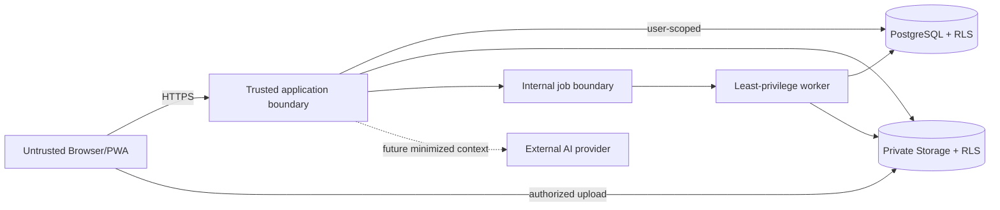

# AI Wardrobe — Security Architecture

**Phase:** 4 approved security architecture with Phase 6–8 implementation appendices
**Status:** Phase 8 local security gate passed; external-review findings remediated
**Baseline:** Approved PRD, UX, Design System and Decisions D-001–D-075  
**Date:** 2026-09-17

# Security Principles

1. **Private by default:** records, images, notes, history, imports, exports and future AI context are never public implicitly.
2. **Verified identity, server-owned scope:** actor/account identity comes from a verified server session, never request body, URL, tool argument or Storage path alone.
3. **Least privilege:** browser keys, server roles, job workers and provider credentials receive only necessary capability.
4. **Defense in depth:** application authorization, database RLS, Storage RLS and object binding must agree.
5. **Deny by default:** new route, relation, bucket operation, job, cache or AI tool has no access until explicitly reviewed.
6. **History integrity:** archive/edit/delete cannot silently rewrite WearEvent evidence.
7. **Data minimization:** process and retain the least personal content required; telemetry is metadata-first.
8. **No trust in generated or imported content:** names, notes, archives, images, metadata and model output are untrusted input.
9. **Safe failure:** a dependency outage or ambiguous write never produces false success or broader access.
10. **Security scales before traffic:** an isolation error is critical at two users and catastrophic at 10,000, so ownership is correct from the first implementation.

# Data Classification

| Class                         | Examples                                                                  | Default handling                                                              |
| ----------------------------- | ------------------------------------------------------------------------- | ----------------------------------------------------------------------------- |
| Public                        | Static app shell, public help/legal copy explicitly published             | CDN cache allowed; integrity still protected                                  |
| Internal operational          | Deploy version, safe error codes, aggregate service metrics               | Team least-privilege access, retention limit                                  |
| Private account data          | Email/account reference, settings, timezone, entitlements future          | Authenticated server access; no shared cache/log content                      |
| Private wardrobe data         | Items, images, notes, tags, outfits, WearEvents, insights, import/export  | Owner-only; RLS; encrypted transport/provider storage; explicit export/delete |
| Sensitive secrets             | Access/refresh tokens, cookies, DB credentials, service role, OpenAI keys | Server secret manager/env only; never log, export or send to browser/model    |
| Transient high-risk artifacts | Upload/import archive, signed URL, export package, future AI context      | Short TTL, narrowly authorized, isolated staging, deletion/reconciliation     |

Wardrobe photographs and notes are treated as private even when they appear visually innocuous: images can reveal identity, location metadata, home context or habits. Future location/weather and AI conversation content receive the same or stronger classification.

# Trust Boundaries

- Browser state, identifiers, filenames and optimistic success are untrusted.
- Application server is trusted to authenticate and authorize but remains constrained by database/storage defense.
- Queue messages may be duplicated, replayed, delayed or stale.
- External services are outside the privacy/availability boundary and receive no implicit trust.
- Caches and logs cross temporal/user boundaries and are treated as possible disclosure surfaces.

# Authentication

- Supabase Auth is the recommended identity provider for password/signup, login, logout, recovery and token refresh.
- Use the supported cookie-based SSR/PKCE pattern. Resolve verified user claims/server identity before authorization; do not authorize solely from an unverified local session object.
- Session cookies use provider/framework-recommended secure attributes and HTTPS. Cross-site behavior is minimized and reviewed with the CSRF model.
- Protected routes are convenience only; every mutation/read endpoint independently authenticates.
- Session refresh and authenticated responses must bypass shared caching.
- Logout/account switch clears recoverable user-scoped local data, image references and signed URLs.
- Recovery and signup responses avoid account enumeration as far as provider-supported flows allow.
- Re-authentication is required for account deletion and other identity-level actions; MFA can be introduced according to risk without changing domain ownership.
- Before closed/public beta, configure production SMTP, sender policy, rate limits and abuse monitoring; provider test SMTP is not a production dependency.

# Authorization

- Every application use case begins with a verified actor/account context.
- Ignore or reject `user_id`/owner/account authority supplied by client or future model. The server injects the scope.
- Resource IDs are re-authorized individually. Knowing an opaque ID, file path or import session ID grants nothing.
- Collection queries filter at the source by owner/account; no fetch-all-then-filter behavior.
- Parent-child consistency is checked: an image/variant/outfit member/event snapshot cannot be attached through a foreign parent owned by another user.
- Lifecycle state adds rules but never broadens cross-user access. Archived/historical entities remain owner-only.
- Import commits, export/download, deletion, background jobs and future AI tools re-evaluate authorization.
- Service/admin operations have separate entry points, explicit allowlists, minimal credentials and audit events.
- Authorization failures reveal only safe information; IDOR probes should not confirm another user's resource.

# Ownership Isolation

The invariant is end-to-end: **verified account owns root domain record; every child, asset, job and derived response resolves to that same account**.

Isolation applies to:

- ClothingItem, AppearanceVariant, image metadata and bytes;
- Outfit, OutfitItem and drafts;
- WearEvent and immutable snapshots;
- search indexes/results and insights/drill-down;
- import session, staged source, preview, decisions and report;
- export packages and deletion workflows;
- local cached/draft data;
- queued job payloads and outputs;
- future AI context, tool results, feedback and recommendations.

The second real user uses the same application with an independent Auth identity and namespace. There are no shared credentials or hardcoded owner. Phase 5 must distinguish authenticated identity, durable personal owner/account scope and any future access/sharing grant, even if identity maps one-to-one to personal owner in MVP. Future Household requires a new product/security decision plus explicit membership and resource grants; it cannot reinterpret or migrate every personal row as jointly owned. No Household tables or shared tenant are introduced now.

# RLS Strategy

- Enable RLS on every exposed user-owned table and on Storage objects; absence of an allow policy means deny.
- Minimize `GRANT` permissions as a separate control. Policies do not correct excessive grants by themselves.
- Root policy uses verified Auth identity. Child policy derives owner through a safe parent chain.
- Validate both `USING`-like read/current-row conditions and new-row/check semantics conceptually for mutation; Phase 5 supplies the ownership topology and policy matrix, while executable policies belong to Phase 6 implementation.
- Audit views, functions and materialized/read projections for owner-context bypass. Security-definer behavior requires explicit review.
- User-scoped server operations preserve user claims where practical so RLS remains active.
- Service-role access bypasses RLS and is therefore restricted to isolated server jobs/admin functions with manual ownership predicates and audit.
- Never create a generic service-role Supabase client that can inherit a user's authorization header/session.
- Test policies as User A, User B, unauthenticated, stale/deleted account and privileged worker.

Supabase explicitly documents RLS on exposed data and that service-role access bypasses it: [Row Level Security](https://supabase.com/docs/guides/database/postgres/row-level-security).

# Storage Security

- Private buckets only. Public bucket/read URL is prohibited for wardrobe originals, catalog images, derivatives, staged imports and exports.
- Storage RLS allows object operations only for the verified owner and expected application namespace.
- Application asset metadata binds opaque object identity to Physical Item/AppearanceVariant/ImageView; folder names or Storage `owner_id` alone do not establish complete authorization.
- Browser receives a narrowly scoped upload authorization after item/import/session ownership and quota checks. Large bytes go directly to Storage.
- Read uses an authenticated download or short-lived signed URL issued after authorization. Signed URLs are bearer secrets: do not log, persist, share or use as stable IDs.
- Signed URL expiry is not guaranteed instant revocation of cached bytes. TTL, versioned object paths and delete/cache propagation are part of the privacy contract.
- Object paths are immutable/versioned. Replacement creates a new version and changes the application pointer; it does not overwrite a cached key.
- Storage listing is not exposed as a general user API. The application returns only bound, authorized assets.
- Orphan/staging/export cleanup is asynchronous, owner-scoped, delayed where race risk exists, and reconciled before final deletion status.
- Backup/recovery covers object bytes separately from database metadata.

Direct upload may use either of two mechanisms; Phase 4 approves the security boundary, not the final provider-specific choice:

| Option                                  | Security semantics                                                                                                                                                                                                                  |
| --------------------------------------- | ----------------------------------------------------------------------------------------------------------------------------------------------------------------------------------------------------------------------------------- |
| **Authenticated direct Storage upload** | Current Supabase identity accompanies the operation and Storage RLS must authorize the exact object operation and owner/parent scope.                                                                                               |
| **Signed upload URL/token**             | The server first authorizes and issues a capability bounded to one expected object/path and operation. After issuance it is a bearer capability governed by provider expiry, not a continuously re-authenticated session operation. |

Supabase currently documents signed upload URLs as usable without further authentication and valid for two hours. Implementation must verify the then-current provider TTL, replay/exposure assumptions and threat model before selecting this option. [Supabase signed upload URL](https://supabase.com/docs/reference/javascript/file-buckets-createsigneduploadurl), [upload to signed URL](https://supabase.com/docs/reference/javascript/file-buckets-uploadtosignedurl)

Official Supabase references: [private buckets](https://supabase.com/docs/guides/storage/buckets/fundamentals), [Storage access control](https://supabase.com/docs/guides/storage/security/access-control), and [private asset delivery](https://supabase.com/docs/guides/storage/serving/downloads).

# Upload Security

Upload acceptance uses layered controls:

1. Browser requests an upload intent; the server verifies authenticated account, allowed parent/import session, current entitlement/quota and declared file facts before authorizing transfer or issuing a capability.
2. Maximum object count, compressed bytes, batch bytes and request frequency.
3. Bucket allowlist for declared MIME and file size.
4. Server/worker inspection of magic bytes and successful decoding—not extension or browser MIME alone.
5. Width, height, pixel/decompression and frame/page limits to prevent image bombs.
6. Supported-format allowlist; HEIC/HEIF follows an explicit isolated conversion policy.
7. Metadata stripping and safe derivative re-encoding; preserve original only under documented policy.
8. Malware/archive-bomb/path-traversal checks appropriate to Bulk Import packages before parsing.
9. Opaque, versioned, server-selected destination identity; the browser cannot choose the owner namespace, and user filenames are display metadata only and safely escaped.
10. Authorization/capability is limited to one expected object/path and operation scope. Signed tokens are bearer secrets and are never logged, persisted as stable IDs or shared-cached.
11. Completion distrusts the client and rechecks expected bucket/object identity, parent binding, size and state.
12. Quarantine/staged state until validation; no successful transfer becomes primary/catalog-ready before magic-byte, decode, dimension, pixel-budget and required security checks pass.
13. User A/User B tests prove that guessed paths, IDs or capabilities cannot upload, complete, list or read across accounts.

Parsing never executes macros/scripts and never resolves paths outside the staged archive. Future URL-based import is disabled until SSRF-safe fetch architecture exists. Failed/abandoned uploads expire via an owner-scoped, idempotent cleanup job. These controls apply identically whether transfer authorization is authenticated-RLS or a signed upload capability.

# Secrets

- DB passwords, service-role keys, OpenAI/API keys, webhook secrets and signing credentials exist only in environment-specific server secret storage.
- Only public-safe Supabase configuration/publishable keys intended for RLS-constrained clients may enter the browser; these never grant privileged access.
- Separate local/staging/production secrets and projects. No production credential in local config, preview logs or test fixtures.
- Rotate credentials, define owners and expiry where supported, and revoke promptly after exposure or personnel change.
- CI/build output, source maps, error pages, telemetry and future tool results are scanned/reviewed for secret leakage.
- Privileged clients are constructed in server-only modules; imports into client bundles are prevented and tested.
- External provider keys have minimum project scope, spend/rate limits and separate environments.

OpenAI recommends keeping keys out of code/public repositories and using environment variables or secret management: [Production best practices](https://developers.openai.com/api/docs/guides/production-best-practices).

# API Security

- Treat Server Actions, Route Handlers, callbacks and future APIs as internet-reachable endpoints.
- Require authentication/authorization per action; route protection alone is insufficient.
- Apply runtime schema validation, canonicalization and allowlists. TypeScript types do not validate network input.
- Use parameterized data access and constrained query builders; no user/model-generated SQL.
- Enforce request/body/file limits early. Large image/import bodies use direct authorized Storage upload.
- Mutation commands carry idempotency keys and expected versions where retry/concurrency matters.
- Apply per-IP and per-account rate limits with global safety caps. Sensitive endpoints have tighter limits.
- Webhooks/callbacks verify signature, timestamp/replay window and event identity before idempotent processing.
- CORS is narrow and not treated as authentication. Errors do not expose stack, query or cross-user existence.
- Any future outbound URL fetch uses protocol/host allowlist, DNS/IP validation, redirect revalidation, size/time limits and private-network denial.

# Browser Security

- HTTPS and secure session cookies are mandatory. Define a Content Security Policy compatible with required Next.js assets and no unsafe third-party script sprawl.
- Escape/render user strings as text. Sanitise any future rich content; imported notes are data, not HTML.
- State-changing cookie-authenticated endpoints have CSRF protection appropriate to framework mechanics: SameSite/origin checks and explicit token where necessary.
- Use clickjacking protection (`frame-ancestors`/equivalent) unless an approved embed use case exists.
- Apply restrictive referrer and permissions policies; camera/location requests are contextual and minimum scope.
- Signed URLs, tokens and personal data must not appear in URL query/referrer/history where avoidable.
- Service worker caches public static shell only by default. It does not cache authenticated responses, private images, exports or signed URLs.
- Local drafts are minimized, encrypted only if a meaningful local threat model and key strategy exist, namespaced by account and cleared on logout/switch/deletion. Do not claim local encryption as a substitute for reducing retention.
- Tab conflicts use optimistic versions; no client-side lock is trusted.
- Dependencies, font/assets and any third-party analytics undergo supply-chain/privacy review; integrity/pinning practices follow the build system.

# Logging Safety

Allowed default fields: timestamp, environment/deploy version, correlation/trace ID, pseudonymous account reference when needed, endpoint/use case, status/error class, duration, job/import/asset ID and aggregate sizes/counts.

Excluded by default:

- credentials, cookies, tokens and secret headers;
- raw email or recovery content;
- full Storage paths, signed URLs or export URLs;
- photos, binary payloads, import archives and manifests;
- personal notes, full search text or detailed garment metadata;
- future AI prompts, completions, tool arguments/results and image context.

Redaction occurs before emission, not only at the dashboard. Access, retention, sampling and deletion policies apply to logs. Security investigation capture is explicit, narrow, time-limited and auditable. User-facing audit events are separate from infrastructure logs.

Recommended audit events include import confirm/commit, export request/download, account deletion request/completion, suspicious Auth events and privileged internal actions. Ordinary browsing/clicks are not audit events.

# AI Security Future

AI is not implemented in MVP. When enabled:

- All calls originate from the server-only AI Gateway; no provider key or direct model endpoint in the browser.
- The server derives identity and injects account scope. Neither browser nor model can choose `user_id`.
- Model has no SQL, database credential, service role, unrestricted Storage listing or full wardrobe dump.
- Tools are read-only and narrowly scoped by default. Every ID/tool request is schema-validated, semantically validated and re-authorized through domain service + RLS.
- Structured Outputs/strict function schemas constrain shape but do not grant authority or prove factual correctness.
- User notes, imported text, OCR, image metadata and future web/weather content are untrusted data and isolated from system/developer instructions to reduce prompt injection.
- Tool outputs are bounded and sanitized. Internal fields and signed URLs are withheld unless a selected image is strictly required.
- Consequential model output is a draft. Normal UX confirmation, authorization, expected version and idempotency precede a persistent write. Destructive/mass writes are never autonomous.
- Final response is post-validated for existing owner-scoped IDs, lifecycle/availability and hard constraints. Failure yields abstention/manual path.
- Provider state is disabled/minimized by default; retention, region, content filtering and user notice are reviewed per feature before launch.
- Cross-account, injected-instruction, hallucinated-ID, stale variant, tool abuse and fallback-model tests are release gates.

OpenAI documents strict tool schemas and Structured Outputs, while application-side execution/validation remains the developer's responsibility: [Function calling](https://developers.openai.com/api/docs/guides/function-calling), [Structured Outputs](https://developers.openai.com/api/docs/guides/structured-outputs), and [data controls](https://developers.openai.com/api/docs/guides/your-data).

# Rate Limiting / Abuse

Layer controls by IP/network signal, verified account, endpoint/feature and global system capacity.

- Auth signup/login/recovery: provider controls plus application abuse monitoring and production SMTP constraints.
- Reads/search: burst limits and bounded pagination/query complexity.
- Mutations/wear/archive: prevent automation abuse while allowing normal quick actions; server idempotency handles repeats.
- Upload/import: file count, per-file/batch bytes, pixel budget, concurrent uploads, daily storage/import limits and archive complexity.
- Export/delete: low-frequency workflow limits, re-auth and one active job per scope where appropriate.
- Jobs: concurrency, lease, attempts, backlog limits and circuit breakers to protect interactive traffic.
- Future AI: authenticated-only, request/token/image/concurrency quotas, per-plan limits, cost budget, anomaly alerts and kill switch.

Rate-limit errors are explicit and do not erase work. Distributed counters must fail safely for expensive/privileged actions. Quotas are an application capability, not ad-hoc UI checks.

# Export / Deletion Security

- Export requires authenticated ownership and may require recent re-auth for high-risk content.
- Generate asynchronously from a coherent owner-scoped snapshot; include only explicitly selected domains/assets.
- Store export packages privately with short expiry, single-account authorization and audit of request/ready/download/expiry.
- Download URLs are bearer secrets with short TTL and no logs/referrers/shared cache.
- Export must not include server secrets, internal paths, another account's linked record or hidden operational logs.
- Account deletion requires strong confirmation/re-auth and creates a resumable, idempotent workflow.
- Each deletion step revalidates/fixes scope, deletes operational DB data and objects, cleans staged/export/future provider state and verifies leftovers.
- Partial deletion is not reported complete. Backups expire according to the disclosed policy; exact scope/SLA must be approved before real MVP data.
- Individual hard-delete behavior with historical WearEvents remains open; archive stays the safe ordinary action.

# Threat Model

| Threat                                      | Impact                                         | Mitigation layers                                                                                      |
| ------------------------------------------- | ---------------------------------------------- | ------------------------------------------------------------------------------------------------------ |
| Cross-user data access                      | Critical privacy breach                        | Verified server actor; owner-scoped use cases; RLS/grants; isolation tests; safe errors                |
| IDOR via item/outfit/event/import/export ID | Read/write/delete another user's object        | Opaque ID not authority; per-object parent ownership; RLS; deny existence details                      |
| Storage object exposure                     | Private photos/exports become public           | Private buckets; Storage RLS; app binding; short signed URLs; no public cache                          |
| API key/service-role leak                   | Full provider/data compromise                  | Server-only modules/secrets; least scope; rotation; log/build scan; separate clients                   |
| Malicious or oversized upload               | Code/parser exploit, resource exhaustion, cost | Direct staged upload; byte/MIME/magic/decode/pixel limits; archive safety; quotas; isolated processing |
| Rate/AI abuse                               | Cost surge, denial of service                  | Per-IP/account/feature/global limits; concurrency/backpressure; spend caps/kill switch                 |
| Prompt/tool abuse future                    | Cross-user leak or unsafe write                | Server scope injection; allowlisted typed tools; semantic auth; read-only default; confirm writes      |
| CSRF                                        | Unwanted archive/wear/delete/account action    | SameSite/secure cookie, origin/token checks, re-auth/confirmation by impact, idempotency               |
| XSS                                         | Session/private data theft                     | Contextual escaping, CSP, no untrusted HTML, dependency review, HttpOnly cookies where supported       |
| SQL/command injection                       | Data theft/corruption                          | Runtime validation, parameterized access, no generated SQL/shell, least DB privilege                   |
| SSRF from future URL import/tools           | Internal network/metadata access               | Feature disabled initially; allowlist, DNS/IP/redirect recheck, protocol/size/time limits              |
| Signed URL leakage/replay                   | Asset visible until expiry                     | Short TTL, no logs/referrer/shared cache, re-authorize issuance, version/delete strategy               |
| Cache leak                                  | One account receives another's RSC/data/image  | Auth payloads no shared cache, verified account cache key, service-worker exclusions, tests            |
| Log/telemetry leak                          | Long-lived private content disclosure          | Pre-emission redaction, minimum fields, retention/access controls, no default AI/media content         |
| Account deletion failure                    | False privacy promise and orphaned data        | Durable idempotent workflow, checkpoints/reconciliation, separate DB/object/provider cleanup, SLA      |
| Import retry duplication/overwrite          | Corrupt catalog/history                        | Owner+source identity, preview version, record idempotency, confirmed-field protection, report         |
| Wear/outfit race                            | Rewritten history or double count              | Immutable event snapshot, transaction boundary, expected versions, duplicate-review/idempotency        |
| Queue replay/stale job                      | Repeated destructive/external effect           | Authenticated worker, current state/owner check, lease/checkpoint, domain idempotency                  |
| Backup/object mismatch                      | Incomplete restore or deletion                 | Combined DB+Storage inventory, independent object backup, restore drills, reconciliation               |

# Security Testing Requirements

Before MVP release:

- Authentication tests for login/logout/refresh/recovery, expired/revoked sessions and account switch.
- Authorization matrix for every read/write/archive/restore/export/delete/import operation: own allowed, other user denied, anonymous denied.
- RLS/grant tests for each table, view/function/read model and child relationship in Phase 5.
- Storage tests for list/read/upload/update/delete, guessed paths, copied signed URLs, expired URLs and cross-user asset binding.
- IDOR fuzzing across ClothingItem, AppearanceVariant, image, Outfit, WearEvent, Import Session, job and export identifiers.
- CSRF, XSS, injection, malicious filename/MIME, image bomb, corrupt decoder input, archive traversal/bomb and oversized-upload tests.
- Direct-upload completion spoofing, orphan cleanup and duplicate callback/job replay tests.
- Cache tests proving no authenticated HTML/RSC/API/private image/signed URL is shared between User A and User B or retained after logout.
- Transaction/concurrency tests for duplicate wear, stale item/outfit, primary image, archive dependency and import retry.
- Export completeness/isolation and deletion partial-failure/reconciliation tests.
- Secret scanning and client-bundle inspection; service credentials must be absent.
- Logging tests with synthetic secrets, URLs, notes and provider payloads to prove redaction.
- Backup/restore drill covering database and object bytes.
- Accessibility/security interaction checks: focus-safe re-auth/confirmation, no sensitive values announced or retained unexpectedly.

Before future AI release add an eval/red-team suite for cross-user IDs, prompt injection through notes/import/image text, arbitrary owner requests, hallucinated IDs, stale/archived variants, destructive requests, invalid/refused/incomplete structures, context oversharing, fallback regressions and provider outage. Owned-item groundedness remains 100% release gate.

# Phase 5 Database Ownership Clarification

- Provider-managed Auth identity and durable application ownership are separate: one verified identity maps one-to-one to one personal `account` in MVP.
- Personal aggregate roots and directly exposed/query-heavy children carry indexed `account_id`; high-risk child relationships also require account-compatible composite foreign keys.
- Secondary personal relationships are account-compatible too: MediaAsset replacement lineage and metadata-evidence ImportRecord provenance cannot cross accounts. Intentionally polymorphic audit/idempotency targets are diagnostic locators, never authorization evidence.
- The Phase 5 RLS matrix is conceptual. Ordinary user access must resolve the verified identity to its account and remain deny-by-default; no executable RLS policy or grant is created in this phase. RLS row eligibility does not mean the browser receives a direct table-mutation GRANT.
- Outfit/Wear/media/import/hard-delete/idempotency/job/account-deletion writes remain behind trusted application commands. Exact Postgres GRANTs, Data API exposure, RPCs and pooled-SQL/user-context split are Phase 6 implementation decisions.
- Service-role/background paths remain exceptional, narrow and server-only. They must re-check owner, current state and operation scope before mutation rather than treating RLS bypass as authorization.
- Individual ClothingItem hard delete creates no tombstone: it deletes current external identity mappings and clears same-account Wear/Import live references in a reviewed workflow, while minimal WearEvent snapshots and safe ImportRecord reports remain until their own retention/account deletion.
- Full account deletion still removes every retained WearEvent snapshot, ImportRecord/report and other personal row/object through the orchestrated workflow.
- A database media binding records ownership and semantic attachment but never authorizes object access by itself. Private Storage authorization, object paths and delivery capabilities remain separate implementation controls.

# Open Security Questions

1. Which production data region(s), subprocessors and residency commitments are acceptable for database, Storage, logs and future AI?
2. What exact operational and backup deletion scope/SLA can be stated to users?
3. What RPO/RTO and independent Storage backup mechanism are required before real data?
4. Which private image delivery TTL/cache/revocation pattern passes User A/B and deletion tests?
5. Is HEIC accepted, where is it decoded, and which isolation/library patch policy applies?
6. What malware/image/archive scanning service or isolated pipeline is required for the actual Source Audit format?
7. Which MVP browser matrix determines cookie, PWA, service-worker and local-draft behavior?
8. D-091 selects a controlled split: user-JWT/RLS reads plus trusted transactional commands. Exact pooled driver/RPC and privileged worker capabilities still require per-feature review.
9. How quickly must logout/account switch purge local PWA state and already-issued signed capabilities?
10. Which audit-event retention and access policy balances operations with data minimization?
11. Before future AI, are Modified Abuse Monitoring/Zero Data Retention or regional processing required, and which selected features are compatible?
12. What Household sharing/grant model is acceptable if that product decision is ever opened?
13. Which direct upload mechanism passes the implementation review: current authenticated identity with per-operation Storage RLS, or a server-issued one-object signed capability with validated provider TTL, replay/exposure controls and cleanup?

Phase 4 security review result: the approved architecture has no intended browser/model path to privileged credentials or another account's records, and no public media shortcut. The remaining questions are explicit implementation/release gates, not reasons to weaken ownership or privacy guarantees.

# Phase 6 Security Implementation

- Browser and user-context server Supabase helpers are separate files. Both carry the verified user session; neither accepts nor imports a service-role key. No privileged client exists in this phase.
- Public environment parsing allows only the Supabase URL and publishable key. Server-only environment parsing is isolated behind `server-only`; `.env*` is ignored except `.env.example`, and CI uses synthetic values.
- All 31 application tables have RLS enabled and forced. Three controlled reference tables allow authenticated SELECT. Ordinary personal reads use `private.current_account_id()` derived from `auth.uid()`; the helper is `SECURITY DEFINER`, has an empty search path and is executable only by `authenticated`.
- `anon` and `authenticated` lose default table/sequence privileges before narrow grants are restored. `authenticated` receives no INSERT/UPDATE/DELETE grant. Jobs, idempotency, audit, external identities, export and account-deletion tables receive no ordinary browser SELECT grant either.
- Cross-account child injection is independently blocked by composite account/parent foreign keys, including item/variant, media replacement/binding, Outfit, Wear live references and import relations.
- The health route is dynamic and `no-store`; it returns only alive/configuration status and environment class. It never returns keys, connection details or validation errors.
- Baseline headers include content-type sniffing protection, frame denial, no-referrer and restrictive camera/microphone/geolocation policy. A robust nonce/hash CSP is deferred until actual scripts/integrations exist; no decorative policy is claimed.
- Cookie-backed mutations added in later phases must verify session, owner and allowed Origin/request intent. SameSite cookies and Next.js behavior are defense in depth, not the complete CSRF model.
- Structured logging accepts scalar context only and removes token/cookie/secret/password/signed URL/note/payload/photo/image-shaped keys. Raw database errors remain inside the server error mapping boundary.
- No Storage bucket or public object policy is created. Direct upload, object-key layout and delivery TTL remain explicit later gates.

Security checks are `pnpm test`, `pnpm test:db` and `pnpm test:e2e`. The pgTAP matrix uses actual synthetic authenticated role/JWT context and verifies known-ID isolation plus absence of direct mutation grants. On 2026-09-15 the local clean replay, DB lint, all 37 pgTAP assertions and the 6-test browser/axe suite passed; external Phase 6 review remains required before approval.

# Phase 7 Security Implementation

- Auth sessions use Supabase SSR cookies. The request proxy calls `auth.getUser()` to refresh/verify state, propagates rotated cookies and rejects anonymous access before protected routes execute.
- PKCE authorization codes are exchanged only in `/auth/callback`; token-hash email links are verified only in `/auth/confirm`. Both routes use required server-only `APP_ORIGIN`, restrict destinations to a small local path allowlist, explicitly attach new cookies to the redirect response and mark responses private/no-store.
- Login uses a generic credential error. Recovery always reports the same success message for known and unknown email addresses, reducing account enumeration.
- Server Actions validate email/password shape and require exact equality with canonical `APP_ORIGIN`, Host and forwarded protocol. Missing protocol, header lists and mismatches fail closed; SameSite cookies remain defense in depth.
- The only privileged Phase 7 capability is `bootstrap_account`. Its key is read by a `server-only` module, the client disables session persistence/URL detection, and the PostgreSQL function is executable only by `service_role`.
- Bootstrap receives a subject only after server-side `auth.getUser()`, chooses its own UUID, uses the unique Auth binding for retry reconciliation and creates preferences idempotently. It cannot be invoked by `anon` or `authenticated`.
- `/api/account` accepts no account selector. It derives the owner from the verified session/RLS context and returns only the current account ID and email with `private, no-store`.
- The protected shell is dynamic and contains no wardrobe data surface. Invalid session material yields a redirect/401 without a private identifier.
- Logout uses local provider scope and clears only the application's `ai-wardrobe:*` local/session keys. A persistent owner marker makes missing/mismatched ownership fail safe, and protected client content waits for binding before display.
- Existing database tests cover known-ID/FTS User A/B isolation and operational grants. The expanded browser suite covers real PKCE recovery, refresh rotation, expired/revoked sessions, same-profile switching, hostile Origin and cache headers.
- The secret scanner covers Markdown/CSS and application/config sources for legacy service-role/JWT shapes plus modern `SUPABASE_SECRET_KEY` assignments and `sb_secret_` markers, with synthetic regression fixtures and an explicit safe `.env.example` placeholder.

Final Phase 7 status: all listed checks passed, repeat external review approved commit `544c089`, and the user explicitly approved Phase 7 in commit `52cc4cb`. Production deployment was not run. Storage, onboarding, export/delete execution, MFA/social providers and production email remained outside Phase 7.

# Phase 8 Security Implementation

- Wardrobe routes remain below protected `/app`; request proxy verification and `Cache-Control: private, no-store` apply to HTML/RSC responses.
- Every read uses the server-created publishable user-context client, so forced RLS derives an active account from `auth.uid()`. Restricted/deleting accounts resolve no rows, known foreign item IDs return no row and search/filter relation queries remain owner-scoped.
- Browser roles keep SELECT-only ordinary-domain grants and cannot execute either migration-12 command. There is no browser import of `SUPABASE_SECRET_KEY` or generic service-role database client.
- Each mutation first requires exact canonical Origin/Host/protocol and a verified ready account context. Client `account_id`, `user_id` and `owner_id` are neither accepted nor trusted.
- The server-only capability client invokes only `save_wardrobe_item` or `set_wardrobe_item_state`. Both functions have an empty search path, validate scope/state/version/reference data and are executable only by `service_role`. The separate bounded `search_wardrobe_item_ids` function is `SECURITY INVOKER`, uses an empty search path and remains subject to authenticated RLS.
- Aggregate create/edit is atomic. Same-ID create retry reconciles without rewrite; stale version, foreign identity, invalid category/color/season and direct authenticated invocation fail closed.
- Archive changes lifecycle/timestamp and emits a narrow audit event; it does not delete ClothingItem or its history. The visible Undo submits a normal version-checked restore against the same server-derived account scope.
- Application responses expose localized safe failures. Structured logs record only stable event names and database error codes, never notes, tags, tokens, cookies, SQL text or service credentials.
- The real browser CSRF regression aborts the browser request, replays its captured Server Action payload through the authenticated API cookie jar with `Origin: https://evil.example`, and proves directly from the database that the forged title was not written.
- User A/User B browser and pgTAP tests cover list isolation, known-ID read denial, privileged mutation denial, non-revealing foreign mutation errors and server-derived ownership. Restricted/deleting-account regressions prove both route and RLS denial.

Local Phase 8 security gate passed with 90/90 pgTAP, 47/47 unit, 32/32 Playwright desktop/mobile, accessibility across empty/grid/filter/new/detail/edit states, secret scanning and no unexpected generated-type drift. Private Storage, uploads/images, Bulk Import, onboarding, Outfit/Wear/Analytics, export/delete execution, AI and Phase 9 remain absent.

Independent Phase 8 external security review completed with outcome `CHANGES REQUIRED`; the P1/P2/P3 findings were remediated and locally revalidated. Phase 8 approval is NO. Production deployment is NOT RUN.
